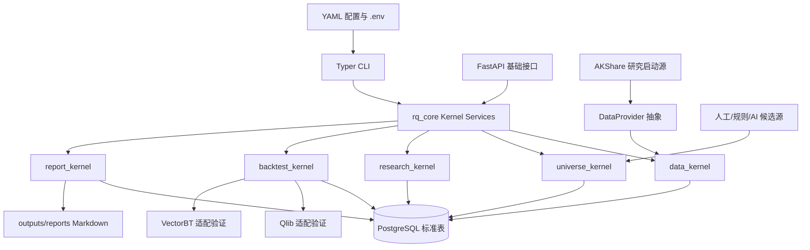
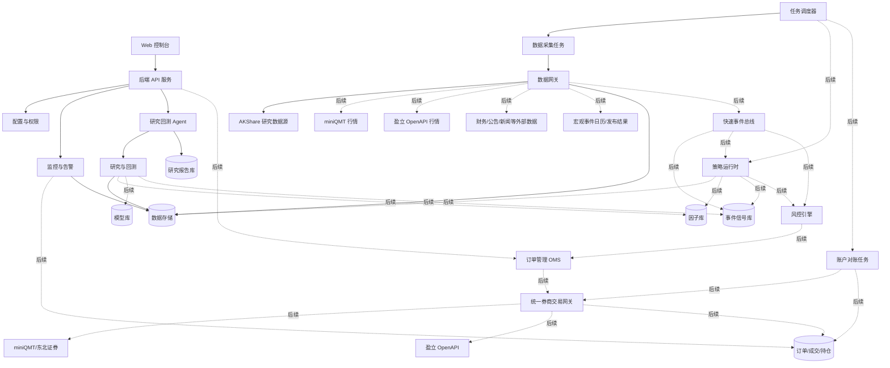
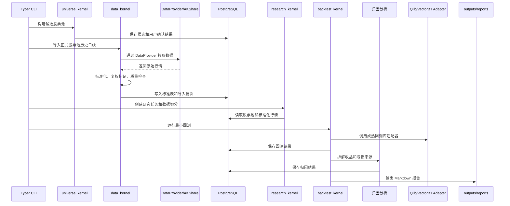
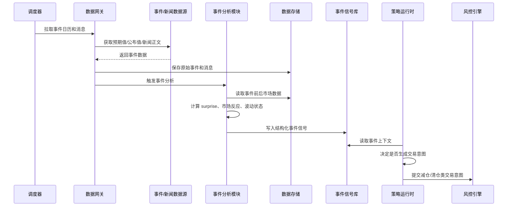
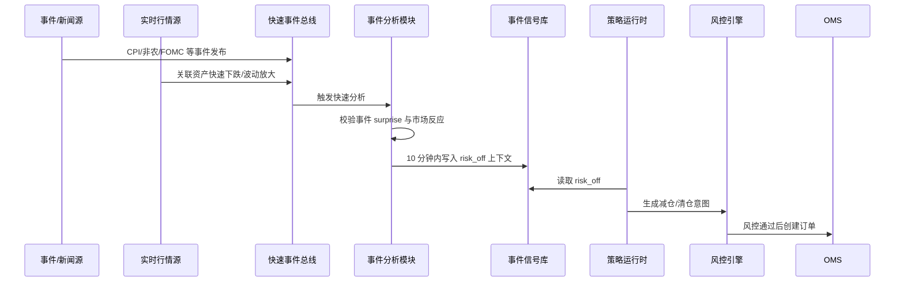
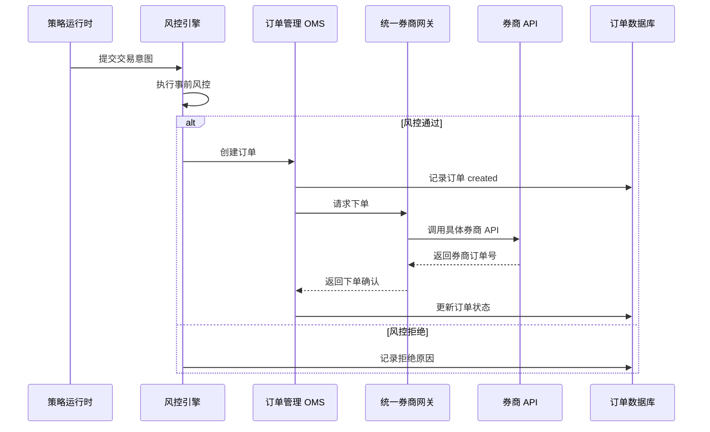
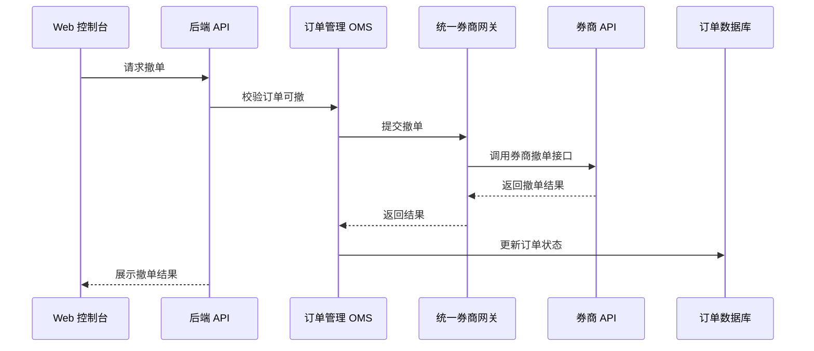
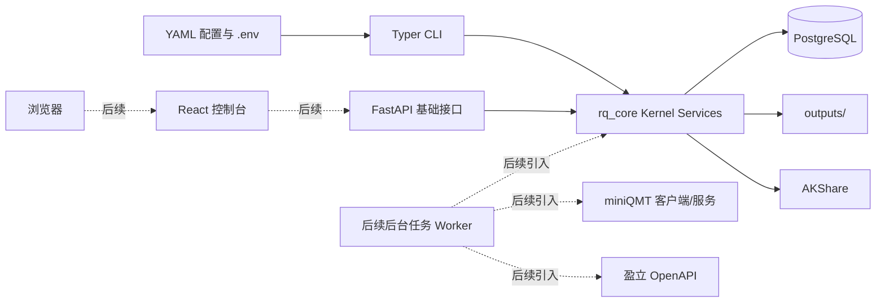

# RobustQuant 系统架构设计

版本：v0.1  
状态：部分确认  
最后更新：2026-05-15

## 1. 项目定位

RobustQuant 是一个面向个人投资者和个人研究者的低频量化交易系统。长期计划同时接入：

- miniQMT：主要用于对接国内券商 QMT 体系，例如东北证券账户，覆盖 A 股相关交易和行情能力。当前已确认 miniQMT 支持无人值守运行。
- 盈立证券 OpenAPI：用于港股、美股账户的行情、交易、撤单、持仓和资金查询。当前 API 申请结果不确定，具体实现等待官方 API 手册确认，不作为 M1 依赖。

长期目标不是做高频交易系统，而是做一个安全、可学习、可扩展的自动化交易框架。长期系统需要支持从数据获取、策略研究、回测、模拟盘、实盘交易、风控、监控到复盘的完整闭环。

当前已确认 M1 先做 A 股研究回测闭环。由于交易接口尚未具备，真实交易能力只保留统一券商适配器抽象和占位实现，不接实盘下单。

在券商 API 尚未全部具备前，当前设计重点先放在“研究与回测 Agent”。这个 Agent 内嵌在系统中，自动完成选股、因子挖掘、分时段取数据训练、回测、模拟、策略草案生成和报告输出，但不直接接入实盘下单。

M1 的当前实现口径更窄：先用本地 PostgreSQL、Typer CLI、AKShare 启动数据源、Qlib/VectorBT 回测验证和 Markdown 报告，跑通 A 股主题股票池的研究回测闭环。FastAPI 和 React 保留为技术栈方向，但 M1 的主操作入口先是 CLI；真实账户、真实订单、真实持仓、真实资金、真实对账和真实券商下单都不进入 M1。

券商接入的硬边界必须提前定清楚：miniQMT 和盈立 OpenAPI 的登录、行情、账户、持仓、订单、成交等只读查询测试，不构成真实交易；任何会向券商提交委托、撤单、条件单、预埋单、止盈止损、触发单或其他可能在券商侧形成订单的调用，都按真实交易处理。所有真实交易能力默认关闭，必须经过实盘开关、人工确认、交易时间检查、风控、OMS 和对账设计后才能启用。

## 2. 范围边界

### 2.1 M1 当前做什么

- 单人本地部署，优先使用本地 PostgreSQL，Docker Compose 优先，本机 PostgreSQL 服务作为备选。
- M1 只覆盖 A 股研究回测闭环，不接真实交易。
- 股票池只导入用户熟悉主题相关标的，不先导入全 A 股。
- 主题范围包括算力、电力、半导体、人工智能、芯片、电池、通信、银行、CPO、机器人、存储、有色金属、影视院线。
- 历史数据默认导入最近 10 年；最近 1 年作为模拟数据，此前数据按时间顺序 8:2 切分为建模数据和回测数据。
- 研究数据源默认使用 AKShare，但必须通过 `DataProvider` 抽象写入内部标准表，研究和回测不能直接调用 AKShare。
- 使用成熟回测库做执行引擎，优先验证 Qlib 和 VectorBT，不自研完整回测框架。
- 第一版任务入口使用 YAML 配置文件 + Typer CLI，所有命令必须提供完整 `--help`。
- 报告第一版使用 Markdown，中间产物和输出默认写入 `outputs/`，不进入代码库。
- `rq_core` 按拆分 kernel 设计，M1 先落 `data_kernel`、`universe_kernel`、`research_kernel`、`backtest_kernel` 和 `report_kernel` 的接口类。

### 2.2 长期保留什么方向

- 长期支持 A 股、港股、美股的统一账户视图、持仓视图、订单视图和交易日志。
- 长期支持统一券商交易网关，后续优先确认 miniQMT，再根据盈立 OpenAPI 申请和官方手册决定港股、美股接入。
- 长期支持策略运行时、风控、OMS、券商适配器、账户对账和 Web 监控。
- 长期支持条件单、止盈止损、触发单、分批下单等高级订单能力，但必须确认券商 API 行为并设计状态机。
- 长期支持消息面和宏观事件注入策略/风控上下文，但不能仅凭关键词或同名匹配选股交易。

### 2.3 当前不做什么

- 不做高频交易、盘口抢单、毫秒级撮合。
- 不做资金出入金功能，出入金仍通过券商官方 App 或网站完成。
- 不做多租户 SaaS 平台，不替别人托管资金或账户。
- 不让 LLM 直接控制实盘交易。LLM 可以辅助研究、解释、生成候选代码，但实盘启用必须经过回测、风控和人工确认。
- M1 不实现真实 A 股下单、真实撤单、真实订单查询、真实成交查询、真实持仓查询和真实资金查询。
- M1 不实现真实 OMS、真实风控拦截、真实账户模型、真实资金模型、真实持仓模型和实盘对账模型。
- M1 不接 miniQMT 真实交易，也不接盈立 OpenAPI。
- M1 不引入 Redis、Celery、Dramatiq 等后台任务队列。
- M1 不把 LLM 生成代码自动运行；LLM 只能作为研究辅助和候选解释。

## 3. 总体架构

本架构文档分两层阅读：

1. M1 当前架构：现在准备编码的研究回测闭环。
2. 长期目标架构：后续实盘、风控、OMS、券商适配和监控能力的方向，不代表 M1 要实现。

### 3.1 M1 当前架构



M1 的主线是：

1. 数据线：AKShare 通过 `DataProvider` 抽象进入 `data_kernel`，清洗、标准化后写入 PostgreSQL。
2. 股票池线：人工、规则或 AI 只生成候选股票池，用户确认后进入正式研究股票池。
3. 研究线：研究任务读取正式股票池和标准化历史数据，按时间顺序切分建模、回测和模拟数据。
4. 回测线：`backtest_kernel` 通过 Qlib/VectorBT 适配器运行最小回测。
5. 报告线：`report_kernel` 输出 Markdown 报告，记录数据源、导入批次、复权方式、参数和风险提示。

M1 没有真实交易线。策略、AI、消息面和回测结果都不能触发真实下单。

### 3.2 长期目标架构



长期架构可以理解为三条主线：

1. 数据线：把行情、财务、公告、新闻和宏观事件数据采集进来，清洗后存储。
2. 研究线：用历史数据做因子、模型、回测和策略验证。
3. 交易线：策略产生交易意图，经过风控、OMS 和统一券商网关后才可能下单。

交易线是长期目标，不是 M1 实现范围。研究线由内嵌研究回测 Agent 负责编排；总体推进顺序见 [05-technical-roadmap.md](./05-technical-roadmap.md)，研究 Agent 详见 [04-research-agent.md](./04-research-agent.md)。

## 4. 核心模块

### 4.1 Web 控制台

Web 控制台是长期的人机交互入口。它不应该成为交易逻辑的核心，只负责展示、配置和人工干预。

M1 不把 Web 控制台作为主入口。当前主入口先是 Typer CLI，原因是数据导入、质量检查和最小回测需要优先保证可复现、可审计、可写入 README。React 控制台可以在最小研究回测闭环跑通后补第一版。

后续 Web 控制台主要功能：

- 查看账户资金、持仓、订单、成交、盈亏。
- 查看策略运行状态、最近信号、最近错误。
- 配置策略参数和风控参数。
- 启动、暂停、停止策略。
- 对未成交订单执行撤单。
- 查看数据采集、回测、模型训练、实盘交易日志。

实盘前不提供“手动买入/卖出”按钮。原因是这个系统的核心是量化交易，手动交易容易把情绪操作混进来。后续可以保留撤单和一键暂停，因为它们是安全控制能力。

### 4.2 后端 API 服务

后端 API 服务负责给 Web 控制台提供接口，也负责对外封装系统内部状态。M1 中，FastAPI 先只作为基础服务入口和健康检查方向，不承载核心研究链路；数据导入、质量检查和最小回测先通过 CLI 调用 kernel 服务完成。

M1 建议职责：

- 健康检查。
- 基础版本信息。
- 后续补数据导入批次、数据质量结果、研究任务和报告查询接口。

长期职责：

- 用户登录、会话、权限。
- 读取和修改配置。
- 查询账户、持仓、订单、成交、日志。
- 触发回测、模拟盘任务、模型训练任务。
- 触发人工撤单、暂停策略、恢复策略。

后端 API 不直接写策略逻辑，不直接调用券商交易接口。交易动作统一交给订单管理模块和券商网关。

### 4.3 数据网关

数据网关负责把不同来源的数据统一成内部格式。这里要特别重视，因为不同市场、不同券商的数据字段会有差异。

数据来源：

- AKShare 研究数据源：M1 默认用于 A 股历史日线、指数行情和基础研究数据导入。
- miniQMT 行情：A 股行情、K 线、可能的实时数据。
- 盈立 OpenAPI 行情：港股、美股行情、K 线、快照。
- 外部数据：财务报表、公司公告、新闻、行业分类、指数成分、宏观数据等。
- 消息面和宏观事件：CPI、PPI、非农就业、失业率、初请失业金、FOMC 利率决议、央行讲话、财报日历、重大公告等。

M1 只实现最小研究数据链路：标的信息、交易日历、日线行情、导入批次、数据质量检查、主题股票池、研究任务、回测结果、归因分析结果和报告产物。miniQMT 行情、盈立行情、财务公告新闻和宏观事件数据都属于后续扩展。

M1 数据源策略：

- 生产级目标优先使用券商接口，尤其是后续 miniQMT 可用后的 A 股行情和账户数据。
- 当前没有可用券商数据接口，因此研究期先通过数据网关接入 AKShare 作为默认启动源。
- 策略、回测和研究 Agent 只读取内部标准化数据表，不能直接绑定外部数据源 SDK。这样后续从临时数据源切换到券商数据时，不需要重写策略和回测逻辑。
- M1 最小数据集包括 A 股日线行情、交易日历、复权因子、停牌状态、基础股票列表。
- M1 默认导入最近 10 年日线数据；最近 1 年作为模拟数据，此前数据按时间顺序 8:2 切分为建模数据和回测数据。
- 具体数据路线详见 [06-data-source-roadmap.md](./06-data-source-roadmap.md)。

数据源分层：

- `AkshareDataProvider`：M1 默认研究数据源，用于 A 股历史日线和指数行情导入。
- `BaostockDataProvider`、`TushareDataProvider` 或本地导入 Provider：作为后续交叉校验或备用数据源。
- `MiniQMTDataProvider`：后续券商接口可用后实现，用于替换或复核研究期数据，并服务实盘前数据一致性检查。

内部建议统一成几类数据表：

- 标的信息：股票代码、市场、名称、交易币种、交易日历。
- K 线数据：日线、分钟线。
- 数据导入批次：数据源、时间范围、导入状态、行数、错误原因、开始和结束时间。
- 实时行情快照：最新价、买卖价、成交量等。
- 基本面数据：财务指标、资产负债表、利润表、现金流量表。
- 事件数据：公告、财报发布日期、分红、拆股、停牌、复牌等。
- 宏观事件数据：事件名称、国家/地区、发布时间、前值、预期值、公布值、修正值、重要级别、影响资产类别。
- 消息解析结果：新闻标题、来源、发布时间、关联标的、事件类型、情绪方向、置信度、摘要。

对量化系统来说，数据质量通常比模型复杂度更重要。错误的复权、缺失的停牌数据、错位的交易日历，都可能让回测看起来很好，实盘却完全失真。

M1 数据质量检查至少包括字段完整性、交易日完整性、重复记录、价格异常、复权序列断裂和导入批次状态。研究报告必须记录数据源、导入批次、复权方式和数据时间范围。

M1 的 PostgreSQL 表、字段、约束和 kernel 归属详见 [08-m1-data-model.md](./08-m1-data-model.md)。

M1 的 Python 接口类、DTO、Protocol 和服务调用边界详见 [09-m1-kernel-interfaces.md](./09-m1-kernel-interfaces.md)。数据表是持久化事实源，接口类是 kernel 之间的协作契约；后续实现时不能把 SQLAlchemy ORM 模型直接当作 kernel 传输对象。

### 4.4 消息面与宏观事件分析模块

消息面与宏观事件分析模块属于后续扩展模块，负责获取重要事件、解析发布结果，并判断市场在事件前后的行为变化。它输出的是“事件信号”，不是交易指令。

M1 只沉淀安全原则和数据模型方向，不实现实时消息面交易响应。若后续先做事件研究，也应优先用于事件窗口回测、报告解释和风控提示，不能直接进入实盘下单。

后续实时要求：对预先登记的重要事件和重大突发消息，系统需要提供快速事件链路。事件发布或行情确认后，事件信号注入策略运行时和风控上下文的目标延迟为 10 分钟以内。这里的“注入”指策略和风控能读到结构化事件状态，并可据此生成减仓、清仓、暂停开仓、降低风险暴露等交易意图。

重点事件包括：

- 通胀数据：CPI、PPI、PCE。
- 就业数据：非农就业、失业率、ADP 就业、初请失业金。
- 利率与央行：FOMC、央行利率决议、会议纪要、重要讲话。
- 增长与景气：GDP、PMI、零售销售、工业产出。
- 公司事件：财报、业绩预告、回购、增减持、并购重组、监管处罚。

事件发布后，系统需要把“公布值”与“市场预期”放在一起看。比如 CPI 高于预期，通常说明通胀压力更强，但市场具体反应还要结合当时利率预期、风险偏好和资产价格位置。系统不能把单个事件硬编码成固定买卖动作。

模块输出建议包括：

- `event_surprise`：公布值相对预期的偏离程度。
- `event_direction`：对风险资产的初步方向判断，例如偏利多、偏利空、中性。
- `market_reaction`：事件后指数、行业、个股、汇率、利率、期货等资产的实际反应。
- `volatility_regime`：事件后波动率是否显著上升。
- `strategy_context`：可注入策略的结构化上下文，例如“高波动事件窗口”“暂停开仓”“降低仓位”“仅允许减仓”。
- `risk_action_hint`：风险动作建议，例如“暂停开仓”“降低科技股暴露”“降低半导体行业暴露”“触发策略自检”“允许策略生成逃逸信号”。

注入策略的方式：

- 作为因子：把事件 surprise、情绪分数、事件后收益/波动等转成可回测因子。
- 作为过滤器：事件发布前后暂停开仓、降低目标仓位、扩大滑点假设。
- 作为策略上下文：策略读取当前事件状态，再决定是否生成交易意图。
- 作为风控输入：重大事件窗口内提高风控严格度。
- 作为快速风险退出触发器：当重要事件发布后，关联资产在短时间内出现显著下跌或波动放大时，允许策略生成减仓/清仓类交易意图。

快速风险退出示例：

- 美国 CPI 发布后，如果“高于预期”的 surprise 与美债收益率上行、纳斯达克/半导体/存储芯片相关标的快速下跌同时出现，事件模块应在 10 分钟内写入 `risk_off` 类事件上下文。
- 持有相关资产的策略读取到该上下文后，可以按预设规则生成减仓或清仓意图，例如“半导体行业暴露降低 50%”或“触发保护性退出”。
- 该意图仍然必须经过风控、OMS 和券商网关；它不是事件模块直接下单。

安全边界：

- 消息面分析不能直接下单。
- 消息面分析不能仅凭关键词或同名匹配选择股票或生成交易意图。必须经过实体识别、标的关联、行业链条或基本面相关性校验，并记录可审计理由。
- 事件信号必须可回测，不能只凭事后解释加入策略。
- 事件源、发布时间、预期值和公布值必须记录，避免数据回填造成未来函数。
- 重要事件发布后的快速分析可以触发告警或策略上下文更新，但实盘订单仍必须经过策略、风控、OMS 和券商网关。
- 快速风险退出只允许降低风险暴露，不允许作为自动加仓或追涨的捷径。
- 若事件源、行情源或分析链路超时，系统应默认进入保守模式：暂停新开仓、发出告警，并记录没有及时注入的原因。

反例：如果新闻是“美国总统特朗普抵达天坛”，系统不能因为文本中出现“天坛”两个字，就选择名称里带“天坛”的股票建仓。这类文本最多进入新闻库或事件库，除非能证明它和某个上市公司主体、业务收入、政策影响或产业链风险存在真实关联。

### 4.5 研究与回测模块

研究与回测模块用于回答一个问题：一个策略在历史上是否真的有效。

建议能力：

- 统一策略接口：同一个策略可以运行在回测、模拟盘、实盘中。
- 历史数据查询：按市场、标的、时间范围读取数据。
- 手续费、印花税、滑点模拟。
- 交易日历处理。
- 复权处理。
- 绩效指标：年化收益、最大回撤、波动率、夏普比率、胜率、换手率。
- 归因分析：拆解收益和亏损来自哪些标的、主题、因子、时间窗口、事件窗口、交易成本、换手和回撤片段。
- 回测报告保存，方便复盘和对比。

M1 回测引擎优先采用成熟开源库，不自研完整回测框架。RobustQuant 自己负责统一数据模型、实验记录、风控假设、报告格式和人工审核流程；成熟回测库负责执行历史回测，避免过早造轮子。

简单解释几个常见指标：

- 最大回撤：从历史最高点跌到之后最低点的最大跌幅。它衡量策略最难熬的时候会亏多少。
- 夏普比率：单位风险换来的收益。不是越高一定越好，但可以帮助比较策略质量。
- 滑点：理论成交价和实际成交价之间的差异。实盘下单很少能完全按回测价格成交。

研究与回测模块本身提供可调用能力，内嵌研究回测 Agent 负责决定“按什么顺序调用、如何比较实验、如何输出结论”。换句话说，研究与回测模块是工具箱，研究回测 Agent 是使用工具箱的研究流程编排器。

Agent 可以自动做的事情包括：

- 自动选股：基于基础规则、因子评分或模型评分生成候选股票池。
- 自动挖掘因子：生成候选因子，计算 IC、分层收益、换手率和稳定性。
- 分时段训练：按滚动窗口或 walk-forward 方法切分训练集、验证集和测试集，避免偷看未来数据。
- 自动回测：对候选策略做历史回测，并保存参数、数据版本和结果。
- 自动归因分析：解释为什么挣钱、为什么亏钱，区分标的贡献、主题贡献、因子贡献、事件窗口影响、交易成本和主要回撤来源。
- 离线模拟数据留出：默认把最近 1 年作为模拟数据，避免把所有历史数据都用于建模和回测。
- 模拟盘验证：后续把通过回测的策略放入模拟运行环境，观察实时表现。
- 策略草案生成：生成候选策略代码或策略配置，但不能直接启用实盘。
- 报告输出：输出研究结论、风险提示、指标表、收益曲线、归因分析和下一步建议。

### 4.6 策略运行时

策略运行时负责在真实时间推进中运行策略，属于模拟盘和实盘里程碑的模块。M1 不实现实时策略运行时，只通过研究任务和回测配置验证策略想法。

它需要做的事情：

- 按交易日历和调度规则触发策略。
- 加载策略代码和策略参数。
- 读取当前行情、历史数据、持仓和可用资金。
- 读取当前消息面事件状态，例如 CPI/非农发布窗口、重大公告、市场异常波动状态。
- 读取快速事件上下文，例如 `risk_off`、`sector_crash`、`macro_shock`，并在策略允许的情况下生成减仓/清仓类交易意图。
- 生成交易意图，例如“买入 00700.HK，目标仓位 10%”。
- 将交易意图交给风控引擎，而不是直接下单。

建议策略不要直接调用券商 API。策略只表达“想要什么”，比如目标仓位、买卖方向、数量、价格约束。真正下单由订单管理和券商网关负责。

### 4.7 风控引擎

风控引擎是实盘交易前最关键的保护层。它负责判断策略的交易意图是否允许执行。

M1 只做接口草案和原则约束，不实现真实交易前风控。后续进入模拟盘和实盘前，风控至少应包含：

- 单笔委托金额上限。
- 单只股票最大持仓比例。
- 单个市场最大资金占用比例。
- 单日最大下单次数。
- 单日最大亏损后自动停止。
- 禁止交易名单。
- 交易时间检查。
- 重大事件窗口检查，例如 CPI、非农、FOMC 发布前后是否允许开仓。
- 快速风险退出检查，例如事件触发的减仓/清仓是否符合最大撤单、最大卖出比例、冷却时间和人工开关。
- 价格偏离检查，例如买入价不能明显高于最新价太多。
- 券商账户可用资金、可卖数量检查。
- 全局一键暂停开关。

交易时间检查是硬约束：任何真实下单或向券商提交挂单请求，都必须发生在确认的交易时间窗口内。非交易时间触发的策略信号、条件单或事件信号，只能形成待审计交易意图，不能直接向券商挂单；进入下一个有效交易窗口后，必须重新经过行情读取、风控检查和 OMS 状态检查。

风控分三层：

- 事前风控：下单前检查，最重要。
- 事中风控：订单未成交、部分成交、长时间挂单时处理。
- 事后风控：收盘后复盘、对账、发现异常。

### 4.8 订单管理 OMS

OMS 是 Order Management System，中文通常叫订单管理系统。它负责管理订单从创建到结束的完整生命周期。

M1 不实现真实 OMS，也不建立真实订单、成交、持仓和资金表。回测里的订单和成交只是虚拟记录，不能复用真实 OMS 表。

订单状态建议统一为：

- `created`：系统内部创建，还没有送到券商。
- `risk_rejected`：风控拒绝。
- `submitted`：已提交给券商。
- `accepted`：券商已接受。
- `partial_filled`：部分成交。
- `filled`：全部成交。
- `cancel_requested`：已请求撤单。
- `cancelled`：已撤单。
- `rejected`：券商拒单。
- `failed`：系统异常导致失败。

OMS 需要保证两个特性：

- 幂等：同一个下单请求不能因为网络重试而重复下两次。
- 可追踪：每个订单为什么产生、由哪个策略产生、经过哪些风控检查、券商返回了什么，都要记录。

下单失败处理原则：

- OMS 下单失败绝对不能自动重试。
- 如果下单接口超时、网络断开、券商返回未知状态，系统不能假设订单失败后再发一次。
- 正确处理方式是将订单标记为 `failed` 或 `unknown`，记录完整上下文，然后通过券商订单查询、成交查询和账户对账确认真实状态。
- 只有在人工确认没有真实委托产生，并重新发起一个新的交易意图后，系统才允许产生新的订单。

原因是交易接口的失败结果经常不等于“券商没有收到订单”。如果系统自动重试，最严重的后果是重复买入或重复卖出。

### 4.9 统一券商交易网关

统一券商交易网关是本项目的关键抽象层。它负责把内部统一订单转换为具体券商 API 调用。

建议定义统一接口：

```python
class BrokerAdapter:
    def connect(self) -> None: ...
    def get_account(self) -> AccountSnapshot: ...
    def get_positions(self) -> list[Position]: ...
    def place_order(self, order: OrderRequest) -> OrderAck: ...
    def cancel_order(self, broker_order_id: str) -> CancelAck: ...
    def query_order(self, broker_order_id: str) -> OrderStatus: ...
    def query_trades(self, since: str | None = None) -> list[Trade]: ...
```

后续可以实现适配器：

- `MiniQMTBrokerAdapter`：对接 miniQMT，用于东北证券等 QMT 账户。
- `YingLiBrokerAdapter`：对接盈立证券 OpenAPI，用于港股、美股账户。

这样策略和风控不需要关心底层是 miniQMT 还是盈立 OpenAPI。它们只和统一订单模型打交道。

M1 不实现真实 `MiniQMTBrokerAdapter` 或 `YingLiBrokerAdapter`。当前只保留 `BrokerAdapter` 概念和占位接口，具体券商 SDK 行为必须等权限、运行环境、官方文档和安全设计确认后再接入。

券商适配器硬约束：

- 只读接入只允许登录、权限检查、行情查询、账户查询、资金查询、持仓查询、订单查询和成交查询，不允许调用任何下单、撤单或条件单接口。
- miniQMT 和盈立 OpenAPI 一律按同一安全边界处理；无论接口名称是否叫 `order`，只要可能在券商侧形成委托或撤销委托，就按真实交易接口处理。
- 不允许用真实下单、真实撤单或真实条件单接口做连通性探测、冒烟测试或权限测试。
- 真实交易能力默认配置为关闭，例如 `trading_enabled=false`；开启时还必须满足账户白名单、标的白名单、人工确认、交易时间、风控通过和 OMS 状态一致。
- 非交易时间不得向券商提交真实下单、挂单、预埋单或券商侧条件单；本地条件触发只能形成待审计交易意图。
- OpenAPI 的协议、频率限制、订单类型、盘前盘后、撤单语义和错误码必须以官方文档为准，未确认前不得假设为可交易能力。

### 4.10 账户、持仓和对账

量化实盘系统不能只相信本地数据库，也不能只依赖券商查询。建议两边都保存，然后定时对账。

账户、持仓、资金和对账属于实盘前必须单独设计的模块，不进入 M1 数据模型。

本地保存：

- 订单记录。
- 成交记录。
- 持仓快照。
- 资金快照。
- 策略信号。
- 风控结果。

券商查询：

- 实际账户资金。
- 实际持仓。
- 实际订单状态。
- 实际成交记录。

对账任务要检查：

- 本地持仓和券商持仓是否一致。
- 本地订单状态是否滞后。
- 是否出现未知订单或未知成交。
- 资金余额是否异常变化。

发现不一致时，建议先暂停相关策略，发出告警，再人工确认。

### 4.11 AI、因子和 LLM 模块

现有手册里已经设想了 AI 选股、因子挖掘、LLM 策略生成。这个方向可以保留，但建议按里程碑推进。

M1 先做：

- AI 或规则辅助生成候选股票池，但必须记录理由、来源、主题和置信度。
- 用户确认后才把候选标的加入正式研究股票池。
- 人工编写少量清晰因子或策略配置。
- 通过 CLI 手动运行数据导入、质量检查、最小回测和 Markdown 报告。
- LLM 只做研究辅助、解释和候选建议，不自动运行生成代码，不进入实盘交易链路。

M2 再做：

- 因子库。
- LightGBM/XGBoost 选股模型。
- 特征重要性解释。
- 自动训练和定期推理。

M3 再做：

- LLM 辅助生成因子。
- LLM 辅助阅读公告和财报。
- LLM 辅助生成策略草案。

核心原则：LLM 的输出只能进入研究流程，不能直接进入实盘交易链路。实盘策略必须经过代码审查、回测、模拟盘、风控配置和人工启用。

## 5. 关键数据流

### 5.1 M1 数据导入与回测流



以下消息面、快速风险退出、实盘交易和撤单流程都是后续设计流，不进入 M1 实现。

### 5.2 后续消息面事件分析流



### 5.3 后续快速风险退出流



### 5.4 后续实盘交易流



### 5.5 后续撤单流



## 6. 部署建议

M1 建议单机本地部署，降低复杂度：

- 主入口：Typer CLI。
- Python 后端服务：FastAPI 先保留基础接口和后续 Web 查询入口。
- 数据库：PostgreSQL。
- 数据库部署：本地部署，优先 Docker Compose，本机 PostgreSQL 服务作为备选。
- 定时任务：M1 暂不引入，后续再评估 APScheduler。
- 后台任务队列：M1 暂不引入，后续再评估 Dramatiq 或 Celery。
- 缓存和轻量消息：M1 暂不引入 Redis，等出现明确队列、缓存或消息协调需求后再加。
- 前端：React 是已确认技术栈方向，但 M1 不优先做完整控制台。
- 日志：结构化 JSON 日志，先落文件和数据库，后续可接入 Grafana/Loki。

已确认的 M1 技术栈为 FastAPI + PostgreSQL + React。M1 数据导入、质量检查和最小回测先通过 CLI 同步执行；Redis 和后台任务框架等到出现明确异步任务、队列或缓存需求后再定。

部署形态：



miniQMT 已确认支持无人值守运行，但仍需要确认具体运行环境要求：是否必须 Windows、是否需要 GUI 客户端保持登录、是否支持自动重连、异常断线后如何恢复。如果 miniQMT 必须运行在 Windows 桌面环境，系统可能需要把“交易执行节点”单独部署在 Windows 机器上，主服务可以仍然部署在云端或同一台机器。

## 7. 建议的目录结构

后续代码可以按下面的思路组织：

```text
RobustQuant/
  docs/
  backend/
    app/
      api/
      core/
      models/
      services/
  cli/
  rq_core/
    data_kernel/
    universe_kernel/
    research_kernel/
    backtest_kernel/
    report_kernel/
    strategy_kernel/
    risk_kernel/
    oms_kernel/
    broker_kernel/
      miniqmt/
      yingli/
    common/
  configs/
  outputs/
  frontend/
  scripts/
  tests/
```

这里的 `rq_core` 是领域核心，不依赖 Web 框架。M1 采用拆分 kernel 的方式：数据、股票池、研究、回测、报告、风控、OMS、券商适配分别保持高内聚，通过明确接口协作。`backend` 和 `cli` 都只是入口层，不能沉淀核心业务规则。`outputs/` 保存中间产物和报告，默认不进入代码库。

M1 先实现 `data_kernel`、`universe_kernel`、`research_kernel`、`backtest_kernel` 和 `report_kernel` 的接口类，具体设计见 [09-m1-kernel-interfaces.md](./09-m1-kernel-interfaces.md)。`risk_kernel`、`oms_kernel` 和 `broker_kernel` 暂时只保留长期目录方向，真实交易接口必须等后续交易链路设计确认后再实现。

## 8. 里程碑路线图

本节保留架构视角下的里程碑摘要。项目级路线、细分实施计划、交付顺序和验收标准详见 [05-technical-roadmap.md](./05-technical-roadmap.md)。

### 设计基线：设计与工程底座

- 已确认 M1 市场：A 股研究回测闭环。
- 明确券商 API 能力边界；miniQMT 后续优先确认权限、运行环境和接口能力，盈立 OpenAPI 等待申请通过和官方 API 手册。
- miniQMT 已确认支持无人值守，后续仍需设计连接、监控、断线恢复和异常告警。
- miniQMT 和盈立 OpenAPI 已明确只读测试与真实交易接口边界，任何会形成或撤销券商委托的调用都按真实交易处理。
- 定义 M1 数据模型和 kernel 接口类。
- 定义统一券商适配器、风控和 OMS 的长期占位接口，但 M1 不接真实交易。
- 定义内嵌研究回测 Agent 的任务模型、实验产物和人工审核边界。
- 明确消息面和 AI 不能仅凭关键词、同名或概念碰瓷选股交易。

### M1：A 股研究回测闭环

- 建立 A 股主题股票池数据存储和数据质量检查。
- 按 [08-m1-data-model.md](./08-m1-data-model.md) 建立 M1 数据模型和迁移。
- 通过数据网关接入 AKShare 作为默认研究启动源，为后续券商行情接口替换预留 Provider 抽象。
- 建立数据导入批次、数据质量检查和数据源版本记录。
- CLI 命令必须提供 `--help`，README 必须能复现运行步骤。
- 建立基础因子计算框架。
- 按最近 1 年模拟、此前数据 8:2 建模/回测切分数据。
- 接入 Qlib 和 VectorBT 做最小验证，至少跑通一个 A 股日频回测。
- 输出 Markdown 报告，记录数据源、复权方式、参数、收益、回撤、归因分析和风险提示。
- 策略只进入研究和回测，不进入实盘。

### M2：模拟盘与风控预演

- 建立研究计划器、数据窗口规划器、因子评估流程和实验记录。
- Agent 输出策略草案后进入人工审核，不能进入实盘。
- 能对比多次实验结果。
- 在不接真实交易的前提下验证策略运行、交易意图、基础风控和虚拟订单流程。
- 策略只能生成交易意图。
- 交易意图必须经过风控。
- 模拟订单状态和风控拒绝原因必须可审计。

### M3：受控实盘交易闭环与扩展

- 优先接入 miniQMT 的账户查询、持仓查询、下单、撤单、订单查询。
- 建立 OMS 和基础风控。
- 预留条件单、止盈止损、触发单、分批下单等高级订单能力的模型和状态机，但必须先确认券商 API 是否原生支持；如果由本地 OMS 托管，需要额外设计断线恢复、重复触发防护和人工暂停。
- 建立 Web 监控页面。
- 在 miniQMT 权限、环境、API 行为、风控、OMS、日志、对账和人工暂停入口确认后，再考虑受控实盘验证。
- 接入 miniQMT 和盈立 OpenAPI。
- 实现统一账户视图。
- 实现多市场交易日历和时间处理。
- 实现自动对账和异常告警。
- 扩展条件单、止盈止损、触发单、分批下单。
- 扩展更完整的数据源、因子库、模型库和 LLM 研究助手。
- 新市场、高级订单和 LLM 能力都不能绕过风控、OMS 和人工审核边界。

## 9. 需要优先确认的问题

- 东北证券 miniQMT 的登录、下单、查询接口能力是否完整。
- AKShare 与后续 miniQMT 数据源之间的差异校验方案。
- 成熟回测库选型：需要评估 A 股数据适配、交易日历、停牌/涨跌停、手续费、复权、事件回测和维护活跃度。
- 研究回测 Agent 在 M1 使用哪些基础因子。
- M1 消息面事件先覆盖哪些事件：CPI、非农、就业数据、FOMC，还是先从公司公告/财报开始。
- React 控制台是在最小回测闭环后做，还是与后端并行做。
- 条件单等高级订单能力后续由券商原生支持还是本地 OMS 托管。
- 盈立 OpenAPI 若申请通过，再确认港股、美股订单类型、盘前盘后、行情权限、频率限制。
