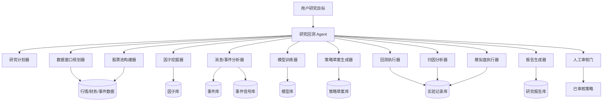
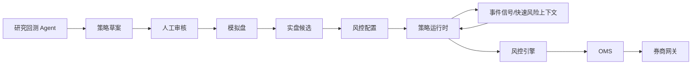

# 内嵌研究回测 Agent 设计

版本：v0.1  
状态：部分确认  
最后更新：2026-05-15

## 1. 设计目标

研究回测 Agent 是 RobustQuant 内嵌的自动研究助理。它负责把“我想研究一个策略方向”拆解成一系列可执行任务，并自动完成数据准备、选股、因子挖掘、训练、回测、归因分析、模拟和报告输出。

它不是实盘交易 Agent。它不能直接下单，不能绕过人工审核，不能把候选策略直接推到实盘。

M1 已确认先做 A 股研究回测闭环。券商交易 API 尚未齐备，因此研究回测 Agent 是当前最适合优先推进的主线。它可以先在历史数据和模拟环境中把研究闭环跑起来，等 miniQMT 等券商接口条件成熟后，再把通过审核的策略接入交易链路。盈立 OpenAPI 申请结果不确定，不作为 M1 依赖。M1 历史行情默认通过 AKShare 导入 PostgreSQL 标准表，项目总体路线见 [05-technical-roadmap.md](../00-project/05-technical-roadmap.md)，数据源专项路线见 [06-data-source-roadmap.md](06-data-source-roadmap.md)。

## 2. Agent 的职责边界

### 2.1 可以自动做什么

- 自动生成研究计划。
- 自动筛选股票池。
- 自动生成候选股票池，供用户确认后进入正式研究股票池。
- 自动计算候选因子。
- 自动挖掘和评估因子。
- 自动获取消息面和宏观事件数据。
- 自动分析 CPI、非农、就业数据、FOMC 等重要事件发布后的市场行为。
- 自动按时间窗口切分训练集、验证集、测试集。
- 自动训练选股模型或信号模型。
- 自动生成候选策略。
- 自动运行回测。
- 自动做归因分析，解释为什么挣钱、为什么亏钱。
- 自动运行模拟盘或 paper trading。
- 自动生成研究报告。
- 自动提出下一轮实验建议。

### 2.2 不能自动做什么

- 不能直接触发真实下单。
- 不能自动启用实盘策略。
- 不能绕过风控。
- 不能把 LLM 生成的代码直接放入实盘。
- 不能在数据质量检查失败时继续给出“可实盘”结论。
- 不能把单条新闻或单个宏观事件直接转换成实盘买卖指令。
- 不能仅凭关键词、同名或概念碰瓷生成选股或交易结论。例如新闻“美国总统特朗普抵达天坛”不能据此选择名称中带“天坛”的股票建仓。
- 不能把快速事件链路当成自动加仓通道；快速链路只允许降低风险暴露或暂停新开仓。

## 3. 总体架构



可以把它理解成一个流水线：

1. 用户给一个研究目标。
2. Agent 把目标拆成研究计划。
3. 系统准备数据和股票池。
4. 系统挖掘因子、训练模型、生成策略草案。
5. 系统分析消息面和事件冲击，并把可验证的事件信号注入回测。
6. 系统回测、归因分析和模拟。
7. 系统输出报告。
8. 用户决定是否继续实验、废弃、或进入人工审核。

## 4. 研究任务输入

M1 建议支持配置化输入，后续再支持自然语言输入。M1 市场固定为 A 股，避免同时处理多市场交易日历、币种、税费和交易规则带来的复杂度。

示例：

```yaml
research_goal: "寻找适合 A 股中短周期的低频选股策略"
market: "CN_A"
universe:
  exclude_st: true
  min_listed_days: 250
  min_avg_amount_20d: 50000000
  min_avg_turnover_rate_20d: 0.005
  max_suspended_days_250d: 20
  min_market_cap: 5000000000
data:
  years: 10
  frequency: "1d"
  simulation_holdout_years: 1
training:
  method: "walk_forward"
  train_backtest_split: [0.8, 0.2]
  train_months: 36
  validation_months: 6
  test_months: 6
risk:
  max_position_per_symbol: 0.10
  max_turnover_daily: 0.30
events:
  enabled: true
  event_types: ["CPI", "NONFARM_PAYROLLS", "UNEMPLOYMENT_RATE", "FOMC"]
  pre_event_minutes: 60
  post_event_minutes: 240
  inject_as: ["factor", "risk_context"]
  fast_injection_sla_minutes: 10
  fast_risk_exit:
    enabled: true
    allowed_actions: ["pause_open", "reduce_position", "exit_position"]
    affected_sectors: ["semiconductor", "memory_chip", "high_growth_tech"]
attribution:
  enabled: true
  dimensions: ["symbol", "theme", "factor", "time_window", "event_window", "cost", "drawdown"]
  top_n: 20
report:
  format: ["markdown", "html"]
```

先用配置文件的好处是可复现。自然语言很方便，但容易含糊。后续可以让 LLM 把自然语言转换成这种结构化配置，再由用户确认。

## 5. 关键子模块

### 5.1 研究计划器

研究计划器负责把目标拆成步骤。例如：

- 先构建股票池。
- 再计算基础量价因子。
- 然后做因子 IC 分析。
- 过滤不稳定因子。
- 用保留下来的因子训练模型。
- 用模型评分生成选股池。
- 用策略规则回测。
- 生成报告。

研究计划器的输出必须保存。这样以后发现结果不靠谱时，可以回头看当时 Agent 到底做了什么。

### 5.2 数据窗口规划器

数据窗口规划器负责“分时段取数据做训练”。

这里最重要的是避免未来函数。未来函数是量化里很常见的坑，意思是回测时使用了当时不可能知道的数据，导致结果虚高。

建议 M1 使用 walk-forward，也叫滚动窗口验证。简单理解：

- 用过去 36 个月训练。
- 用之后 6 个月验证。
- 再用之后 6 个月测试。
- 时间往前滚动，再重复一轮。

示例：

```text
窗口 1：2018-2020 训练，2021 上半年验证，2021 下半年测试
窗口 2：2018 下半年-2021 上半年训练，2021 下半年验证，2022 上半年测试
窗口 3：2019-2021 训练，2022 上半年验证，2022 下半年测试
```

这种方式比简单地“前 80% 训练、后 20% 测试”更接近真实使用场景。

### 5.3 股票池构建器

股票池构建器负责决定“哪些股票进入研究范围”。

M1 建议先用保守规则：

- AI、规则和 AKShare 概念板块可以先生成候选股票池，但必须由用户确认后才能进入正式研究股票池。
- 候选股票必须用“代码 + 名称”展示，例如 `688981.SH 中芯国际`。
- 候选理由必须记录来源、主题、相关性说明和置信度。
- 排除 ST 或风险警示股票。
- 排除上市时间太短的股票。
- 排除长期停牌或数据缺失严重的股票。
- 排除成交额太低、流动性太差的股票。
- 排除换手率过低、长期无量、疑似容易被大资金操纵的小票股。
- 可选：限制市值范围、行业范围、指数成分范围。

股票池规则必须记录到实验结果中，否则回测不可复现。

股票池构建不能只做关键词匹配。系统必须区分“新闻文本里出现某个词”和“该新闻对某个上市公司有真实影响”。只有后者才可能进入事件分析或候选池理由。

### 5.4 因子挖掘器

因子挖掘器负责生成、计算和评估候选因子。

M1 可以先从简单因子开始：

- 动量：过去 N 日涨跌幅。
- 反转：短期跌幅是否过大。
- 波动率：过去 N 日收益波动。
- 成交量变化：近期成交量相对历史是否放大。
- 均线偏离：价格相对均线的位置。
- 流动性：成交额、换手率。

评估指标：

- IC：因子和未来收益的相关性。
- IC_IR：IC 的稳定性。
- 分层收益：按因子从低到高分组，看收益是否单调。
- 换手率：策略需要多频繁调仓。
- 衰减：因子效果能持续多久。

### 5.5 消息/事件分析器

消息/事件分析器负责把新闻、公告、宏观数据发布结果转换成可回测的结构化信号。

M1 重点覆盖：

- CPI：通胀数据，常影响利率预期、成长股估值、美元和美债收益率。
- 非农就业：Nonfarm Payrolls，常影响美股、美债、美元和全球风险偏好。
- 失业率、ADP 就业、初请失业金：用于补充判断就业市场强弱。
- FOMC 利率决议、会议纪要、央行讲话：用于判断货币政策方向。
- 重大公司公告和财报：用于个股或行业事件驱动研究。

事件数据至少要保存：

- 事件名称。
- 国家/地区。
- 计划发布时间。
- 实际发布时间。
- 前值。
- 预期值。
- 公布值。
- 修正值。
- 数据来源。
- 重要级别。

事件分析器需要计算：

- surprise：公布值相对预期值的偏离程度。
- 事件前走势：发布前市场是否已经提前反应。
- 事件后走势：发布后 5 分钟、30 分钟、1 小时、1 日、5 日等窗口的收益和波动。
- 资产联动：指数、行业、个股、汇率、利率、商品之间是否出现一致反应。
- 波动状态：事件后波动是否显著放大。
- 策略注入建议：作为因子、过滤器、风险上下文，还是只作为报告观察项。

注入策略时要分清三种层次：

- 因子注入：把事件 surprise、情绪分数、事件后反应等变成模型输入。
- 过滤器注入：例如重大事件发布前后不新开仓，只允许减仓或降低仓位。
- 风控上下文注入：例如事件窗口内提高滑点假设、降低单笔金额上限。

重要原则：事件信号必须经过历史事件回测验证。不能因为某次 CPI 发布后市场上涨，就硬编码成“CPI 低于预期就买入”的规则。

消息面注入还必须避免关键词碰瓷。新闻文本中的地名、人名、产品名或普通词语，不能直接映射到同名股票。只有当新闻主体、上市公司、行业链条、收入来源或政策影响之间存在可解释关联时，才能成为候选事件信号。

快速注入要求：

- 对预先登记的重要事件，事件发布或行情确认后，结构化事件信号注入策略上下文的目标延迟为 10 分钟以内。
- 快速注入可以触发 `risk_off`、`sector_crash`、`macro_shock` 等上下文。
- 快速注入只允许用于暂停开仓、降低仓位、清理指定风险暴露等防守动作。
- 任何快速注入触发的交易意图仍必须经过策略、风控、OMS 和券商网关。

典型场景：

- 美国 CPI 发布后，公布值显著高于预期。
- 同时纳斯达克、半导体 ETF、持仓中的存储/芯片标的在短时间内明显下跌。
- 事件分析器在 10 分钟内写入 `risk_off` 或 `sector_crash` 上下文。
- 持有相关资产的策略按预设规则生成减仓/清仓意图。
- 风控检查通过后，OMS 创建订单；如果下单失败，仍然绝对不能自动重试。

### 5.6 模型训练器

模型训练器负责把因子转成选股评分或交易信号。

M1 建议从简单模型开始：

- 线性模型。
- LightGBM。
- XGBoost。

模型训练必须记录：

- 使用的数据版本。
- 使用的因子列表。
- 训练窗口、验证窗口、测试窗口。
- 模型参数。
- 随机种子。
- 评估指标。

没有这些记录，实验就很难复现。

### 5.7 策略草案生成器

策略草案生成器负责把研究结果转换成候选策略。

候选策略可以有两种形态：

- 策略配置：例如“每周一调仓，买入模型评分前 20，只用限价单，单票不超过 5%”。
- 事件规则配置：例如“FOMC/CPI/非农发布前 60 分钟暂停开仓，发布后等待波动稳定再恢复策略”。
- 快速退出配置：例如“CPI 发布后，如果半导体行业 30 分钟跌幅超过阈值且持仓相关，则最多减仓 50%”。
- 策略代码：符合 RobustQuant 策略接口的 Python 代码。

M1 建议优先生成策略配置，少生成代码。配置更安全，也更容易审核。

### 5.8 回测执行器

回测执行器负责验证候选策略在历史上表现如何。

M1 优先接入成熟回测库作为执行引擎，不自研完整回测框架。RobustQuant 自己保留数据标准化、实验记录、研究报告、人工审核和后续实盘风控边界；回测库负责历史回测计算。具体选型后续需要比较 A 股适配能力、维护活跃度、性能、事件处理、手续费/滑点/涨跌停/停牌支持，以及是否容易接入自定义数据。

必须考虑：

- 手续费。
- 印花税。
- 滑点。
- 停牌。
- 涨跌停。
- 交易日历。
- 调仓频率。
- 成交约束。
- 事件窗口限制，例如 CPI、非农、FOMC 发布前后是否允许开仓。
- 事件数据的发布时间，避免使用发布前不可见的公布值。
- 事件信号注入延迟，模拟 1 分钟、5 分钟、10 分钟、30 分钟不同延迟下的退出效果。
- 快速退出规则，例如行业急跌、指数急跌、波动率上升时的减仓/清仓表现。

回测输出：

- 收益曲线。
- 最大回撤。
- 年化收益。
- 夏普比率。
- 胜率。
- 换手率。
- 持仓明细。
- 交易明细。
- 归因分析：标的、主题、因子、时间窗口、事件窗口、交易成本和主要回撤片段的收益/亏损贡献。
- 异常和数据缺口。
- 事件窗口内外表现对比。
- 快速风险退出是否降低最大回撤，以及是否带来过度交易。

### 5.9 归因分析器

归因分析器负责回答“为什么挣钱、为什么亏钱”。它不是为了给亏损找借口，而是把回测结果拆开看，找出真正贡献收益和拖累收益的来源。

M1 归因分析先做基础维度：

- 标的归因：哪些股票贡献最多收益，哪些股票造成最多亏损。
- 主题归因：算力、电力、半导体、人工智能、芯片、电池、通信、银行、CPO、机器人、存储、有色金属、影视院线等主题各自贡献多少。
- 因子归因：动量、均线、波动率、成交额过滤等基础因子是否真的带来收益。
- 时间窗口归因：收益和亏损集中在什么年份、月份、周或特定市场环境。
- 事件窗口归因：CPI、非农、FOMC、重大公告等事件窗口内外表现是否不同。
- 成本归因：手续费、印花税、滑点和换手率吞掉了多少收益。
- 回撤归因：最大回撤期间主要亏在哪些标的、主题、因子或交易动作上。

建议输出：

- `top_positive_contributors`：主要收益贡献项。
- `top_negative_contributors`：主要亏损贡献项。
- `drawdown_segments`：主要回撤区间和原因拆解。
- `cost_impact`：交易成本和滑点影响。
- `explanation`：面向人的解释，明确哪些结论只是统计相关，不能直接当成因果事实。

归因分析要遵守两个原则：

- 归因必须基于可追溯数据，例如持仓、交易、收益曲线、因子值、事件窗口和成本假设。
- 报告里不能把相关性包装成确定因果。比如“半导体贡献了收益”可以写，“半导体一定导致策略赚钱”不能写。

### 5.10 模拟盘执行器

模拟盘执行器用于在真实时间里验证策略，但不发真实订单。

模拟盘比回测更接近真实环境，因为它不能偷看未来数据。一个策略即使回测很好，也应该先经过模拟盘观察。

模拟盘输出：

- 每日信号。
- 虚拟订单。
- 虚拟成交。
- 虚拟持仓。
- 实时收益和回撤。
- 与回测预期的偏差。
- 重要事件发布前后的策略行为。
- 事件信号从获取、分析、写入、策略读取到生成交易意图的耗时。

### 5.11 报告生成器

报告生成器负责把实验结果整理成用户能读懂的报告。

报告建议包含：

- 研究目标。
- 数据范围。
- 股票池规则。
- 因子列表。
- 训练和测试切分。
- 模型和策略参数。
- 回测结果。
- 归因分析：为什么挣钱、为什么亏钱，主要收益和亏损来自哪些标的、主题、因子、时间窗口、事件窗口和交易成本。
- 风险提示。
- 消息面和宏观事件分析。
- 事件窗口内外收益、波动和回撤对比。
- 快速注入链路耗时统计，例如 P50/P95/P99 延迟。
- 快速风险退出规则对收益、回撤、换手率和错杀次数的影响。
- 失败实验摘要。
- Agent 的结论。
- 建议下一步。

报告必须区分“研究结论”和“可实盘建议”。默认所有策略都只是研究结论，不能自动标记为可实盘。

## 6. Agent 状态机

建议每个研究任务都有明确状态：

```text
created
planned
data_ready
factor_ready
model_ready
backtested
simulating
reported
review_pending
approved_for_paper
approved_for_live_candidate
rejected
failed
```

其中：

- `approved_for_paper` 表示允许进入模拟盘。
- `approved_for_live_candidate` 只表示成为实盘候选，还不能直接下单。
- 真正实盘启用必须由策略运行时、风控、OMS 和人工开关共同控制。

## 7. 人工审核门

Agent 每次输出策略草案后，必须进入人工审核。

审核内容：

- 研究目标是否合理。
- 数据范围是否正确。
- 是否存在未来函数。
- 回测成本是否合理。
- 最大回撤是否可接受。
- 交易频率是否符合低频定位。
- 是否依赖不可获得的数据。
- 是否有过拟合迹象。
- 是否适合进入模拟盘。

过拟合是量化研究里非常重要的风险。简单说，就是策略把历史数据“背熟了”，但对未来没有泛化能力。Agent 必须在报告里提示过拟合风险。

## 8. 与实盘交易链路的关系

研究回测 Agent 和实盘交易链路必须隔离。



隔离原则：

- Agent 输出的是研究产物，不是交易指令。
- 模拟盘通过后，也只是成为实盘候选。
- 实盘启用必须人工确认。
- 实盘下单必须经过风控和 OMS。
- OMS 下单失败绝对不能自动重试。
- 快速事件信号允许触发防守型交易意图，但只允许降低风险暴露，不允许自动加仓。
- 重要事件从发布/行情确认到策略上下文可读取，目标控制在 10 分钟内。

## 9. M1 建议实现范围

M1 先做最小研究闭环：

1. 配置化研究任务。
2. A 股日线数据接入；研究期默认通过 AKShare 导入 PostgreSQL 标准表，生产级目标是后续优先使用券商行情接口。
3. AI/规则辅助生成候选股票池，用户确认后形成正式主题股票池。
4. 基础技术因子计算。
5. 基础消息面/宏观事件数据模型。
6. CPI、非农、就业数据、FOMC 等事件窗口分析。
7. 快速事件注入链路的离线回放验证。
8. walk-forward 时间切分。
9. 简单模型训练。
10. 成熟回测库接入。
11. 归因分析，先回答主要收益和亏损来自哪些标的、主题、因子、时间窗口、事件窗口和交易成本。
12. Markdown 研究报告。

先不要急着做：

- 自动实盘。
- 复杂 LLM 自动编码。
- 多市场同时研究。
- 高频分钟级策略。
- 过多另类数据。
- 事件发布后直接自动下单。
- 利用快速事件链路自动加仓或追涨。
- 条件单、止盈止损、触发单、分批下单等高级订单能力；这些需要在后续 OMS 和券商适配器设计中预留，但不进入 M1 研究回测实现。

## 10. 待确认问题

- 主题股票池第一版具体标的清单。
- Qlib 和 VectorBT 并行最小验证后，根据同口径结果选择最适合的 M1 主回测执行器；必要时再明确两者分工。
- AI 候选扩展的引用来源和置信度如何落库展示。
- 报告是否需要 HTML/PDF，还是先 Markdown。
- 模拟盘是否需要实时行情，还是先离线 replay。
- 消息面数据源选哪个，是否能稳定提供事件预期值、公布值和准确发布时间。
- 事件信号先用于报告观察，还是 M1 就注入策略回测。
- 10 分钟快速注入 SLA 的起点如何定义：事件发布时间、数据源到达时间、行情确认时间，还是三者分别记录。
- 快速退出规则先覆盖哪些资产：美股科技/半导体/存储芯片，还是 A 股相关行业也同步覆盖。
