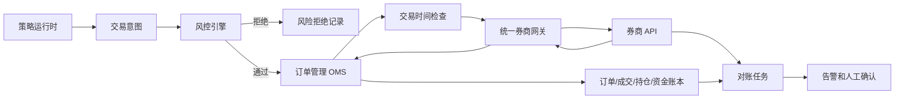

# 交易安全、风控、OMS 和券商网关规范

版本：v0.1  
状态：长期草案，M1 不实现真实交易  
最后更新：2026-05-15

## 0. 文档定位

本文档是 RobustQuant 交易安全边界的专项真相源。它定义后续 M2/M3 进入模拟盘和实盘前必须满足的规则。

重要结论：

- M1 不实现真实下单、真实撤单或真实条件单。
- M1 不建立真实账户、真实订单、真实成交、真实持仓和真实资金表。
- 本文档中的实盘相关状态机是后续设计基线，不是 M1 实现许可。

任何交易链路、风控规则、OMS 状态、券商适配器行为、账户模型或对账模型变更，都必须先更新本文档，并经用户确认后再编码。

## 1. 白话定位

策略只能表达“我想交易什么”。风控判断“能不能交易”。OMS 管理“订单现在处于什么状态”。券商网关负责“如何调用具体券商 API”。对账负责“本地记录和券商真实账户是否一致”。

这些层不能混在一起。混在一起的风险是：策略一出错就直接碰真实资金，或者网络一抖就重复下单。

## 2. 总体交易链路



## 3. 能力模式

券商适配器必须有能力模式：

| 模式 | 含义 | 允许能力 |
|---|---|---|
| `read_only` | 只读查询 | 交易开放 API：登录、账户、资金、持仓、订单、成交查询；基础报价 API / 报价推送 API：行情查询和订阅，两者走不同网关 |
| `simulated` | 模拟执行 | 不调用券商交易接口，只写模拟账本 |
| `live_guarded` | 受控实盘 | 在所有安全前置条件通过后，允许真实下单和撤单 |

默认必须是 `read_only`。

盈立 OpenAPI 申请所需源码截图属于券商申请材料事项，不作为 RobustQuant 开发交付，也不等同于上述三种运行模式。开发侧只按 uSmart 官方网页手册和本地 Markdown 转换稿做接口设计；任何真实下单、改单、撤单请求仍必须按真实交易能力处理。

即使用户配置了 `live_guarded`，真实交易仍需同时满足：

- `trading_enabled=true`。
- 账户在白名单中。
- 标的在白名单中。
- 当前是有效交易时间。
- 策略处于可交易状态。
- 全局暂停开关未触发。
- 风控通过。
- OMS 状态合法。
- 人工确认要求已满足。
- 对账状态正常。

任一条件不满足，都不能调用真实下单或撤单接口。

## 4. 交易意图

交易意图不是订单。它只是策略表达的目标。

建议字段：

| 字段 | 说明 |
|---|---|
| `intent_id` | 交易意图 ID |
| `strategy_id` | 策略来源 |
| `account_ref` | 账户引用，必须脱敏 |
| `market` | 市场 |
| `symbol` | 标的代码 |
| `name` | 标的名称 |
| `side` | 买入或卖出 |
| `target_position_pct` | 目标仓位，可为空 |
| `quantity` | 数量，可为空 |
| `limit_price` | 限价，可为空 |
| `reason` | 策略理由 |
| `created_at` | 创建时间 |
| `source_context` | 数据窗口、信号、事件上下文摘要 |

规则：

- 交易意图不能直接发给券商。
- 非交易时间产生的意图只能进入待审计状态。
- 快速风险退出产生的意图只能降低风险暴露，不能用于自动加仓。
- LLM 不能生成可直接执行的交易意图进入实盘链路。

## 5. 风控引擎

### 5.1 事前风控

真实下单前至少检查：

- 全局暂停开关。
- 策略启用状态。
- 账户白名单。
- 标的白名单。
- 禁止交易名单。
- 交易时间。
- 单笔订单金额上限：第一版普通订单 `500 USD`，美股碎股 `100 USD`。
- 单只股票最大持仓比例：第一版 `10%`。
- 最大持仓股票数量：第一版 `20`。
- 单日最大交易次数：第一版 `5`。
- 单日最大成交金额：第一版 `2000 USD`。
- 单日最大亏损阈值：第一版 `200 USD`，触发后进入风险处置模式。
- 可用资金或可卖数量。
- 价格偏离限制。
- 订单类型是否允许。
- 重大事件窗口限制。
- 对账状态是否正常。

### 5.2 风控结果

```text
approved
rejected
requires_manual_review
degraded
paused
```

规则：

- `rejected` 必须记录拒绝规则和输入摘要。
- `requires_manual_review` 不能自动转为通过。
- `paused` 表示系统级或策略级暂停。
- 风控通过结果必须有有效期，过期后下单要重新检查。

### 5.3 默认保守策略

未确认前默认：

- 不允许市价单。
- 不允许融资融券。
- 不允许杠杆。
- 不允许期权。
- 不允许做空。
- 不允许盘前盘后交易。
- 不允许券商侧条件单。

## 6. OMS 状态机

建议订单状态：

```text
created
  -> risk_rejected
  -> ready_to_submit
  -> submitting
  -> submitted
  -> accepted
  -> partial_filled
  -> filled
  -> cancel_requested
  -> cancelled
  -> broker_rejected
  -> failed
  -> unknown
```

关键规则：

- `created` 只是本地订单，尚未触达券商。
- `submitting` 表示正在调用券商接口。
- 调用超时、网络异常或券商返回无法判断时，进入 `unknown`。
- `unknown` 不能自动重试。
- `failed` 也不能自动补偿重试。
- 只有通过订单查询、成交查询、账户对账或人工确认后，才能从 `unknown` 转出。

## 7. 下单失败处理

下单失败不等于券商没收到。

因此：

- 不允许自动重试 `place_order`。
- 不允许因为 HTTP 超时就再发一笔同样订单。
- 不允许用幂等 key 之外的本地猜测判断券商状态。
- 必须记录请求时间、响应时间、错误、券商原始状态摘要和 `trace_id`。
- 必须通过 `query_order`、`query_trades` 和对账确认真实状态。

如果人工确认券商侧没有产生订单，用户可以重新发起新的交易意图。新的意图必须重新经过风控和 OMS。

## 8. 撤单规则

撤单也是真实交易行为。

撤单前检查：

- 订单是否属于当前账户。
- 本地状态是否允许撤单。
- 券商状态是否可能撤单。
- 当前是否在允许撤单的时间窗口。
- 是否需要人工确认。

撤单状态：

```text
cancel_requested
  -> cancelled
  -> cancel_rejected
  -> unknown
```

撤单超时或未知时，也不能自动重复撤单。应进入 `unknown`，查询券商状态后再处理。

## 9. 交易时间

任何真实下单、挂单、预埋单、条件单提交和撤单请求前，都必须通过交易时间检查。

非交易时间：

- 策略信号可以记录。
- 条件触发可以形成待审计交易意图。
- 可以发送告警。
- 不得向券商提交真实挂单。

下一个交易窗口开始后，不能直接沿用旧检查结果。必须重新读取行情、账户、持仓，重新执行风控，并检查 OMS 状态。

## 10. 条件单和高级订单

条件单、止盈止损、触发单、分批下单必须单独设计。

先要确认：

- 券商是否原生支持。
- 原生条件单是否会在非交易时间进入券商侧。
- 本地托管条件单在系统断线时如何处理。
- 重复触发如何防护。
- 触发后是否重新经过风控。
- 人工暂停后如何取消或冻结触发。

默认规则：

- 条件触发不能绕过风控和 OMS。
- 本地托管条件单在系统不确定状态下进入保守暂停。
- 非交易时间触发不能向券商挂单。
- 高级订单失败或未知状态不能自动重试。

## 11. 只读券商接入

只读接入允许：

- 登录或连接。
- 权限检查。
- 行情查询。
- 账户查询。
- 资金查询。
- 持仓查询。
- 订单查询。
- 成交查询。

只读接入禁止：

- 下单。
- 撤单。
- 提交条件单。
- 提交预埋单。
- 改变券商侧订单状态。
- 用交易接口做连通性探测。

即使是只读接入，也必须保护账户隐私。日志和报告不得输出完整账号、资金隐私或券商 token。

## 12. 对账和异常暂停

对账检查：

- 本地订单与券商订单是否一致。
- 本地成交与券商成交是否一致。
- 本地持仓与券商持仓是否一致。
- 本地资金与券商资金是否存在异常变化。
- 是否有本地未知但券商存在的订单或成交。

发现不一致时：

1. 暂停相关策略。
2. 记录异常事件。
3. 发出告警。
4. 查询券商订单和成交。
5. 提示人工确认。

在人工确认前，不得继续自动交易相关标的或账户。

## 13. 人工干预

后续 Web 控制台必须提供：

- 全局暂停。
- 策略暂停。
- 查看风险拒绝原因。
- 查看 unknown 订单。
- 撤单入口。
- 对账异常确认。

M1 如果做前端，只能只读展示，不提供真实交易干预入口。

## 14. 初始实盘标的策略

后续进入 M3 受控实盘时，第一批实盘验证优先使用价格较低、流动性好的宽基 ETF，而不是直接上个股。

原因：

- 宽基 ETF 分散度更高，单一公司事件风险较低。
- 流动性通常更好，滑点和被操纵风险相对更低。
- 价格较低时更适合用小资金验证订单链路、风控、OMS 和对账。
- ETF 适合先验证系统稳定性，而不是追求策略收益。

默认规则：

- 个股实盘后置。
- 模拟盘可以覆盖主题股票池、行业 ETF、宽基 ETF 和个股。
- 实盘 ETF 白名单必须人工确认。
- 即使是 ETF，也必须经过交易时间、风控、OMS、对账和人工开关。

## 15. 盈立 OpenAPI 官方资料边界

盈立 OpenAPI 官方网页手册解析按 [yingli-openapi-reference.md](../backend/clients/yingli-openapi-reference.md) 执行。`TradingGateway` 统一券商交易网关模块设计按 [broker-trading-gateway.md](../backend/trading/broker-trading-gateway.md) 执行。源码截图材料与开发无关，不进入 M1 任务。

边界：

- 可以解析官方网页手册和本地 Markdown 转换稿，形成接口事实清单。
- 可以在 UAT / sandbox 中验证，前提是券商明确该环境不会产生真实委托。
- 用户已确认项目策略：不自动把 UAT 当作可交易 sandbox；未确认 UAT 交易动作安全语义时，只允许真实登录和只读查询，不运行真实下单、改单、撤单。
- 不能为了源码截图材料编写或运行真实交易代码。
- 不能为了申请材料绕过风控、OMS 和人工确认规则。

## 16. 待确认问题

进入 M3 前必须确认：

- miniQMT 是否必须运行在 Windows。
- miniQMT 是否需要 GUI 客户端保持登录。
- miniQMT 自动重连和断线语义。
- miniQMT 下单、撤单、查询的官方错误码和状态码。
- 东北证券账户 API 权限范围。
- 盈立 OpenAPI 是否申请通过。
- 盈立 OpenAPI 官方网页手册中认证、endpoint、签名、订单类型、盘前盘后、频率限制、错误码和订单状态码的确认结果。
- 第一版实盘是否只允许限价单。
- 第一版风控阈值已按小额低频策略确定；正式实盘前可按账户规模重新校准。
- 亏损阈值触发后不硬抗，也不自动追损；进入 `risk_halt` 后禁止普通开仓和加仓，允许人工确认的 `risk_exit` / `risk_hedge` 止损、减仓、平仓、对冲或做空处置。
- 第一批实盘宽基 ETF 白名单。
- 盈立 OpenAPI 的 UAT 测试地址是否等同 sandbox / paper trading、是否保证交易动作不产生真实委托仍需券商确认；项目策略已确认：未确认前交易动作继续 dry-run。
