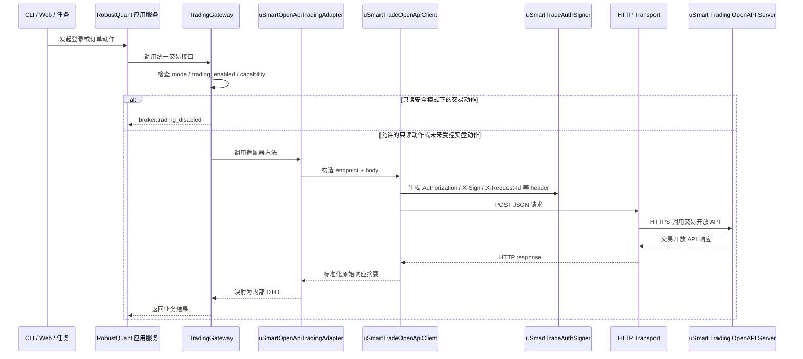

# uSmart / 盈立交易开放 API 调用栈全链路设计

版本：v0.1  
状态：设计草案，待用户确认  
最后更新：2026-05-21

## 0. 文档定位

本文档说明 RobustQuant 中“从本地入口到实际调用 uSmart / 盈立交易开放 API server”的全链路代码层设计。它回答券商审核最关心的几个问题：

- 从 CLI / Web / 本地服务到 uSmart / 盈立交易开放 API server，中间经过哪些层。
- 哪一层代码会发起到交易开放 API 的 HTTP 请求。
- 登录、下单、改单、撤单分别调用哪些 endpoint。
- 请求 header、签名、`X-Request-Id`、token 如何生成和传递。
- 交易动作如何先经过 `TradingGateway` 安全门控。
- 日志和错误处理如何避免泄露账号、密码、token、密钥和真实资金隐私。

本文档是 [broker-trading-gateway.md](../trading/broker-trading-gateway.md) 的下层专项设计。`TradingGateway` 是统一交易安全门面；本文档描述从本地入口、应用服务、`TradingGateway`、`uSmartOpenApiTradingAdapter`、交易开放 API client、交易开放 API signer、HTTP transport 到 uSmart / 盈立交易开放 API server 的完整调用栈。

机器可读 OpenAPI 对接草案见 [api/usmart-trade-openapi.draft.yaml](api/usmart-trade-openapi.draft.yaml)。该草案只用于字段对齐、契约测试和后续代码生成准备；其中 `x-pending-confirmation` 标记的字段不得视为已确认接口事实。

盈立官方资料实际拆成三套 API，本文档只覆盖第一套：

| API | 官方文档 | 协议 | RobustQuant 边界 |
|---|---|---|---|
| 交易开放 API | `交易開放API接口文檔V1.0-20201029(繁).pdf` | HTTPS POST | `TradingGateway`、`BrokerTradingAdapter`、uSmart 交易适配器 |
| 基础报价 API | `基礎報價開放API(繁)_20201029.pdf` | HTTPS POST | `QuotationDataGateway` 后续 HTTP 行情适配器 |
| 报价推送 API | `報價推送(繁)_20201029.pdf` | WebSocket | `QuotationDataGateway` 后续 WS 行情适配器 |

三套 API 的 base URL、签名原文、认证 header、限流、连接生命周期和错误处理都不能混用。

登录、下单、改单、撤单四条链路的接口级 API 手册、输入输出、上下调用层和当前设计缺口见 [usmart-openapi-api-manual.md](usmart-openapi-api-manual.md)。

## 1. 调用链路

RobustQuant 本地系统与 uSmart / 盈立交易开放 API 是 client-server 架构：



当前实现阶段：

- `TradingGateway` 已实现默认 `read_only` 交易阻断。
- `uSmartOpenApiTradingAdapter` 已保留登录、下单、改单、撤单方法外形；当前代码里的请求体仍是 dry-run 骨架，尚未按 PDF 字段完整映射。
- 交易开放 API client 当前为 dry-run 外壳，不发真实 HTTP。
- 交易开放 API signer、真实 HTTP transport、token 生命周期管理尚未实现。
- 本文 2026-05-19 后续章节补全的是目标设计，不代表当前代码已经具备真实 OpenAPI 出网能力。

### 1.1 全链路分层总览

| 层级 | 模块 | 作用 | 是否接触 uSmart 协议字段 | 是否允许真实交易决策 |
|---|---|---|---|---|
| L0 | CLI / Web / 定时任务 | 用户或任务入口，发起登录、查询、订单动作 | 否 | 否 |
| L1 | FastAPI Router / CLI command | 参数解析、权限检查、生成 `trace_id` | 否 | 否 |
| L2 | Application Service | 编排业务用例，调用 OMS、风控或只读查询服务 | 否 | 否 |
| L3 | OMS / Risk | 订单生命周期、风控检查、交易时间和白名单检查 | 否 | 是，但只决定内部订单是否可提交 |
| L4 | `TradingGateway` | 统一交易安全门面，执行 `mode`、`trading_enabled`、capability 阻断 | 否 | 是，真实交易出网前最后一道门 |
| L5 | `BrokerTradingAdapter` | 统一券商适配器基类 | 否 | 否 |
| L6 | `uSmartOpenApiTradingAdapter` | 内部 DTO 与交易开放 API endpoint/body 字段转换 | 是 | 否 |
| L7 | 交易开放 API client | 生成 JSON、调用交易 API signer、调用 HTTP transport、解析响应 | 是 | 否 |
| L8 | 交易开放 API signer | 生成交易 API 的 `X-Sign`、`X-Request-Id`、认证 header | 是 | 否 |
| L9 | `uSmartHttpTransport` | 真实 HTTPS POST，处理 HTTP 状态和 timeout | 是 | 否 |
| L10 | uSmart / 盈立交易开放 API Server | 券商服务端，处理登录、查询、委托、改单、撤单 | 是 | 券商侧执行 |

关键约束：

- L0 到 L3 不允许出现 uSmart 私有字段，例如 `entrustId`、`entrustProp`、`exchangeType`。
- L6 以后才允许出现 uSmart endpoint 和字段映射。
- 真实交易动作必须在 L4 被 `TradingGateway` 允许后，才可进入 L6。
- 当前 `read_only` 模式下，`place_order`、`modify_order`、`cancel_order` 在 L4 直接阻断，不会进入 L6。

### 1.2 四条核心链路

登录链路：

```text
CLI/FastAPI
  -> ApplicationService.connect_broker
  -> TradingGateway.connect
  -> uSmartOpenApiTradingAdapter.connect
  -> uSmartTradeOpenApiClient.post('/user-server/open-api/login')
  -> uSmartTradeAuthSigner.build_headers
  -> uSmartHttpTransport.post_json
  -> uSmart / 盈立交易开放 API Server
```

只读查询链路：

```text
CLI/FastAPI
  -> QueryService
  -> TradingGateway.get_positions / query_order / query_trades
  -> uSmartOpenApiTradingAdapter
  -> uSmartTradeOpenApiClient
  -> uSmart / 盈立交易开放 API Server
```

只读安全模式下的交易阻断链路：

```text
OMS
  -> TradingGateway.place_order / modify_order / cancel_order
  -> CapabilityGuard.ensure_allowed
  -> broker.trading_disabled
  -> 审计事件 usmart.place_order_blocked / modify_order_blocked / cancel_order_blocked
```

未来受控实盘链路：

```text
OMS
  -> 风控通过 + 交易时间通过 + 白名单通过 + 人工确认通过
  -> TradingGateway 允许
  -> uSmartOpenApiTradingAdapter
  -> uSmartTradeOpenApiClient
  -> uSmartTradeAuthSigner
  -> uSmartHttpTransport
  -> uSmart / 盈立交易开放 API Server
  -> 订单回报映射
  -> OMS 状态更新
  -> 对账任务复核
```

### 1.3 请求与响应追踪

全链路必须携带以下追踪字段：

| 字段 | 生成层 | 传递范围 | 说明 |
|---|---|---|---|
| `trace_id` | L1 | L1-L9 | 一次用户操作或任务链路 |
| `intent_id` | 策略/人工动作 | L2-L4 | 交易意图 ID，登录和只读查询可为空 |
| `order_id` | OMS | L3-L9 | 本地订单 ID |
| `risk_check_id` | Risk | L3-L4 | 风控结果 ID |
| `request_id` | Gateway / Client | L4-L10 | 对应 `X-Request-Id` |
| `broker_order_id` | uSmart server | L10-L3 | 券商订单号，日志中必须脱敏 |

返回路径必须从下往上逐层收敛：

```text
交易开放 API 原始响应
  -> uSmartTradeOpenApiResponse 脱敏摘要
  -> BrokerOrderAck / BrokerModifyAck / BrokerCancelAck
  -> OMS 状态
  -> ApplicationService 响应 DTO
  -> CLI/FastAPI 用户可见结果
```

禁止把 uSmart 原始响应直接返回给 CLI、Web 或报告。

### 1.4 本地 server 与券商 server 的关系

RobustQuant 后续可能有自己的 FastAPI server。它和 uSmart / 盈立交易开放 API server 是两个不同角色：

| Server | 归属 | 作用 |
|---|---|---|
| RobustQuant FastAPI server | 本地系统 | 给 Web/CLI/任务提供本地接口，调用 `TradingGateway` |
| uSmart / 盈立交易开放 API server | 券商 | 接收交易开放 API HTTPS 请求，处理登录、查询、委托、改单、撤单 |

本地 FastAPI server 不直接拼接 uSmart 请求，也不保存私钥和 token 原文。真正与交易开放 API server 通信的是 `uSmartTradeOpenApiClient` + `uSmartHttpTransport`。

## 2. 代码分层

建议目标代码结构：

```text
src/
  rq_core/
    broker_kernel/
      gateway.py                    TradingGateway：统一交易安全门面
      contracts.py                  统一 DTO、枚举、适配器基类
      capability.py                 交易能力和模式检查
      errors.py                     统一异常
      usmart/
        adapter.py                  uSmartOpenApiTradingAdapter
        client.py                   交易开放 API client
        auth.py                     交易开放 API signer
        transport.py                uSmartHttpTransport
        endpoints.py                endpoint 常量
        mapper.py                   交易开放 API 响应与内部 DTO 映射
        rate_limit.py               交易开放 API 频率限制
    quotation_kernel/
      usmart_http/                  基础报价 API HTTP 适配器，后续实现
      usmart_ws/                    报价推送 API WebSocket 适配器，后续实现
```

职责边界：

| 模块 | 职责 | 禁止事项 |
|---|---|---|
| `TradingGateway` | 检查能力模式、交易开关、调用来源，决定是否允许触达适配器 | 不拼接 uSmart 字段，不保存 token |
| `uSmartOpenApiTradingAdapter` | 将内部 DTO 转为交易开放 API endpoint 和 body | 不绕过 `TradingGateway`，不自行决定真实交易是否允许 |
| 交易开放 API client | 组织交易 API header、签名、HTTP POST、响应解析 | 不包含策略、风控、OMS 逻辑；不处理基础报价或报价推送 |
| 交易开放 API signer | 生成交易 API 的 `X-Sign`、`X-Request-Id`、时间戳、认证 header | 不把私钥、密码、token 写入日志；不复用基础报价签名规则 |
| `uSmartHttpTransport` | 发起 HTTPS 请求、处理 timeout 和 HTTP 状态 | 不对下单/改单/撤单做自动重试 |
| `uSmartMapper` | 映射状态码、错误码、订单号和响应字段 | 不猜测 PDF 未说明的状态 |

## 3. Endpoint 范围

第一版只覆盖券商申请、只读联调、对账和交易网关最小闭环需要的接口。申请材料截图只使用 dry-run / offline request builder，不做真实登录；只读联调可在用户显式授权后触达登录和查询接口，但不允许下单、改单、撤单。字段以官方 PDF 为准；本文只记录当前设计映射。

### 3.1 交易 API endpoint 分组

| 能力 | 方法 | endpoint | 当前允许触达 OpenAPI |
|---|---|---|---|
| 渠道密码登录 | POST | `/user-server/open-api/login` | 申请材料只 dry-run；只读联调阶段可显式允许 |
| 获取手机验证码 | POST | `/user-server/open-api/send-phone-captcha` | 申请材料只 dry-run；短信登录验证码 `type=106`，避免自动化滥用 |
| 渠道验证码登录 | POST | `/user-server/open-api/loginCaptcha` | 申请材料只 dry-run；只读联调阶段可作为备选登录方式 |
| 获取交易解锁状态 | POST | `/user-server/open-api/get-trade-status` | 只读联调阶段可允许 |
| 普通下单 | POST | `/stock-order-server/open-api/entrust-order` | 默认禁止，需 `live_guarded` |
| 委托改单 | POST | `/stock-order-server/open-api/modify-order` | 默认禁止，需 `live_guarded` |
| 委托撤单 | POST | `/stock-order-server/open-api/modify-order` | 默认禁止，需 `live_guarded` |
| 碎股下单 | POST | `/stock-order-server/open-api/odd-entrust` | 默认禁止，需 `live_guarded` + 美股碎股能力 |
| 碎股撤单 | POST | `/stock-order-server/open-api/odd-modify` | 默认禁止，需 `live_guarded` + 美股碎股能力 |
| 改单范围查询 | POST | `/stock-order-server/open-api/modified-range` | 只读联调扩展；不进第一批只读联调 |
| 最大可买可卖数量 | POST | `/stock-order-server/open-api/trade-quantity` | 只读联调扩展；不进第一批只读联调 |
| 今日订单查询 | POST | `/stock-order-server/open-api/today-entrust` | 只读联调阶段可允许 |
| 历史订单查询 | POST | `/stock-order-server/open-api/his-entrust` | 只读联调阶段可允许 |
| 订单明细查询 | POST | `/stock-order-server/open-api/order-detail` | 只读联调阶段可允许 |
| 成交流水查询 | POST | `/stock-order-server/open-api/stock-record` | 只读联调阶段可允许 |
| 持仓查询 | POST | `/stock-order-server/open-api/stock-holding` | 只读联调阶段可允许 |
| 资产查询 | POST | `/stock-order-server/open-api/stock-asset` | 只读联调阶段可允许 |
| 客户股票资产批量查询 | POST | `/stock-order-server/open-api/stock-asset-list` | 第一版不启用；只读联调先限定单账户 |
| 聚合资产查询 | POST | `/aggregation-server/open-api/user-asset-aggregation/v1` | 第一版不启用；只读联调先限定单账户 |
| 查询汇率 | POST | `/stock-capital-server/open-api/currency-exchange-info` | 第一版可作为多币种估值辅助，不进入交易决策硬依赖 |

第一批只读联调只开放：真实登录、资产查询、持仓查询、今日订单、历史订单、订单明细、成交流水。其他只读接口后置。

不进入第一版：

- 修改、重置登录密码或交易密码。
- 交易解锁 `trade-login`。
- IPO 申购和 IPO 改单；港股新股暗盘交易若通过普通下单接口和 `sessionType=3` 处理，不属于 IPO 申购接口，但第一批只保留设计。
- 美股盘前盘后交易。
- 条件单、止盈止损、触发单。

`trade-login` 不是下单接口，但可能改变账户交易可用状态，因此不作为只读联调接口。

### 3.2 非本文档范围：基础报价 API 与报价推送 API

以下接口来自另外两套官方 API，不挂在 `TradingGateway` 上，也不由交易开放 API client、signer 或 mapper 承接。它们由 `QuotationDataGateway` 和后续 `uSmartQuotationHttpAdapter` / `uSmartQuotationWsAdapter` 承接。行情只读联调允许独立启用，但行情失败、延迟或权限不足时，未来实盘交易必须进入降级或暂停。

| 能力 | 方法 | endpoint / 入口 | 第一版用途 |
|---|---|---|---|
| 市场状态 | POST | `https://open-hz.yxzq.com/quotes-openservice/api/v1/marketstate` | 交易时间和市场状态参考 |
| 基础信息 | POST | `https://open-hz.yxzq.com/quotes-openservice/api/v1/basicinfo` | 标的信息补充 |
| 即时报价 | POST | `https://open-hz.yxzq.com/quotes-openservice/api/v1/realtime` | 只读行情快照 |
| 分时 | POST | `https://open-hz.yxzq.com/quotes-openservice/api/v1/timeline` | 只读行情序列 |
| K 线 | POST | `https://open-hz.yxzq.com/quotes-openservice/api/v1/kline` | 研究和校验辅助 |
| 逐笔 | POST | `https://open-hz.yxzq.com/quotes-openservice/api/v1/tick` | 第一版暂不作为交易依据 |
| 买卖盘 | POST | `https://open-hz.yxzq.com/quotes-openservice/api/v1/orderbook` | 只读盘口 |
| 行情推送 | WS | `wss://open-hz.yxzq.com/wss/v1` | 报价推送 API，`auth`、`sub`、`unsub`、`update`、`ping`、`pong` |

报价推送 API 第一版只允许恢复行情订阅，不允许在重连、订阅恢复或 `update` 回调中触发任何交易动作。

## 4. 交易开放 API 请求 header 设计

根据交易开放 API PDF 初步解析，交易接口请求 header 包含：

| Header | 来源 | 说明 |
|---|---|---|
| `Authorization` | 登录后 token | 登录接口以外的交易和查询接口需要 |
| `Content-Type` | 固定 | `application/json; charset=utf-8` |
| `X-Lang` | 配置 | 语言类别，例如 `1` 表示简体 |
| `X-Channel` | uSmart 分配 | 渠道 ID |
| `X-Time` | 本地生成 | Unix epoch milliseconds，作为字符串写入 header |
| `X-Dt` | 配置 | 设备类型数字字符串，默认 `"4"` 表示 Windows |
| `X-Type` | 配置 | APP 类别，默认 `"1"` 表示大陆版 |
| `X-Request-Id` | 本地生成 | 幂等防重 ID |
| `X-Sign` | 交易开放 API signer 生成 | 对 body 内容签名/加密后的值 |

设计规则：

- `X-Request-Id` 必须由本地生成并写入订单审计记录。
- `X-Sign` 只由交易开放 API signer 生成，其他模块不接触私钥。
- `Authorization` token 只保存在内存会话中，默认不落库。
- 日志只记录 header key 列表、`X-Request-Id` 和脱敏 token 摘要，不记录完整 token 或签名。
- `X-Type` 按官方说明为 APP 类别，`"1"` 表示大陆版、`"2"` 表示港版；本项目默认大陆版。
- `Content-Type` 统一由 client 注入，调用方不允许手工传入，避免签名 body 和实际 body 不一致。
- 同一请求的 header、body_json、endpoint 和 request_id 必须作为不可变对象进入签名流程，签名后不得再修改 body。

`X-Dt` 设备类型按官方说明中的 `t1`、`t2`、`t3`、`t4`、`t5` 语义理解，但 header 示例使用数字值，因此代码中保存为数字字符串：

| `X-Dt` | 设备类型 |
|---|---|
| `"1"` | Android |
| `"2"` | iOS |
| `"3"` | 其他 |
| `"4"` | Windows |
| `"5"` | Mac |

默认值为 `"4"`，匹配本地 Windows 开发和申请材料截图环境；如盈立后续要求 `t4` 字面值，可通过配置切换。

`X-Type` APP 类别：

| `X-Type` | APP 类别 |
|---|---|
| `"1"` | 大陆版 |
| `"2"` | 港版 |

本项目默认 `"1"`，即大陆版。

### 4.1 请求 ID 策略

PDF 中存在长度描述不一致：概述中 `X-Request-Id` 描述为 19 位数字，登录等接口章节又出现 30 位描述；下单 body 的 `serialNo` 明确为最长 19 位。当前实现结论：`X-Request-Id` 按 30 位可配置字符串处理，不硬编码；下单 body 的 `serialNo` 严格按最长 19 位处理。

| 场景 | 字段 | 设计策略 |
|---|---|---|
| HTTP header 幂等 | `X-Request-Id` | 由 `RequestIdGenerator` 生成，按 30 位可配置字符串校验 |
| 下单 body 流水 | `serialNo` | 与本地 `broker_request_id` 建立映射，按 PDF 的最长 19 位约束处理 |
| 本地 OMS 订单 | `order_id` | RobustQuant 内部 ID，不直接暴露给券商 |
| 链路追踪 | `trace_id` | 可为 UUID/ULID，不参与券商幂等 |

映射关系：

```text
order_id -> broker_request_id -> X-Request-Id
broker_request_id -> serialNo
broker_order_id <- entrustId
```

规则：

- `broker_request_id` 必须在调用券商前持久化到审计记录；如果持久化失败，不允许触达 OpenAPI。
- 只读查询也要携带 `request_id`，但查询 request_id 不得复用交易 request_id。
- 交易请求超时后，不自动复用同一个 request_id 重发，也不生成新 request_id 补发。
- 如果券商对重复 `X-Request-Id` 的返回语义不清楚，统一标记为 `unknown_by_pdf`，不能依赖它做自动补偿。

## 5. 交易开放 API 签名与认证设计

交易开放 API PDF 初步信息：

- 协议：HTTPS。
- 签名 header：`X-Sign`。
- 签名算法描述：`MD5withRSA`。
- 交易开放 API 概述描述签名内容为 Body 内容。
- 基础报价 API 描述签名原文为 `Authorization`、`X-Channel`、`X-Lang`、`X-Request-Id`、`X-Time` 头字段与 body 内容按序拼接；这是另一套 API，不在本文档的交易 signer 中实现。
- 编码方式：`safeBase64` / URL-safe Base64；默认保留 `=` padding，并通过配置允许切换。
- 幂等字段：`X-Request-Id`。
- 访问控制：IP 白名单。

因此第一版不能把交易开放 API、基础报价 API 和报价推送 API 硬编码成同一个 signer。本文档只定义交易开放 API signer：

| 签名器 | 适用范围 | 输入 |
|---|---|---|
| `uSmartTradeAuthSigner` | 交易开放 API | 稳定 JSON body，不拼接 header |
| `uSmartQuoteHttpAuthSigner` | 基础报价 API | 不在本文档实现；后续按基础报价 PDF 独立设计 |
| `uSmartQuoteWsAuthSigner` | 报价推送 API | 不在本文档实现；后续按报价推送 PDF 独立设计 |

目标接口：

```python
class uSmartTradeAuthSigner:
    def build_headers(
        self,
        *,
        endpoint: str,
        body_json: str,
        request_id: str,
        token: str | None,
        now_ms: int,
    ) -> dict[str, str]:
        ...
```

处理步骤：

1. 将 body 使用稳定 JSON 序列化，保证签名前后的 body 字节一致。
2. 生成或接收 `X-Request-Id`。
3. 按交易开放 API 规则生成签名前原文：只使用稳定 JSON body，不拼接 header 字段。
4. 对交易开放 API 签名结果做 URL-safe Base64 编码，写入 `X-Sign`。
5. 组装 `Authorization`、`X-Lang`、`X-Channel`、`X-Time`、`X-Dt`、`X-Request-Id`、`X-Sign`。

隐私字段加密与签名分开处理：

- 官方手册同时出现“验签测试公开密钥”和“隐私资料加密测试公开密钥”，说明 `X-Sign` 渠道签名密钥材料与隐私资料加密密钥材料是两套，不得混用。
- 登录手机号、登录密码、交易密码等字段使用 PDF 所说的“隐私资料加密”密钥材料，与 `X-Sign` 渠道签名私钥不是同一件事。
- 手册对隐私资料加密方向存在“公开密钥”和“私密金钥”两种表述；实现中必须把 key role 和 padding/transform 做成配置。默认按常见模式使用隐私资料加密公钥加密，若盈立最终要求私钥变换，可通过配置切换。
- `uSmartTradeSensitiveFieldEncryptor` 负责加密 `phoneNumber`、`password`、交易密码等交易开放 API 字段。
- `uSmartTradeAuthSigner` 只负责交易开放 API 请求签名，不接收明文密码和手机号。
- 明文敏感字段只能从本地密钥管理层读出后在内存中短暂存在，禁止进入 DTO、日志、异常消息和测试 fixture。

待确认项：

- `X-Request-Id` 重复请求返回语义。
- 隐私资料加密最终使用公钥加密还是私钥变换，以及 padding 模式。

## 6. 交易开放 API Client 设计

目标接口：

```python
class uSmartTradeOpenApiClient:
    def post(
        self,
        endpoint: str,
        body: dict[str, Any],
        *,
        trace_id: str,
        request_id: str,
        token_required: bool,
        operation_kind: Literal["readonly", "trade_action"],
    ) -> uSmartTradeOpenApiResponse:
        ...
```

内部流程：

1. 校验 endpoint 是否在白名单常量中。
2. 生成稳定 body JSON。
3. 调用 `uSmartTradeAuthSigner.build_headers(...)`。
4. 通过 `uSmartHttpTransport.post_json(...)` 发起 HTTPS 请求。
5. 解析 HTTP 状态码和 JSON 响应。
6. 生成脱敏响应摘要。
7. 返回 `uSmartTradeOpenApiResponse` 给 adapter。

重试边界：

- `operation_kind="readonly"` 可以按 `RateLimiter` 和退避策略有限重试。
- `operation_kind="trade_action"` 不允许由 client 自动重试；timeout、连接中断、未知响应统一向上抛出可审计错误，由 OMS 进入 `unknown`。
- client 只能重试传输层未出网的只读请求；是否“未出网”不能确定时，按已可能触达券商处理。

`uSmartTradeOpenApiResponse` 建议字段：

| 字段 | 说明 |
|---|---|
| `endpoint` | OpenAPI endpoint |
| `http_status` | HTTP 状态码 |
| `request_id` | `X-Request-Id` |
| `broker_code` | 券商业务返回码 |
| `broker_message` | 脱敏后的返回消息 |
| `data` | 脱敏或必要字段后的业务数据 |
| `raw_hash` | 原始响应哈希，用于审计对照 |
| `duration_ms` | 请求耗时 |

日志不得保存完整 `raw response`。

## 7. 登录 API 设计

交易开放 API 有两种登录方式。申请材料截图只展示 dry-run 请求构造和调用栈，不做真实登录；真实登录只允许在只读联调配置显式开启后发生。

1. 渠道密码登录：手机 + 登录密码 + 渠道，endpoint 为 `/user-server/open-api/login`。
2. 渠道验证码登录：先调用 `/user-server/open-api/send-phone-captcha` 获取手机验证码，短信登录验证码类型为 `type=106`；再用手机 + 验证码 + 渠道调用 `/user-server/open-api/loginCaptcha`。

统一适配器方法：

```python
class uSmartOpenApiTradingAdapter:
    def connect(self, account_ref: AccountRef | None = None) -> BrokerSession:
        ...
```

密码登录 OpenAPI：

```text
POST /user-server/open-api/login
```

密码登录请求 body 设计：

| 字段 | 来源 | 说明 |
|---|---|---|
| `areaCode` | 配置 | 区号 |
| `phoneNumber` | 本地密钥配置 | PDF 登录接口字段，需使用隐私资料加密密钥材料处理，默认按公钥加密 |
| `password` | 本地密钥配置 | RSA 加密后的登录密码 |

登录手机号字段名确认使用 `phoneNumber`，不使用 `mobile`、`phone` 或 `telephone`。

获取验证码请求 body 设计：

| 字段 | 来源 | 说明 |
|---|---|---|
| `areaCode` | 配置 | 区号 |
| `phoneNumber` | 本地密钥配置 | 使用隐私资料加密密钥材料处理 |
| `type` | 固定值 | `106` 表示短信登录验证码 |

验证码登录请求 body 设计：

| 字段 | 来源 | 说明 |
|---|---|---|
| `areaCode` | 配置 | 区号 |
| `phoneNumber` | 本地密钥配置 | 使用隐私资料加密密钥材料处理 |
| `captcha` | 用户输入 / 人工流程 | 手机验证码，不写日志 |

`loginCaptcha` 参数表只列出 `areaCode`、`captcha`、`phoneNumber` 三个 body 字段；请求 body 示例里出现了 `modifyUserConfigParam`。第一版不主动发送 `modifyUserConfigParam`，除非盈立确认该示例字段在当前渠道必填。

响应处理：

- 登录响应不是 `data.token` 包装结构；手册示例为顶层对象直接包含 `token`、`expiration`、`tradePassword`、`openedAccount` 等字段。
- 成功后从顶层字段提取 `token`。
- 从顶层字段读取 token 过期时间 `expiration`，但不记录 token 原文。
- 读取 `tradePassword`、`openedAccount`、`extendStatusBit` 作为权限和账户状态摘要；仅保存脱敏布尔值或摘要，不保存完整用户资料。
- token 存入内存 `uSmartSession`。
- 返回 `BrokerSession`，其中只包含脱敏 `session_id_masked`。
- 日志不记录手机号、密码、token 原文。

只读安全边界：

- 登录可作为只读联调的一部分。
- 登录成功不代表允许交易。
- 登录后仍不能调用下单、改单、撤单，除非 `TradingGateway` 进入受控实盘模式并满足全部风控条件。

## 8. 下单 API 设计

方法：

```python
class uSmartOpenApiTradingAdapter:
    def place_order(self, request: BrokerOrderRequest) -> BrokerOrderAck:
        ...
```

OpenAPI：

```text
POST /stock-order-server/open-api/entrust-order
```

内部字段映射：

| 内部字段 | uSmart body 字段 | 说明 |
|---|---|---|
| `request.request_id` 派生的 19 位流水 | `serialNo` | 下单 body 流水号，最长 19 位；与 `X-Request-Id` 的关系需记录审计映射 |
| `request.quantity` | `entrustAmount` | 委托数量 |
| `request.limit_price` | `entrustPrice` | 委托价格，竞价单传 0 |
| `request.price_type` + `market` | `entrustProp` | 委托属性，枚举见下表 |
| `request.side` | `entrustType` | 0 买，1 卖 |
| `request.market` | `exchangeType` | 0 港股，5 美股，6 沪港通，7 深港通 |
| `request.symbol` | `stockCode` | 股票代码 |
| `request.name` | `stockName` | 可选 |
| 交易密码 | `password` | 可选，是否需要以官方要求为准 |
| 是否强制委托 | `forceEntrustFlag` | 默认不启用 |
| 交易阶段 | `sessionType` | 默认不传或正常交易 |

市场映射：

| 内部市场 | `exchangeType` | 第一版策略 |
|---|---|---|
| `HK` | `0` | 可作为港股只读和未来受控交易候选 |
| `US` | `5` | 主要交易市场，可作为美股只读和未来受控交易候选 |
| `SH_HK_CONNECT` | `6` | 第一版不启用真实交易 |
| `SZ_HK_CONNECT` | `7` | 第一版不启用真实交易 |
| `ALL` | `100` | 仅查询接口使用，不允许下单 |

订单方向映射：

| 内部方向 | `entrustType` |
|---|---|
| `buy` | `0` |
| `sell` | `1` |

委托属性映射：

| `entrustProp` | PDF 含义 | 第一版策略 |
|---|---|---|
| `0` | 美股限价单 / 暗盘委托 limit order | 美股主要限价类型候选；港股暗盘仅保留设计 |
| `d` | 竞价单 | 默认不启用 |
| `e` | 增强限价单 | 第一批不启用；后续港股普通交易候选 |
| `g` | 竞价限价单 | 默认不启用 |
| `h` | 港股限价单 | 在查询响应字段中出现；第一版下单暂不主动发送，需确认与 `e` 的适用差异 |
| `j` | 特殊限价单 | 默认不启用 |
| `u` | 碎股单 | 仅美股碎股候选；港股碎股不做 |

交易阶段 `sessionType`：

| `sessionType` | PDF 含义 | 第一版策略 |
|---|---|---|
| `0` / 不传 | 正常订单交易，默认值 | 第一批美股盘中交易候选 |
| `1` | 盘前交易 | 不进第一批实现 |
| `2` | 盘后交易 | 不进第一批实现 |
| `3` | 暗盘交易 | 港股新股暗盘仅保留设计，不进第一批实现 |

`OrderType.MARKET`、`forceEntrustFlag=true`、未建模的高级订单默认拒绝。第一批交易实现目标是美股盘中限价和美股碎股；港股新股暗盘只保留设计，不实现真实请求构造。

响应处理目标：

| uSmart 响应字段 | 内部字段 | 说明 |
|---|---|---|
| `code` | `broker_response_code` | 业务状态码 |
| `msg` | `broker_message` | 脱敏后消息 |
| `data.entrustId` | `broker_order_id` | PDF 说明可用于查询订单、修改订单、取消订单 |
| `data.status` | `broker_status_raw` | 普通订单状态码，枚举见 12.1 |
| `data.statusName` | `broker_status_name_raw` | 状态名摘要，日志需脱敏 |

- `code=0` 且存在 `data.entrustId` 时，才能认为券商返回了可追踪订单号。
- `code=0` 但缺少 `entrustId` 时，进入 `unknown_response`，内部状态为 `unknown`。
- HTTP 2xx 不等于业务成功，必须同时检查业务 `code`。

安全规则：

- 默认 `read_only` 下，`TradingGateway.place_order` 直接返回/抛出 `broker.trading_disabled`，不会触达本方法。
- 未来即使允许调用，也必须由 OMS 发起，并携带 `order_id`、`risk_check_id`、`trace_id`。
- 下单 HTTP timeout、网络异常或未知响应时，内部订单进入 `unknown`，不得自动重试。
- 默认不启用 `forceEntrustFlag`。
- 美股为主要交易市场；第一批只做美股盘中交易和美股碎股。港股暗盘只保留设计，当前不实现真实请求构造；当前 `read_only` 阶段只构造 dry-run 请求，不真实提交。

## 9. 改单 API 设计

方法：

```python
class uSmartOpenApiTradingAdapter:
    def modify_order(self, request: BrokerModifyRequest) -> BrokerModifyAck:
        ...
```

OpenAPI：

```text
POST /stock-order-server/open-api/modify-order
```

MinerU 重新转换后的交易 API 手册确认普通股票委托 `actionType=1` 表示改单。IPO 改撤单接口的 `actionType` 枚举不同，不能复用这里的映射。

内部字段映射：

| 内部字段 | uSmart body 字段 | 说明 |
|---|---|---|
| 固定值 | `actionType=1` | 改单 |
| `request.new_quantity` | `entrustAmount` | 新委托数量 |
| `request.broker_order_id` | `entrustId` | 原委托 ID |
| `request.new_limit_price` | `entrustPrice` | 新委托价格 |
| 交易密码 | `password` | 可选，是否需要以官方要求为准 |
| 是否强制委托 | `forceEntrustFlag` | 默认不启用 |

响应处理目标：

| uSmart 响应字段 | 内部字段 | 说明 |
|---|---|---|
| `code` | `broker_response_code` | 业务状态码 |
| `msg` | `broker_message` | 脱敏后消息 |
| `data.entrustId` | `broker_apply_id` | PDF 回应参数说明为“申请编号”；不得覆盖原始 `broker_order_id` |
| `data.status` | `broker_status_raw` | 普通订单状态码，`5` 表示等待改单 |
| `data.statusName` | `broker_status_name_raw` | 状态名摘要 |

改单前置校验：

- 如果接口可用，应先调用 `/stock-order-server/open-api/modified-range` 获取可改数量上下限。
- `new_quantity` 必须在可改范围内，`new_limit_price` 必须通过价格偏离和订单类型检查。
- 如果 `modified-range` 查询失败，不得继续提交真实改单。

安全规则：

- 默认 `read_only` 下，`TradingGateway.modify_order` 阻断，不触达 OpenAPI。
- 改单在 OMS 风险模型中按 cancel + replace 风险处理，即使券商接口名为 modify；改单后必须通过查询和对账确认最终订单状态。
- 改单 timeout 或未知响应进入 `unknown`，不得自动再次改单。
- 改单前必须确认本地 OMS 状态允许修改。

## 10. 撤单 API 设计

方法：

```python
class uSmartOpenApiTradingAdapter:
    def cancel_order(self, request: BrokerCancelRequest) -> BrokerCancelAck:
        ...
```

OpenAPI：

```text
POST /stock-order-server/open-api/modify-order
```

MinerU 重新转换后的交易 API 手册确认普通股票委托 `actionType=0` 表示撤单。IPO 改撤单接口的 `actionType` 枚举不同，不能复用这里的映射。

内部字段映射：

| 内部字段 | uSmart body 字段 | 说明 |
|---|---|---|
| 固定值 | `actionType=0` | 撤单 |
| 固定值 | `entrustAmount=0` | 撤单时传 0 |
| `request.broker_order_id` | `entrustId` | 原委托 ID |
| 固定值 | `entrustPrice=0` | 撤单时传 0 |
| 交易密码 | `password` | 可选，是否需要以官方要求为准 |

响应处理目标：

| uSmart 响应字段 | 内部字段 | 说明 |
|---|---|---|
| `code` | `broker_response_code` | 业务状态码 |
| `msg` | `broker_message` | 脱敏后消息 |
| `data.entrustId` | `broker_apply_id` | PDF 回应参数说明为“申请编号”；不得覆盖原始 `broker_order_id` |
| `data.status` | `broker_status_raw` | 普通订单状态码，撤单申请后通常需查询确认最终状态 |
| `data.statusName` | `broker_status_name_raw` | 状态名摘要 |

安全规则：

- 默认 `read_only` 下，`TradingGateway.cancel_order` 阻断，不触达 OpenAPI。
- 撤单也属于真实交易行为，必须经过 OMS 状态检查。
- 撤单 timeout 或未知响应进入 `unknown`，不得自动重复撤单。
- 必须通过订单查询或对账确认最终状态。

## 11. 只读查询 API 设计

只读查询允许用于账户观察、风控辅助和对账，但仍需脱敏。

| 内部方法 | endpoint | 用途 |
|---|---|---|
| `query_today_orders` | `/stock-order-server/open-api/today-entrust` | 今日订单 |
| `query_history_orders` | `/stock-order-server/open-api/his-entrust` | 历史订单 |
| `query_order_detail` | `/stock-order-server/open-api/order-detail` | 订单明细 |
| `query_trades` | `/stock-order-server/open-api/stock-record` | 成交流水 |
| `get_positions` | `/stock-order-server/open-api/stock-holding` | 持仓 |
| `get_account` / `get_cash` | `/stock-order-server/open-api/stock-asset` | 资产和资金 |
| `query_trade_quantity` | `/stock-order-server/open-api/trade-quantity` | 最大可买可卖数量，风控辅助 |
| `query_modify_range` | `/stock-order-server/open-api/modified-range` | 改单范围，改单前校验 |

统一查询 DTO：

| DTO | 核心字段 | 说明 |
|---|---|---|
| `QueryOrderRequest` | `account_ref`、`market`、`broker_order_id`、`request_id`、`trace_id`、`page_num`、`page_size`、`start_date`、`end_date` | 查询今日、历史或单笔订单 |
| `QueryTradeRequest` | `account_ref`、`market`、`symbol`、`broker_order_id`、`start_date`、`end_date`、`page_num`、`page_size`、`request_id`、`trace_id` | 查询成交流水 |
| `PositionSnapshot` | `account_ref`、`market`、`symbol`、`quantity`、`available_quantity`、`frozen_quantity`、`odd_quantity`、`last_price`、`cost_price` | 持仓快照 |
| `CashSnapshot` | `account_ref`、`market`、`currency`、`asset`、`available_cash`、`withdrawable_cash`、`frozen_cash`、`on_way_cash` | 资金快照 |
| `BrokerOrderSnapshot` | `broker_order_id`、`market`、`symbol`、`side`、`quantity`、`filled_quantity`、`limit_price`、`avg_fill_price`、`status`、`broker_status_raw`、`final_state_flag` | 订单快照 |
| `BrokerTradeSnapshot` | `broker_trade_id`、`broker_order_id`、`market`、`symbol`、`side`、`quantity`、`price`、`amount`、`business_status`、`business_time` | 成交快照 |

PDF 字段映射：

| uSmart 字段 | 内部字段 | 来源 |
|---|---|---|
| `exchangeType` | `market` | 0 港股、5 美股、67 A 股、100 查询全部等；不同接口枚举不完全一致，必须按接口校验 |
| `stockCode` | `symbol` | 标的代码 |
| `stockName` | `name` | 标的名称，用户可见，不做主键 |
| `currentAmount` | `quantity` | 持仓数量 |
| `enableAmount` | `available_quantity` | 可卖数量 |
| `frozenAmount` | `frozen_quantity` | 冻结数量 |
| `oddAmount` | `odd_quantity` | 碎股数量 |
| `asset` | `asset` | 总资产，日志不得输出完整值 |
| `marketValue` | `market_value` | 持仓市值，日志不得输出完整值 |
| `enableBalance` | `available_cash` | 可用金额 |
| `withdrawBalance` | `withdrawable_cash` | 可取金额 |
| `frozenBalance` | `frozen_cash` | 冻结金额 |
| `onWayBalance` | `on_way_cash` | 在途资金 |
| `entrustId` | `broker_order_id` | 委托记录号 |
| `entrustType` | `side` 或成交类型 | 查询接口里可能包含买、卖、撤单、补单、改单等类型，不能简单复用下单方向枚举 |
| `orderStatus` / `status` | `broker_status_raw` | 原始状态码，需经 mapper 转内部状态 |
| `finalStateFlag` | `final_state_flag` | 是否最终状态，语义需确认 |
| `businessAmount` | `filled_quantity` / `trade_quantity` | 成交数量 |
| `businessAveragePrice` / `businessPrice` | `avg_fill_price` / `trade_price` | 成交均价或成交价 |
| `businessBalance` | `trade_amount` | 成交金额 |
| `businessStatus` | `trade_status_raw` | 1 成交成功、2 成交取消 |

规则：

- 只读查询可以在 `read_only` 模式下触达 OpenAPI。
- 第一批只读联调允许真实登录、资产查询、持仓查询、今日订单、历史订单、订单明细和成交流水；不允许 `trade-login`、下单、改单、撤单、IPO 申购、IPO 改单。
- 申请材料截图不做真实登录；截图只展示 dry-run 请求构造、签名边界、脱敏和交易阻断。
- 只读联调启用前必须显式配置 `allow_real_http_readonly=true`、base URL、IP 白名单、渠道号和密钥路径；缺任一项只能 dry-run。
- 真实登录 token 只保存在进程内存；除非后续单独设计加密会话缓存，不落盘。
- 查询结果可以在控制台显示整理后的完整结果，例如自然语言账户摘要、持仓表、订单表和成交表；禁止直接输出券商原始 JSON。
- 普通日志可以保留相对完整的结构化字段：endpoint、request_id、trace_id、账户引用、查询类型、分页参数、响应 code、耗时、字段名、整理后结果摘要和 `raw_hash`；不得记录 token、密码、私钥、完整手机号或券商原始 JSON。
- 程序查询存储可以保留券商返回的原始结构化字段，用于后续 mapper、对账和问题定位；存储记录必须标记账户引用、endpoint、request_id、schema_version 和 `raw_hash`。
- 真实资金、持仓市值、订单明细和成交明细可以进入本地只读联调审计日志；审计日志可保留原始结构化字段和整理后结构化记录，但不保存原始 JSON 文本或 HTTP response 全文。
- 本地只读联调审计日志保留 30 个交易日。
- 查询失败可以按限流策略做有限重试，默认最多 2 次退避；交易动作不自动重试。
- 对账和风控只能使用结构化结果，不直接传播券商原始响应。
- 查询接口分页必须显式传入 `page_num`、`page_size` 或使用配置默认值；不得无限翻页。
- 多市场 `exchangeType=100` 只允许用于查询，不允许流入下单请求。
- 只读查询结果可以用于风控辅助，但不能替代对账状态；对账异常时必须暂停相关自动交易。
- 第一版只做单账户只读联调，不启用批量资产和多账户聚合查询。

## 12. 错误处理

错误分类：

| 类型 | 示例 | 处理 |
|---|---|---|
| `transport_error` | DNS、TLS、connect timeout、read timeout | 交易动作进入 `unknown`，查询可有限重试 |
| `http_error` | 401、403、404、5xx | 映射统一错误码，记录脱敏摘要 |
| `auth_error` | token 失效、签名失败、IP 白名单拒绝 | 停止交易动作，提示人工检查 |
| `rate_limited` | 频率限制 | 查询退避重试，交易不自动补偿 |
| `business_reject` | 资金不足、数量错误、市场规则拒绝 | 映射为 `broker_rejected` |
| `unknown_response` | 缺少订单号、状态码未知、响应结构不匹配 | 进入 `unknown_by_pdf` 或 `unknown` |

交易动作统一原则：

- 下单、改单、撤单不做自动重试。
- HTTP timeout 不等于券商未收到请求。
- `unknown` 状态必须通过订单查询、成交查询、对账或人工确认转出。

### 12.1 状态映射初稿

普通订单 `status` 已在交易 API 手册资料字典 `5.1 訂單狀態（Status）` 中给出。没有列出的状态码一律映射为 `unknown_by_pdf`，并保留原始状态摘要供人工确认。

| 来源字段 | PDF 值 | PDF 状态名 | 内部建议状态 | 说明 |
|---|---|---|---|---|
| 普通订单 `status` | `-1` | 失败 | `broker_rejected` | 失败原因取 `msg` 或后续查询 |
| 普通订单 `status` | `0` | 全部成交 | `filled` | 订单终态候选，仍需结合成交和对账 |
| 普通订单 `status` | `1` | 等待提交 | `submitted` | 尚非终态 |
| 普通订单 `status` | `2` | 待成交 | `accepted` | 尚非终态 |
| 普通订单 `status` | `3` | 部分成交 | `partial_filled` | 尚非终态 |
| 普通订单 `status` | `4` | 等待撤单 | `cancel_pending` | 撤单申请中，尚非终态 |
| 普通订单 `status` | `5` | 等待改单 | `modify_pending` | 改单申请中，尚非终态 |
| 普通订单 `status` | `6` | 已撤单 | `cancelled` | 订单终态候选 |
| 普通订单 `status` | `7` | 部成撤单 | `partial_cancelled` | 部分成交后撤单，终态候选 |
| 普通订单 `status` | `8` | 废单 | `broker_rejected` | 订单终态候选 |
| 订单明细 `orderStatus` | `11` | 委托下单 | `submitted` 或 `accepted` 待确认 | 示例历史节点 |
| 订单明细 `orderStatus` | `21` | 改单（最新订单） | `accepted` 或 `unknown` 待确认 | 示例历史节点 |
| 订单明细 `orderStatus` | `0` | 全部成交（订单结束） | `filled` | 示例显示为最终成交 |
| 成交流水 `businessStatus` | `1` | 成交成功 | `filled_event` | 成交流水事件，不直接作为订单总状态 |
| 成交流水 `businessStatus` | `2` | 成交取消 | `trade_cancelled_event` | 成交流水事件，不直接作为订单总状态 |

状态映射规则：

- 下单、改单、撤单响应里的 `status` 只能表示本次申请状态，不能单独作为最终订单状态。
- 订单最终状态以订单明细、今日/历史订单、成交流水和对账综合确认。
- `finalStateFlag` 若为最终状态标识，必须先确认枚举含义；未确认前不得用它自动结束 OMS 订单。
- `orderStatus` 是订单明细历史节点状态，手册未提供完整资料字典；第一版只按已见示例做审计展示，不用于 OMS 主状态判断。
- 任意状态名文本只能做审计辅助，不能作为唯一状态判断依据。

## 13. 配置和密钥

`.env` 或本地密钥配置示例，禁止进入 Git：

```text
USMART_API_BASE_URL=...
USMART_QUOTE_BASE_URL=https://open-hz.yxzq.com/quotes-openservice/api/v1
USMART_WS_URL=wss://open-hz.yxzq.com/wss/v1
USMART_CHANNEL_ID=...
USMART_ACCOUNT_REF=...
USMART_SIGN_PRIVATE_KEY_PATH=...
USMART_SIGN_VERIFY_PUBLIC_KEY_PATH=...
USMART_SENSITIVE_KEY_PATH=...
USMART_LOGIN_AREA_CODE=...
USMART_LOGIN_PHONE=...
USMART_LOGIN_PASSWORD_SECRET_REF=...
USMART_TRADE_PASSWORD_SECRET_REF=...
```

进入 Git 的 YAML 只允许放非敏感开关：

```yaml
broker: usmart
mode: read_only
trading_enabled: false

transport:
  connect_timeout_ms: 3000
  read_timeout_ms: 5000

headers:
  x_lang: "1"
  x_dt: "4"
  x_type: "1"
  x_time_format: epoch_ms
  x_time_type: string

sign:
  key_ref: USMART_SIGN_PRIVATE_KEY_PATH
  urlsafe_base64_strip_padding: false

sensitive_encrypt:
  key_ref: USMART_SENSITIVE_KEY_PATH
  key_role: public
  padding: unknown_by_official

capabilities:
  login: true
  trade_status_query: true
  account_query: true
  position_query: true
  order_query: true
  trade_query: true
  trade_quantity_query: true
  modify_range_query: true
  place_order: false
  modify_order: false
  cancel_order: false
  odd_lot_order: false
  grey_market_order: false
  ipo: false
  prepost_market: false
  allow_real_http_readonly: false

request_id:
  header_length: 30
  serial_no_length: 19
  generator: snowflake_or_compatible

safety:
  block_trade_login_in_read_only: true
  block_force_entrust: true
  block_unknown_session_type: true
  block_ipo_endpoints: true
  require_query_before_unknown_resolution: true
```

## 14. 日志和审计

允许记录：

- `trace_id`
- `order_id`
- `request_id`
- endpoint
- HTTP 状态码
- 券商业务错误码
- 耗时
- 脱敏账户引用
- 响应摘要哈希

禁止记录：

- API Key、Secret、私钥。
- 登录密码、交易密码、验证码。
- token、session、cookie。
- 完整手机号、完整账号。
- 真实完整资金余额、真实完整持仓市值。
- 完整 OpenAPI 原始响应。

关键审计事件：

| 事件 | 说明 |
|---|---|
| `usmart.login_requested` | 发起登录 |
| `usmart.login_completed` | 登录完成 |
| `usmart.request_signed` | 请求签名完成，只记录 request_id |
| `usmart.http_request_completed` | HTTP 请求完成 |
| `usmart.place_order_blocked` | 下单被 `TradingGateway` 阻断 |
| `usmart.modify_order_blocked` | 改单被 `TradingGateway` 阻断 |
| `usmart.cancel_order_blocked` | 撤单被 `TradingGateway` 阻断 |
| `usmart.order_unknown` | 订单动作状态未知 |

## 15. 测试和验收

离线测试：

- `TradingGateway` 在 `read_only` 模式下阻断下单、改单、撤单。
- 被阻断时，`uSmartTradeOpenApiClient` 不应收到调用。
- `uSmartOpenApiTradingAdapter` 能按 PDF 字段构造登录、下单、改单、撤单请求体。
- 下单请求体必须包含 `serialNo`、`entrustAmount`、`entrustPrice`、`entrustProp`、`entrustType`、`exchangeType`、`stockCode`。
- 改单请求体必须包含 `actionType=1`、`entrustAmount`、`entrustId`、`entrustPrice`。
- 撤单请求体必须包含 `actionType=0`、`entrustAmount=0`、`entrustId`、`entrustPrice=0`。
- 只读查询 DTO 能映射 `stock-asset`、`stock-holding`、`today-entrust`、`his-entrust`、`order-detail`、`stock-record` 的脱敏响应。
- `uSmartTradeAuthSigner` 使用固定测试 key 生成可重复签名。
- 日志脱敏测试确认不输出 token、密码、私钥、完整账号。
- 对 PDF 示例状态 `1`、`5`、`11`、`21`、`0` 建立 mapper 单元测试；未识别状态必须进入 `unknown_by_pdf`。
- 对 `X-Request-Id` 和 `serialNo` 生成、长度校验、审计映射建立单元测试。

只读联调测试：

- 只允许真实登录、资产查询、持仓查询、今日订单、历史订单、订单明细和成交流水。
- 不允许 `trade-login`。
- 不允许触达下单、改单、撤单 endpoint。
- 不允许触达 IPO 申购、IPO 改单 endpoint。
- 申请材料截图路径必须保持 dry-run，不做真实登录。
- 控制台允许显示整理后的完整只读结果，优先用自然语言摘要和表格；不得显示原始 JSON、token、密码、私钥、完整手机号。
- 本地只读联调审计日志保留 30 个交易日，并覆盖账户、持仓、订单、成交的原始结构化字段和整理后结构化结果。

受控实盘前测试：

- 必须先确认 sandbox 或 paper trading 环境。
- 没有 sandbox 时，不执行真实下单、改单、撤单测试。
- 交易接口必须经过 OMS、风控、交易时间、白名单和人工确认。

## 16. 待确认问题

需要从 PDF 或 uSmart 官方确认：

- 交易 API base URL：当前官方手册未提供，需要 OpenAPI 申请通过后由盈立提供；实现中只能保留 `USMART_API_BASE_URL` 配置占位，默认 dry-run 不出网。
- `X-Request-Id` 重复请求返回语义。
- `X-Sign` 输出编码默认保留 `=` padding，并通过配置允许切换；签名输入已确认只使用稳定 JSON body，不拼接 header 字段。
- 隐私资料加密最终使用公钥加密还是私钥变换，以及 padding 模式；密钥材料已确认必须与 `X-Sign` 渠道签名密钥分离。
- token 有效期、刷新方式、多会话冲突语义。
- IPO 改撤单接口的 `actionType` 枚举与普通股票委托不同，后续如接入 IPO 必须单独建模。
- 券商内部改单是原生修改还是券商侧 cancel + replace；本地 OMS 风险模型按 cancel + replace 处理。
- 订单明细 `orderStatus` 历史节点的完整枚举。
- 错误码完整枚举。
- `finalStateFlag` 的完整枚举和是否可作为 OMS 订单终态判断依据。
- `entrustProp` 中 `0` 对美股限价的精确适用规则；港股暗盘相关规则保留为后续设计项。
- `sessionType=0` 在美股盘中交易中的精确适用规则；盘前、盘后和港股暗盘后置。
- 频率限制、IP 白名单生效规则。

## 17. 后续实现顺序

正式编码时按以下顺序推进，避免先写真实 transport 后才补安全边界：

1. 补齐交易开放 API 离线 DTO、枚举和 mapper：账户、资金、持仓、订单、成交、错误响应、状态响应。行情 DTO 属于 `quotation_kernel`，不在本文档实现。
2. 补齐 `CapabilityGuard` 的交易开放 API 只读能力判断：登录、交易状态查询、账户查询、持仓查询、订单查询、成交查询独立开关；`trade-login`、下单、改单、撤单仍默认阻断。
3. 实现 `uSmartRequestIdPolicy`、`uSmartTradeSensitiveFieldEncryptor`、`uSmartTradeAuthSigner` 的离线单元测试，不接真实账号。
4. 实现 dry-run adapter 的 PDF 字段请求体构造，契约测试只断言字段和脱敏，不出网。
5. 实现 `uSmartMapper`，用 PDF 示例和人工脱敏 fixture 覆盖成功、业务拒绝、未知状态、缺失字段。
6. 实现真实 HTTP transport，但默认配置仍为 `dry_run=true` 或 `mode=read_only`；没有用户明确配置时不能出网。
7. 用户已确认允许只读查询联调；实现时只开放真实登录、资产查询、持仓查询、今日订单、历史订单、订单明细、成交流水和行情查询，禁止 `trade-login` 和所有交易动作。申请材料截图仍不做真实登录。
8. 只有官方 sandbox 明确存在且不会产生真实委托时，才进入下单、改单、撤单链路验证；否则停在离线契约测试和只读联调。
