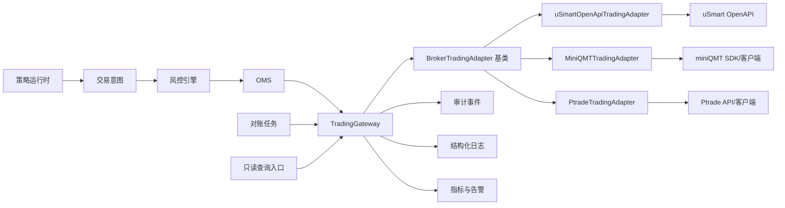

# TradingGateway 统一券商交易网关模块设计

版本：v0.1  
状态：设计草案，待用户确认  
最后更新：2026-05-19

## 0. 文档定位

本文档定义 RobustQuant 后续对接券商交易接口的 `TradingGateway` 模块设计。`TradingGateway` 是 OMS 与具体券商适配器之间的统一交易安全边界，上层同时覆盖 miniQMT、盈立 OpenAPI、Ptrade 和后续券商接口。OpenAPI、miniQMT、Ptrade 都只是适配器类型，不是网关本体。

行情数据另设 `QuotationDataGateway`。`TradingGateway` 只处理账户、资金、持仓、订单、成交、下单、改单、撤单等交易相关能力；`QuotationDataGateway` 负责 K 线、快照、盘口、逐笔和 WebSocket 行情推送。两者可以共用券商底层连接配置，但对上层暴露独立接口，避免行情链路和交易链路混杂。

uSmart OpenAPI 真实 HTTP 调用、签名认证、登录、下单、改单、撤单和只读查询的下层 API 设计见 [usmart-openapi-call-design.md](../clients/usmart-openapi-call-design.md)。

本设计只进入文档阶段，不代表可以开始真实下单、改单、撤单或连接真实账户。任何会改变券商侧订单状态的接口，都必须等 OMS、风控、交易时间检查、账户/标的白名单、人工确认、对账和告警设计确认后才能实现和启用。

## 1. 设计目标

`TradingGateway` 要解决的问题：

- 把不同券商的 HTTP / WebSocket / 本地 SDK / 客户端桥接协议封装成统一的内部接口。
- 把认证、签名、token、请求头、幂等 ID、重试策略和限流集中管理。
- 给 OMS 和风控提供稳定的券商能力边界。
- 把券商原始返回映射成内部统一状态，但保留可审计的原始摘要。
- 对真实交易接口默认加锁，避免任何入口绕过风控和 OMS。
- 对日志、错误、审计事件和敏感信息脱敏形成统一规范。

非目标：

- 不让策略直接调用券商 API。
- 不在 M1 接入真实交易。
- 不实现资金出入金。
- 不实现券商 App 或网站已有的人工交易功能。
- 不为了券商申请材料绕过交易安全边界。

## 2. 总体位置



调用原则：

- 策略只能生成交易意图，不能调用网关。
- 风控不直接调用交易接口，只读取必要的账户、持仓、行情快照。
- OMS 是唯一允许请求真实下单、改单、撤单的内部模块。
- 对账任务可以调用只读查询接口。
- Web / CLI 只能通过服务层发起只读查询、暂停、人工确认等动作，不能绕过 OMS 调用交易接口。

## 3. 模块分层

建议代码分层如下：

```text
rq_core/
  broker_kernel/
    contracts.py              统一 DTO、枚举、Protocol
    gateway.py                TradingGateway 门面
    adapter_base.py           BrokerTradingAdapter 统一接口基类
    capability.py             能力模式、权限判断
    errors.py                 统一错误与状态映射
    idempotency.py            请求幂等与 request_id 生成
    redaction.py              脱敏工具
    audit.py                  审计事件模型
    usmart/
      adapter.py              uSmartOpenApiTradingAdapter
      client.py               uSmart HTTP/WebSocket 原始客户端
      auth.py                 uSmart 认证、签名、token 生命周期
      mapper.py               uSmart 字段与内部 DTO 映射
      endpoints.py            uSmart endpoint 常量与能力声明
      rate_limit.py           uSmart 限流策略
    miniqmt/
      adapter.py              MiniQMTTradingAdapter，占位派生，当前不实现具体连接
    ptrade/
      adapter.py              PtradeTradingAdapter，占位派生，后续按同一基类实现
  quotation_kernel/
    gateway.py                QuotationDataGateway 门面
    adapter_base.py           QuotationDataAdapter 统一行情接口基类
```

分层职责：

| 层 | 职责 | 禁止事项 |
|---|---|---|
| `TradingGateway` | 对 OMS、风控、对账暴露统一交易方法；执行能力检查、审计和错误归一化 | 不拼接具体券商字段，不绑定具体券商协议 |
| `BrokerTradingAdapter` | 统一交易适配器基类，定义登录、账户、持仓、订单、成交、下单、改单、撤单方法 | 不包含风控判断，不决定是否允许真实交易 |
| `uSmartOpenApiTradingAdapter` | 从 `BrokerTradingAdapter` 派生，封装 uSmart OpenAPI 交易接口 | 不绕过 `TradingGateway` |
| `uSmartAuthSigner` | 生成请求头、签名、token 管理 | 不写日志输出密钥 |
| `uSmartMapper` | 字段、状态、错误码映射 | 不吞掉未知状态 |
| `MiniQMTTradingAdapter` | 从 `BrokerTradingAdapter` 派生，当前只保留抽象占位 | 不在本阶段实现具体连接 |
| `PtradeTradingAdapter` | 后续从 `BrokerTradingAdapter` 派生 | 不需要修改 `TradingGateway` 上层代码 |
| `RateLimiter` | 限制请求频率和并发 | 不为下单失败做自动补偿 |
| `AuditLogger` | 记录审计事件 | 不记录敏感原文 |

核心边界：

- `TradingGateway` 是唯一交易上层入口，接口名和 DTO 不出现 `usmart`、`qmt`、`ptrade` 等券商细节。
- `uSmartOpenApiTradingAdapter` 只负责 uSmart OpenAPI 的 HTTP 协议和交易字段转换。
- `MiniQMTTradingAdapter` 只负责 miniQMT 的 SDK、客户端或桥接进程协议转换，本阶段只保留基类派生占位。
- `PtradeTradingAdapter` 后续按同一基类派生，不要求修改 `TradingGateway`。
- 所有适配器共享同一套能力模式、交易开关、审计、脱敏、错误分类和 OMS 调用约束。
- 后续新增券商时，只新增适配器，不改策略、风控和 OMS 的调用契约。

## 4. 能力模式

网关必须支持能力模式，默认值必须是 `read_only`。

| 模式 | 用途 | 允许能力 |
|---|---|---|
| `disabled` | 完全关闭券商网关 | 不允许任何外部请求 |
| `read_only` | 只读联调和账户观察 | 登录、权限检查、行情、账户、资金、持仓、订单查询、成交查询 |
| `simulated` | 模拟盘 | 不调用券商交易接口，只写模拟账本 |
| `live_guarded` | 受控实盘 | 在全部安全前置条件通过后，允许真实下单、改单、撤单 |

能力开关必须细分：

```yaml
broker_gateway:
  mode: read_only
  trading_enabled: false
  allow_login: true
  allow_trade_status_query: true
  allow_account_query: true
  allow_position_query: true
  allow_order_query: true
  allow_trade_query: true
  allow_place_order: false
  allow_modify_order: false
  allow_cancel_order: false
  allow_trade_login: false
  allow_trade_quantity_query: true
  allow_modify_range_query: true
  allow_odd_lot_order: false
  allow_ipo: false
  allow_prepost_market: false
```

规则：

- `mode != live_guarded` 时，所有真实交易接口必须返回 `broker.trading_disabled`。
- 即使 `mode=live_guarded`，只要 `trading_enabled=false`，也不能调用交易接口。
- 下单、改单、撤单三个能力必须分别开关，不能用一个总开关隐式放开所有交易行为。
- 登录、账户、持仓、订单、成交、行情等只读能力也要单独开关，便于未来只读联调逐项开放。
- `trade-login` 虽然不是下单接口，但会改变账户交易可用状态，必须单独开关，默认关闭。
- IPO 申购、碎股交易、盘前盘后、高级订单必须默认关闭，并单独设计后才能启用。

## 5. 统一接口契约

### 5.1 Protocol 草案

```python
class TradingGateway:
    def health_check(self) -> BrokerHealth: ...
    def connect(self) -> BrokerSession: ...
    def get_trade_status(self, account_ref: AccountRef) -> BrokerTradeUnlockStatus: ...
    def get_account(self, account_ref: AccountRef) -> AccountSnapshot: ...
    def get_positions(self, account_ref: AccountRef) -> list[PositionSnapshot]: ...
    def get_cash(self, account_ref: AccountRef) -> CashSnapshot: ...
    def query_order(self, request: QueryOrderRequest) -> BrokerOrderSnapshot: ...
    def query_orders(self, request: QueryOrderListRequest) -> Page[BrokerOrderSnapshot]: ...
    def query_trades(self, request: QueryTradeRequest) -> list[BrokerTradeSnapshot]: ...
    def query_trade_quantity(self, request: TradeQuantityRequest) -> TradeQuantitySnapshot: ...
    def query_modify_range(self, request: ModifyRangeRequest) -> ModifyRangeSnapshot: ...
    def get_quote(self, request: QuoteRequest) -> QuoteSnapshot: ...
    def place_order(self, request: BrokerOrderRequest) -> BrokerOrderAck: ...
    def modify_order(self, request: BrokerModifyRequest) -> BrokerModifyAck: ...
    def cancel_order(self, request: BrokerCancelRequest) -> BrokerCancelAck: ...


class BrokerTradingAdapter:
    def connect(self) -> BrokerSession: ...
    def get_trade_status(self, account_ref: AccountRef) -> BrokerTradeUnlockStatus: ...
    def get_account(self, account_ref: AccountRef) -> AccountSnapshot: ...
    def get_positions(self, account_ref: AccountRef) -> list[PositionSnapshot]: ...
    def get_cash(self, account_ref: AccountRef) -> CashSnapshot: ...
    def query_order(self, request: QueryOrderRequest) -> BrokerOrderSnapshot: ...
    def query_orders(self, request: QueryOrderListRequest) -> Page[BrokerOrderSnapshot]: ...
    def query_trades(self, request: QueryTradeRequest) -> list[BrokerTradeSnapshot]: ...
    def query_trade_quantity(self, request: TradeQuantityRequest) -> TradeQuantitySnapshot: ...
    def query_modify_range(self, request: ModifyRangeRequest) -> ModifyRangeSnapshot: ...
    def place_order(self, request: BrokerOrderRequest) -> BrokerOrderAck: ...
    def modify_order(self, request: BrokerModifyRequest) -> BrokerModifyAck: ...
    def cancel_order(self, request: BrokerCancelRequest) -> BrokerCancelAck: ...


class QuotationDataGateway:
    def get_realtime_quote(self, request: QuoteRequest) -> QuoteSnapshot: ...
    def get_kline(self, request: KlineRequest) -> list[KlineBar]: ...
    def get_orderbook(self, request: OrderBookRequest) -> OrderBookSnapshot: ...
    def subscribe(self, request: QuoteSubscribeRequest) -> QuoteSubscription: ...
```

接口分组：

- 连接与权限：`health_check`、`connect`、`get_trade_status`。
- 只读账户：`get_account`、`get_positions`、`get_cash`。
- 只读订单：`query_order`、`query_orders`、`query_trades`、`query_trade_quantity`、`query_modify_range`。
- 行情数据不放在 `TradingGateway`，由 `QuotationDataGateway` 提供。
- 交易动作：`place_order`、`modify_order`、`cancel_order`。

交易动作只能由 OMS 调用。后续代码层面应通过依赖注入和应用服务边界限制调用方，不在 CLI 或策略运行时暴露这些方法。

### 5.2 统一 DTO

`BrokerOrderRequest` 建议字段：

| 字段 | 说明 |
|---|---|
| `order_id` | 本地 OMS 订单 ID |
| `intent_id` | 交易意图 ID |
| `account_ref` | 脱敏账户引用 |
| `broker` | 券商标识，例如 `usmart` |
| `market` | 市场，例如 `HK`、`US` |
| `symbol` | 标的代码 |
| `side` | `buy` / `sell` |
| `order_type` | 内部订单类型 |
| `price_type` | 限价、市价等价格类型 |
| `quantity` | 委托数量 |
| `limit_price` | 限价，可为空 |
| `currency` | 币种 |
| `time_in_force` | 有效期 |
| `request_id` | 本次券商请求幂等 ID |
| `risk_check_id` | 风控结果 ID |
| `manual_confirm_id` | 人工确认 ID，可为空 |
| `trace_id` | 链路追踪 ID |
| `created_at` | 本地创建时间 |

`BrokerOrderAck` 建议字段：

| 字段 | 说明 |
|---|---|
| `order_id` | 本地 OMS 订单 ID |
| `broker_order_id` | 券商订单号，日志中必须脱敏 |
| `request_id` | 本次请求 ID |
| `status` | 内部统一状态 |
| `broker_status_raw` | 券商原始状态摘要 |
| `broker_response_code` | 券商返回码 |
| `broker_message` | 脱敏后的券商返回消息 |
| `accepted_at` | 券商接受时间，可为空 |
| `unknown_reason` | 状态未知原因，可为空 |

只读查询 DTO 建议字段：

| DTO | 建议字段 | 说明 |
|---|---|---|
| `QueryOrderRequest` | `account_ref`、`broker_order_id`、`request_id`、`trace_id` | 查询单笔订单详情 |
| `QueryOrderListRequest` | `account_ref`、`market`、`start_date`、`end_date`、`page_num`、`page_size`、`request_id`、`trace_id` | 今日订单或历史订单分页查询 |
| `QueryTradeRequest` | `account_ref`、`market`、`symbol`、`broker_order_id`、`start_date`、`end_date`、`page_num`、`page_size`、`request_id`、`trace_id` | 成交流水查询 |
| `AccountSnapshot` | `account_ref`、`broker`、`market`、`currency`、`asset`、`market_value`、`cash`、`raw_hash`、`as_of` | 账户资产快照，日志中不得输出完整金额 |
| `CashSnapshot` | `available_cash`、`withdrawable_cash`、`frozen_cash`、`on_way_cash`、`currency`、`as_of` | 资金快照 |
| `PositionSnapshot` | `market`、`symbol`、`name`、`quantity`、`available_quantity`、`frozen_quantity`、`odd_quantity`、`last_price`、`cost_price` | 持仓快照 |
| `BrokerOrderSnapshot` | `broker_order_id`、`market`、`symbol`、`side`、`quantity`、`filled_quantity`、`limit_price`、`avg_fill_price`、`status`、`broker_status_raw`、`final_state_flag` | 订单快照 |
| `BrokerTradeSnapshot` | `broker_trade_id`、`broker_order_id`、`market`、`symbol`、`side`、`quantity`、`price`、`amount`、`business_status_raw`、`business_time` | 成交快照 |
| `TradeQuantitySnapshot` | `market`、`symbol`、`side`、`max_quantity`、`raw_hash` | 最大可买可卖数量，只能做风控辅助 |
| `ModifyRangeSnapshot` | `broker_order_id`、`modified_lower_amount`、`modified_upper_amount`、`business_amount`、`raw_hash` | 改单范围，只能做改单前校验 |

只读 DTO 规则：

- DTO 不保存券商完整原始响应，只保存必要字段、脱敏摘要和 `raw_hash`。
- 真实资金、持仓市值和完整账号不能进入普通日志；需要审计时仅记录哈希或脱敏摘要。
- 查询结果可以用于风控辅助，但不能替代对账状态；对账异常时必须暂停相关账户或策略的自动交易。

## 6. 盈立 OpenAPI 能力映射

盈立官方 PDF 已转换为 Markdown，索引见 `券商API/盈立/API文档/markdown/zh-Hans/API_ENDPOINT_INDEX.md`。以下只是当前抽取结果，字段和状态码仍需逐页核对 PDF。

### 6.1 认证与登录

| 能力 | 盈立 endpoint | 网关用途 |
|---|---|---|
| 渠道密码登录 | `/user-server/open-api/login` | 建立登录态，获取 token |
| 渠道验证码登录 | `/user-server/open-api/loginCaptcha` | 登录备选路径 |
| 获取手机验证码 | `/user-server/open-api/send-phone-captcha` | 登录验证码流程 |
| 解锁交易 | `/user-server/open-api/trade-login` | 交易解锁，属于高风险前置能力 |
| 获取交易解锁状态 | `/user-server/open-api/get-trade-status` | 只读检查交易状态 |

规则：

- 登录接口可作为只读联调范围，但日志禁止记录手机号、密码、token。
- `trade-login` 虽然不是下单，但它会改变账户交易可用状态，必须按敏感动作处理；默认不在只读联调中调用。
- 设置、重置、修改登录密码或交易密码属于账户安全操作，不进入 RobustQuant 网关第一版。

### 6.2 交易与订单

| 能力 | 盈立 endpoint | 默认模式 |
|---|---|---|
| 普通下单 | `/stock-order-server/open-api/entrust-order` | 禁用，需 `live_guarded` |
| 委托改单/撤单 | `/stock-order-server/open-api/modify-order` | 禁用；PDF 初步显示 `actionType=1` 为改单、`actionType=0` 为撤单，但仍需确认最终语义 |
| 改单范围 | `/stock-order-server/open-api/modified-range` | 只读查询，可用于改单前校验 |
| 碎股下单 | `/stock-order-server/open-api/odd-entrust` | 禁用 |
| 碎股撤单 | `/stock-order-server/open-api/odd-modify` | 禁用 |
| 最大可买可卖 | `/stock-order-server/open-api/trade-quantity` | 只读风控辅助 |
| 今日订单 | `/stock-order-server/open-api/today-entrust` | 只读对账 |
| 全部订单 | `/stock-order-server/open-api/his-entrust` | 只读对账 |
| 订单明细 | `/stock-order-server/open-api/order-detail` | 只读对账 |
| 成交流水 | `/stock-order-server/open-api/stock-record` | 只读对账 |

关键待确认：

- `/modify-order` 的 `actionType=0/1` 是否分别稳定表示撤单/改单。
- 改单是否为原生修改，还是券商侧 cancel + replace。
- 下单响应中 `data.entrustId` 是否可稳定作为 `broker_order_id`。
- 改单/撤单响应中的 `data.entrustId` 是原委托 ID、新委托 ID，还是申请编号。
- 订单状态码与 `submitted`、`accepted`、`partial_filled`、`filled`、`cancelled`、`broker_rejected`、`unknown` 的映射。
- HTTP 成功但业务失败、业务成功但状态未知、网络超时三类情况如何区分。

### 6.3 账户、资金和持仓

| 能力 | 盈立 endpoint | 网关用途 |
|---|---|---|
| 查询持仓 | `/stock-order-server/open-api/stock-holding` | 持仓快照、对账 |
| 查询资产 | `/stock-order-server/open-api/stock-asset` | 资金和资产快照 |
| 批量资产查询 | `/stock-order-server/open-api/stock-asset-list` | 多账户只读观察 |
| 聚合资产 | `/aggregation-server/open-api/user-asset-aggregation/v1` | 统一账户视图候选数据源 |
| 查询汇率 | `/stock-capital-server/open-api/currency-exchange-info` | 多币种估值辅助 |

规则：

- 真实资金和持仓属于隐私数据，日志只能记录是否查询成功、字段数量、摘要哈希和脱敏账户。
- 风控可以读取可用资金、可卖数量和持仓比例，但不能直接依赖未经对账的单次查询结果启用自动交易。
- 批量资产和聚合资产可以作为统一账户视图的数据源候选，但第一版最小闭环优先使用单账户 `stock-asset` 和 `stock-holding`。
- 查询汇率只用于估值和展示辅助，不能单独触发调仓或换汇动作。

### 6.4 行情查询与推送

基础报价 HTTP 接口：

- `marketstate`
- `basicinfo`
- `realtime`
- `timeline`
- `kline`
- `tick`
- `orderbook`

WebSocket 推送：

- 接入地址：`wss://open-hz.yxzq.com/wss/v1`
- 消息类型：`auth`、`sub`、`unsub`、`update`、`ping`、`pong`
- 推送订阅限制按 PDF 初步摘录为每秒最多订阅 10 个 topic、最大订阅 topic 数 10、每秒最多取消订阅 10 个 topic；正式实现前需再次核对 PDF。

规则：

- 行情接口第一版只作为只读数据源。
- WebSocket 推送必须有心跳、自动断线告警和订阅状态审计。
- WebSocket 自动重连只能恢复行情订阅，不能触发任何交易动作。
- 行情延迟、断线或权限不足时，实盘交易应进入降级或暂停，而不是继续使用旧行情。

### 6.5 不进入第一版的盈立能力

- 设置、重置、修改登录密码。
- 设置、重置、修改交易密码。
- IPO 申购和 IPO 改单。
- 碎股交易。
- 盘前盘后交易。
- 条件单、止盈止损或触发单。
- 任何 PDF 未明确解释语义的高级订单。

## 7. 认证、签名和 token 生命周期

已知 PDF 信息：

- 请求使用 HTTPS。
- Header 中包含 `X-Sign`。
- `X-Sign` 使用 `MD5withRSA` 对 Body 内容加密或签名后，再经过 `safeBase64` 编码。
- 基础报价 PDF 进一步说明签名原文包含 `Authorization`、`X-Channel`、`X-Lang`、`X-Request-Id`、`X-Time` 头字段与 body 的有序拼接；交易 API 当前摘录以 body 签名为主，二者不能混为一个硬编码策略。
- `X-Request-Id` 用于确保唯一和防重。
- PDF 对 `X-Request-Id` 长度存在 19 位和 30 位两种摘录，下单 body 的 `serialNo` 明确最长 19 位；正式实现前必须通过 PDF 逐页校对或官方确认。
- 接入涉及 IP 白名单。

设计规则：

- 密钥只从环境变量、加密配置或后续密钥管理服务读取，不进入代码库。
- `uSmartAuthSigner` 只返回请求头，不向日志暴露私钥、密码、token、明文手机号。
- token 存在内存会话中，默认不落库；如必须持久化，需要加密保存并记录过期时间。
- 登录态过期时，只读查询可以重新登录；交易动作不能在下单过程中隐式刷新登录后继续提交，必须让 OMS 重新进入可审计状态。
- 签名失败、验签失败、401、权限不足必须归一化为明确错误码。

建议错误码：

```text
broker.auth_missing
broker.auth_expired
broker.auth_failed
broker.sign_failed
broker.permission_denied
broker.ip_not_allowed
broker.rate_limited
```

## 8. 幂等和请求 ID

盈立 PDF 提到 `X-Request-Id` 用于防重。RobustQuant 内部还需要自己的幂等关系。

建议关系：

```text
order_id -> broker_request_id -> X-Request-Id -> broker_order_id
```

规则：

- 每次向券商提交请求前，由 OMS 创建本地 `order_id`。
- 网关为每一次券商 HTTP 请求生成 `broker_request_id`，并映射到 `X-Request-Id`。
- 下单 body 的 `serialNo` 也必须和 `broker_request_id` 建立映射；不得直接使用用户输入。
- `X-Request-Id` 必须持久化到本地订单审计表。
- 下单超时后，不得用同一个或新的 `X-Request-Id` 自动重发下单。
- 撤单超时后，不得自动重复撤单。
- 查询接口可以按限流策略重试；交易接口不自动重试。

## 9. 错误处理与状态映射

### 9.1 统一错误分类

| 类别 | 说明 | 交易动作处理 |
|---|---|---|
| `transport_error` | DNS、连接、TLS、超时 | 进入 `unknown`，不得自动重试 |
| `auth_error` | 401、token 失效、签名失败 | 进入 `failed` 或 `unknown`，按是否已触达券商判断 |
| `rate_limit` | 频率限制 | 查询可重试，交易不可自动补偿 |
| `broker_reject` | 券商明确拒绝 | 进入 `broker_rejected` |
| `business_error` | 参数、资金、权限、市场规则错误 | 进入 `broker_rejected` 或 `failed` |
| `unknown_response` | 返回字段缺失或状态无法识别 | 进入 `unknown` |

### 9.2 订单状态映射

内部订单状态以 [trading-safety.md](../../architecture/trading-safety.md) 为准：

```text
created
ready_to_submit
submitting
submitted
accepted
partial_filled
filled
cancel_requested
cancelled
broker_rejected
failed
unknown
```

映射规则：

- PDF 已明确状态码时，写入 `uSmartOrderStatusMapper`。
- PDF 未明确的状态码不得猜测，只能映射为 `unknown_by_pdf`。
- 无法判断是否已到达券商的请求，必须进入 `unknown`。
- `unknown` 只能通过订单查询、成交查询、对账或人工确认转出。

## 10. 限流、并发和重试

规则：

- 所有券商请求经过 `RateLimiter`。
- 只读行情和账户查询可以配置有限重试，但必须有最大次数和退避时间。
- 下单、改单、撤单不做自动重试。
- WebSocket 行情断线可以自动重连，但重连只恢复订阅，不触发交易。
- 同一账户的交易动作应串行化，避免并发改单、撤单和下单造成状态竞争。
- 同一 `order_id` 同一时刻只能有一个未完成券商请求。

建议第一版并发模型：

- 只读查询：账户维度限流，允许有限并发。
- 订单动作：账户维度串行，同一订单强互斥。
- 行情 HTTP：标的批量查询优先，避免逐只请求打爆限流。
- 行情 WebSocket：订阅状态由单独会话管理，不和交易请求共享生命周期。

## 11. 审计、日志和隐私

网关必须记录审计事件：

| 事件 | 说明 |
|---|---|
| `broker.connect_started` | 开始连接或登录 |
| `broker.connect_completed` | 连接或登录成功 |
| `broker.connect_failed` | 连接或登录失败 |
| `broker.query_completed` | 只读查询完成 |
| `broker.order_submit_requested` | OMS 请求提交订单 |
| `broker.order_submit_blocked` | 网关因安全开关阻止订单 |
| `broker.order_submit_unknown` | 下单结果未知 |
| `broker.order_status_mapped` | 券商状态映射完成 |
| `broker.cancel_requested` | OMS 请求撤单 |
| `broker.cancel_unknown` | 撤单结果未知 |
| `broker.ws_connected` | WebSocket 连接成功 |
| `broker.ws_disconnected` | WebSocket 断线 |

日志允许记录：

- `trace_id`
- `order_id`
- `intent_id`
- 脱敏 `account_ref`
- 脱敏 `broker_order_id`
- endpoint 名称
- HTTP 状态码
- 券商错误码
- 耗时
- 字段数量和响应摘要哈希

日志禁止记录：

- API Key、Secret、私钥。
- token、session、cookie。
- 登录密码、交易密码、验证码。
- 完整手机号、完整账号、身份证件。
- 真实完整资金余额、真实完整持仓市值。
- 完整券商原始响应。

## 12. 配置设计

建议配置拆分：

`.env`，不进入 Git：

```text
USMART_API_BASE_URL=...
USMART_QUOTE_BASE_URL=...
USMART_WS_URL=...
USMART_CHANNEL_ID=...
USMART_PRIVATE_KEY_PATH=...
USMART_PUBLIC_KEY_PATH=...
USMART_PASSWORD_PUBLIC_KEY_PATH=...
USMART_ACCOUNT_REF=...
USMART_LOGIN_AREA_CODE=...
USMART_LOGIN_PHONE=...
USMART_LOGIN_PASSWORD_SECRET_REF=...
USMART_TRADE_PASSWORD_SECRET_REF=...
```

`configs/broker/usmart.yaml`，可以进入 Git，但不得包含秘密：

```yaml
broker: usmart
mode: read_only
trading_enabled: false

timeouts:
  connect_ms: 3000
  read_ms: 5000

rate_limit:
  readonly_per_second: 2
  trading_per_second: 1

capabilities:
  login: true
  trade_status_query: true
  quote_http: true
  quote_ws: true
  account_query: true
  position_query: true
  order_query: true
  trade_query: true
  trade_quantity_query: true
  modify_range_query: true
  trade_login: false
  place_order: false
  modify_order: false
  cancel_order: false
  odd_lot_order: false
  ipo: false
  prepost_market: false

request_id:
  header_length: unknown_by_pdf
  serial_no_length: 19

safety:
  require_oms_caller: true
  require_trade_window: true
  require_risk_check: true
  require_manual_confirm_for_live: true
  block_unknown_order_when_reconcile_failed: true
```

## 13. 测试策略

测试分四层：

| 层 | 内容 | 是否允许真实券商请求 |
|---|---|---|
| 单元测试 | 签名、字段映射、脱敏、错误分类、状态映射 | 不允许 |
| 契约测试 | 用录制或人工构造的脱敏响应验证 DTO 映射 | 不允许 |
| 只读集成测试 | 登录、行情、账户、持仓、订单查询 | 仅在用户明确配置只读环境后允许 |
| 受控实盘前演练 | 下单、改单、撤单链路演练 | 需要 sandbox；无 sandbox 不执行 |

重要规则：

- 没有官方 sandbox 时，不运行真实下单、改单、撤单测试。
- 交易接口截图或演示代码不作为 RobustQuant 开发验收标准。
- 测试 fixture 不得包含真实账号、token、真实资金和真实持仓。
- 对 `unknown`、超时、401、限流、字段缺失必须有单元测试。
- 对日志脱敏必须有测试，防止未来把 token 或账户打出来。
- 对盈立 PDF 字段映射必须有契约测试：下单 `serialNo/entrustAmount/entrustPrice/entrustProp/entrustType/exchangeType/stockCode`，改单 `actionType=1`，撤单 `actionType=0`。
- 对只读 DTO 映射必须有契约测试：资产、持仓、订单、成交、最大可买可卖、改单范围。
- 对 `X-Request-Id` 与 `serialNo` 的生成、长度校验和审计映射必须有单元测试。

## 14. 开发阶段划分

### Phase 0：文档和接口事实摘录

- 从 PDF/Markdown 提取 endpoint、字段、状态码、错误码、订单类型。
- 标记 `confirmed_by_pdf` 和 `unknown_by_pdf`。
- 完成网关设计并经用户确认。

### Phase 1：纯离线骨架

- 实现 DTO、Protocol、状态映射和脱敏工具。
- 使用 mock client，不发任何真实网络请求。
- 通过单元测试验证安全开关默认禁用交易。

### Phase 1.5：申请材料代码骨架

- 代码中可以完整写出登录、下单、改单、撤单方法和请求构造。
- `TradingGateway` 默认 `read_only`，必须在网关处阻断下单、改单、撤单，不让请求触达适配器。
- 盈立申请材料需要展示源码时，展示的是适配器方法和网关安全阻断，不运行真实交易请求。
- miniQMT 只保留 `MiniQMTTradingAdapter` 抽象派生，不实现具体连接。

### Phase 2：只读券商接口联调

- 只在 `read_only` 模式下启用。
- 允许登录、账户、持仓、订单、成交查询。
- 行情联调通过 `QuotationDataGateway`，不通过 `TradingGateway`。
- uSmart 通过 `uSmartOpenApiTradingAdapter` 接入；miniQMT 通过 `MiniQMTTradingAdapter` 接入。
- 禁止 `trade-login`、下单、改单、撤单、IPO、碎股交易。
- 所有输出脱敏。

### Phase 3：模拟盘网关

- OMS 调用同一接口，但落到模拟账本。
- 验证交易意图、风控、OMS 状态机和对账流程。
- 不调用券商交易接口。

### Phase 4：sandbox 交易验证

- 前提：官方明确提供 sandbox，且确认不会产生真实委托。
- 验证下单、改单、撤单、查询、成交回报。
- 仍然经过 OMS、风控、交易时间检查和审计。

### Phase 5：受控实盘

- 前提：用户确认、风控阈值确认、ETF 白名单确认、人工暂停和对账可用。
- 第一批只允许小额、低频、宽基 ETF、限价单。
- 个股实盘后置。

## 15. 验收标准

设计验收：

- 网关职责与 OMS、风控、策略边界清楚。
- 盈立 endpoint 已按认证、交易、账户、行情、推送分组。
- 交易接口默认禁用规则明确。
- 未确认行为全部列为 `unknown_by_pdf`。
- 日志和审计不泄露敏感信息。
- 下单、改单、撤单失败不自动重试。

代码验收，后续实施时适用：

- 默认配置启动后，交易接口全部不可用。
- 单元测试覆盖签名、脱敏、错误映射、状态映射、能力开关。
- 只读集成测试不会调用任何交易 endpoint。
- 任何交易调用必须带 `order_id`、`risk_check_id`、`trace_id`。
- 下单超时进入 `unknown`，不会自动重试。
- 撤单超时进入 `unknown`，不会自动重复撤单。
- 日志扫描确认无 token、密码、完整账号和真实资金隐私。

## 16. 待确认问题

必须从 PDF 或盈立官方确认：

- 盈立是否提供 sandbox 或 paper trading 环境。
- 交易 API base URL，当前索引只对行情 base URL 抽取较明确。
- `/stock-order-server/open-api/modify-order` 的 `actionType=0/1` 是否分别稳定表示撤单/改单。
- 改单是原生修改还是 cancel + replace。
- 普通下单响应中的 `data.entrustId` 是否稳定作为券商订单号字段。
- 改单/撤单响应中的 `data.entrustId` 是原委托 ID、新委托 ID，还是申请编号。
- 订单状态码完整枚举和状态流转。
- 错误码完整枚举。
- 订单类型、价格类型、市场、币种、盘前盘后规则。
- `X-Request-Id` 的有效期、重复请求返回语义和长度限制；PDF 摘录存在 19 位和 30 位两种描述。
- 下单 body `serialNo` 与 header `X-Request-Id` 的关系。
- `X-Sign` 对交易 API 和基础报价 API 的签名原文是否不同。
- `X-Type` 是否必填及可用枚举。
- token 有效期、刷新方式和多会话冲突规则。
- HTTP 频率限制和 WebSocket 订阅上限。

需要用户确认：

- `TradingGateway` 第一版上层抽象同时预留 uSmart OpenAPI、miniQMT 和 Ptrade；代码实现先落 `TradingGateway`、`BrokerTradingAdapter`、`uSmartOpenApiTradingAdapter`、`MiniQMTTradingAdapter` 的同层骨架，uSmart 申请所需方法外形放在 uSmart 适配器内。
- 只读联调阶段是否允许真实登录和账户/持仓查询。
- 如果允许只读联调，脱敏输出和本地日志保存周期。
- 第一版受控实盘是否强制只允许限价单。
- 第一批实盘宽基 ETF 白名单和单笔金额上限。
