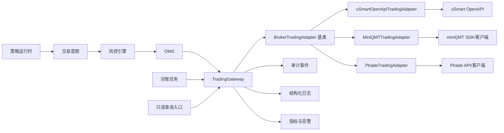

# TradingGateway 统一券商交易网关模块设计

版本：v0.1  
状态：设计草案，待用户确认  
最后更新：2026-05-28

## 0. 文档定位

本文档定义 Augur_Maestro 后续对接券商交易接口的 `TradingGateway` 模块设计。`TradingGateway` 是 OMS 与具体券商交易适配器之间的统一交易安全边界，上层同时覆盖 miniQMT、盈立交易开放 API、Ptrade 和后续券商交易接口。OpenAPI、miniQMT、Ptrade 都只是适配器类型，不是网关本体。

盈立官方资料拆成三套不同 API：交易开放 API、基础报价 API、报价推送 API。本文档只定义交易开放 API 对应的 `TradingGateway` 边界。行情数据另设 `QuotationDataGateway`：基础报价 API 负责 K 线、快照、盘口、逐笔等 HTTP 行情；报价推送 API 负责 WebSocket 行情推送。三套 API 的 base URL、签名/认证、限流、连接生命周期和错误处理不能混为一谈。

uSmart / 盈立交易开放 API 的真实 HTTP 调用、签名认证、登录、下单、改单、撤单和交易账户只读查询的下层 API 设计见 [usmart-openapi-call-design.md](../clients/usmart-openapi-call-design.md)。

面向盈立 OpenAPI 申请材料的登录、下单、改单、撤单完整调用栈 API 手册见 [usmart-openapi-api-manual.md](../clients/usmart-openapi-api-manual.md)。

本设计只进入文档阶段，不代表可以开始真实下单、改单、撤单或连接真实账户。任何会改变券商侧订单状态的接口，都必须等 OMS、风控、交易时间检查、账户/标的白名单、策略授权、对账和告警设计确认后才能实现和启用；运行期基础交易不要求逐笔人工确认，自动化程序可以执行通过风控门禁的正股买入和卖出，包括策略模块生成的建仓、加仓、减仓、平仓、止盈和止损意图。

交易模块状态控制枚举、归属层级、终态和流转约束见 [trading-status-control.md](trading-status-control.md)。该文档只定义状态，不定义 broker 官方错误码，也不定义 Gateway 错误码。

## 1. 设计目标

`TradingGateway` 要解决的问题：

- 把不同券商的交易 HTTP / 本地 SDK / 客户端桥接协议封装成统一的内部交易接口。
- 把认证、签名、token、请求头、幂等 ID、重试策略和限流集中管理。
- 给 OMS 和风控提供稳定的券商能力边界。
- 把券商原始返回映射成内部统一状态，但保留可审计的原始摘要。
- 对真实交易接口默认加锁，避免任何入口绕过风控和 OMS。
- 对日志、错误、审计事件和敏感信息脱敏形成统一规范。

非目标：

- 不让策略直接调用券商 API。
- 不在 M1 接入真实交易。
- 不实现资金出入金。
- 不实现券商 App 或网站已有的人工交易功能。
- 不为了券商申请材料绕过交易安全边界。

## 2. 总体位置



调用原则：

- 策略只能生成交易意图，不能调用网关。
- 风控不直接调用交易接口，只读取必要的账户、持仓、行情快照。
- OMS 是唯一允许请求真实下单、改单、撤单的内部模块。
- 对账任务可以调用只读查询接口。
- Web / CLI 只能通过服务层发起只读查询、暂停、人工确认等动作，不能绕过 OMS 调用交易接口。

## 3. 模块分层

建议代码分层如下：

```text
src/
  rq_core/
    broker_kernel/
      contracts.py              统一 DTO、枚举、Protocol
      gateway.py                TradingGateway 门面
      adapter_base.py           BrokerTradingAdapter 统一接口基类
      capability.py             能力模式、权限判断
      errors.py                 统一错误与状态映射
      idempotency.py            请求幂等与 request_id 生成
      redaction.py              脱敏工具
      audit.py                  审计事件模型
      usmart/
        adapter.py              uSmartOpenApiTradingAdapter
        client.py               uSmart 交易开放 API HTTP 客户端
        auth.py                 uSmart 认证、签名、token 生命周期
        mapper.py               uSmart 字段与内部 DTO 映射
        endpoints.py            uSmart endpoint 常量与能力声明
        rate_limit.py           uSmart 限流策略
      miniqmt/
        adapter.py              MiniQMTTradingAdapter，占位派生，当前不实现具体连接
      ptrade/
        adapter.py              PtradeTradingAdapter，占位派生，后续按同一基类实现
    quotation_kernel/
      gateway.py              QuotationDataGateway 门面
      adapter_base.py         QuotationDataAdapter 统一行情接口基类
      usmart_http/            基础报价 API HTTP 适配器，后续实现
      usmart_ws/              报价推送 API WebSocket 适配器，后续实现
```

分层职责：

| 层 | 职责 | 禁止事项 |
|---|---|---|
| `TradingGateway` | 对 OMS、风控、对账暴露统一交易方法；执行能力检查、审计和错误归一化 | 不拼接具体券商字段，不绑定具体券商协议 |
| `BrokerTradingAdapter` | 统一交易适配器基类，定义登录、账户、持仓、订单、成交、下单、改单、撤单方法 | 不包含风控判断，不决定是否允许真实交易 |
| `uSmartOpenApiTradingAdapter` | 从 `BrokerTradingAdapter` 派生，封装 uSmart OpenAPI 交易接口 | 不绕过 `TradingGateway` |
| `uSmartTradeAuthSigner` | 生成交易开放 API 请求头、签名、token 管理 | 不写日志输出密钥；不复用基础报价 API 或报价推送 API 的认证规则 |
| `uSmartMapper` | 字段、状态、错误码映射 | 不吞掉未知状态 |
| `MiniQMTTradingAdapter` | 从 `BrokerTradingAdapter` 派生，当前只保留抽象占位 | 不在本阶段实现具体连接 |
| `PtradeTradingAdapter` | 后续从 `BrokerTradingAdapter` 派生 | 不需要修改 `TradingGateway` 上层代码 |
| `RateLimiter` | 限制请求频率和并发 | 不为下单失败做自动补偿 |
| `AuditLogger` | 记录审计事件 | 不记录敏感原文 |

核心边界：

- `TradingGateway` 是唯一交易上层入口，接口名和 DTO 不出现 `usmart`、`qmt`、`ptrade` 等券商细节。
- 2026-05-25 用户确认 Gateway 以上层必须适配多种 broker 后端实现：上层只依赖统一 Broker DTO、统一错误码和 `BrokerTradingAdapter` 抽象；uSmart、miniQMT、Ptrade 分别作为该统一抽象的派生实现。
- `uSmartOpenApiTradingAdapter` 只负责 uSmart OpenAPI 的 HTTP 协议和交易字段转换。
- `MiniQMTTradingAdapter` 只负责 miniQMT 的 SDK、客户端或桥接进程协议转换，本阶段只保留基类派生占位。
- `PtradeTradingAdapter` 后续按同一基类派生，不要求修改 `TradingGateway`。
- 所有适配器共享同一套能力模式、交易开关、审计、脱敏、错误分类和 OMS 调用约束。
- 后续新增券商时，只新增适配器，不改策略、风控和 OMS 的调用契约。

## 4. 能力模式

网关必须支持能力模式，默认值必须是 `read_only`。

| 模式 | 用途 | 允许能力 |
|---|---|---|
| `disabled` | 完全关闭券商网关 | 不允许任何外部请求 |
| `read_only` | 交易开放 API 只读联调和账户观察 | 登录、权限检查、账户、资金、持仓、订单查询、成交查询 |
| `simulated` | 模拟盘 | 不调用券商交易接口，只写模拟账本 |
| `live_guarded` | 受控实盘 | 在全部安全前置条件通过后，允许真实下单、改单、撤单 |

能力开关必须细分：

```yaml
broker_gateway:
  broker: usmart
  mode: read_only
  trading_enabled: false
  transport:
    allow_real_http_readonly: false
  capabilities:
    login_captcha: false
    login: true
    disconnect: true
    trade_status_query: true
    account_query: true
    position_query: true
    order_query: true
    trade_query: true
    trade_quantity_query: false
    modify_range_query: false
    trade_login: false
    place_order: false
    odd_lot_order: false
    modify_order: false
    cancel_order: false
    odd_lot_cancel: false
    grey_market_order: false
    ipo: false
    prepost_market: false
```

规则：

- `mode=disabled` 时，除本地 `health_check` 外不允许任何 broker 出网请求，返回 `broker.disabled`。
- `mode=read_only` 只允许 capability 中显式开启的登录、交易状态、账户、持仓、订单和成交查询；真实 HTTP 还必须同时满足 `transport.allow_real_http_readonly=true`。
- `mode=simulated` 不调用真实券商交易接口；查询可走模拟账本或显式配置的只读真实查询，但不能触达真实下单、改单、撤单 endpoint。
- `mode != live_guarded` 时，所有真实交易接口必须返回 `broker.trading_disabled`。
- 即使 `mode=live_guarded`，只要 `trading_enabled=false`，也不能调用交易接口。
- 下单、碎股下单、改单、撤单、碎股撤单能力必须分别开关，不能用一个总开关隐式放开所有交易行为。
- 登录、账户、持仓、订单、成交等交易开放 API 只读能力也要单独开关，便于未来只读联调逐项开放。基础报价 API 和报价推送 API 的开关归 `QuotationDataGateway`，不归 `TradingGateway`。
- `trade-login` 虽然不是下单接口，但会改变账户交易可用状态，必须单独开关，第一版默认关闭；遇到券商要求交易密码、交易解锁或交易锁定时，不自动调用 `trade-login`，订单进入 `blocked_by_broker_trade_lock` 并提示人工确认。
- IPO 申购必须排除在第一版外。第一批真实交易只做美股盘中交易和美股碎股；港股新股暗盘只保留能力设计，港股碎股不做。在 `read_only` 和申请材料截图阶段必须保持阻断，只允许 dry-run 构造。
- `allow_real_http_readonly` 是 transport 出网开关，不属于 `capabilities`；DTO 中不得出现 `allow_real_http` 之类可以绕过配置的字段。

### 4.1 Gateway 能力开关契约

能力开关以 Gateway 统一方法为准，不以某个 broker endpoint 为准。具体 broker 若不支持某能力，即使配置为 true，也必须在适配器能力声明或启动校验中降级为 `broker.unsupported_capability`，不能让上层绕过 Gateway 调私有接口。

| Gateway 方法 | capability key | read_only | live_guarded | 本轮 uSmart 只读联调 |
|---|---|---|---|---|
| `health_check` | 无 | 允许本地健康检查 | 允许 | 允许，不要求出网 |
| `request_login_captcha` | `login_captcha` | 可配置允许 | 可配置允许 | 默认关闭，避免短信滥用 |
| `connect(BrokerLoginRequest)` | `login` | 可配置允许 | 可配置允许 | 允许，需 `transport.allow_real_http_readonly=true` 才真实出网 |
| `disconnect` | `disconnect` | 允许本地清理 | 允许 | 允许本地清理，不要求券商远端登出 |
| `get_trade_status` | `trade_status_query` | 可配置允许 | 可配置允许 | 允许 |
| `get_account` / `get_cash` | `account_query` | 可配置允许 | 可配置允许 | 允许，映射 `open-assetQuery/v1` |
| `get_positions` | `position_query` | 可配置允许 | 可配置允许 | 允许，映射 `open-assetQuery/v1` 的 `holdInfos` |
| `query_orders` | `order_query` | 可配置允许 | 可配置允许 | 允许 `today/history/detail` |
| `query_trades` | `trade_query` | 可配置允许 | 可配置允许 | 允许 |
| `query_trade_quantity` | `trade_quantity_query` | 可配置允许 | 可配置允许 | 后置，不进第一批只读联调 |
| `query_modify_range` | `modify_range_query` | 可配置允许 | 可配置允许 | 后置，不进第一批只读联调 |
| `trade_login` | `trade_login` | 禁止 | 高风险配置允许 | 禁止；第一版不自动调用 |
| `place_order` | `place_order` | 禁止 | 需 `trading_enabled=true` 且 capability=true | 禁止真实出网，只允许 dry-run builder |
| `place_odd_lot_order` | `odd_lot_order` | 禁止 | 需 `trading_enabled=true` 且 capability=true | 禁止真实出网，只允许 dry-run builder |
| `modify_order` | `modify_order` | 禁止 | 需 `trading_enabled=true` 且 capability=true | 禁止真实出网，只允许 dry-run builder |
| `cancel_order` | `cancel_order` | 禁止 | 需 `trading_enabled=true` 且 capability=true | 禁止真实出网，只允许 dry-run builder |
| `cancel_odd_lot_order` | `odd_lot_cancel` | 禁止 | 需 `trading_enabled=true` 且 capability=true | 禁止真实出网，只允许 dry-run builder |

统一错误码见 [broker-gateway-error-codes.yaml](broker-gateway-error-codes.yaml)。能力开关相关的第一批 Gateway 本地错误包括：

| 场景 | gateway 错误码 |
|---|---|
| `mode=disabled` | `broker.disabled` |
| 只读模式触发交易动作 | `broker.trading_disabled` |
| `live_guarded` 但 `trading_enabled=false` | `broker.trading_disabled` |
| capability 为 false | `broker.capability_disabled` |
| broker 后端不支持该能力 | `broker.unsupported_capability` |
| 出网开关未开但请求真实 HTTP | `broker.real_http_disabled` |
| 调用方不是允许的 OMS / 对账 / 查询服务 | `broker.caller_not_allowed` |

## 5. 统一接口契约

### 5.1 Protocol 草案

```python
class TradingGateway:
    def health_check(self) -> BrokerHealth: ...
    def request_login_captcha(self, request: BrokerCaptchaRequest) -> BrokerCaptchaResult: ...
    def connect(self, request: BrokerLoginRequest) -> BrokerLoginResult: ...
    def disconnect(self, request: BrokerDisconnectRequest) -> BrokerDisconnectResult: ...
    def get_trade_status(self, account_ref: AccountRef) -> BrokerTradeUnlockStatus: ...
    def get_account(self, account_ref: AccountRef) -> AccountSnapshot: ...
    def get_positions(self, account_ref: AccountRef) -> list[PositionSnapshot]: ...
    def get_cash(self, account_ref: AccountRef) -> CashSnapshot: ...
    def query_orders(self, request: OrderQueryRequest) -> Page[BrokerOrderSnapshot]: ...
    def query_trades(self, request: QueryTradeRequest) -> list[BrokerTradeSnapshot]: ...
    def query_trade_quantity(self, request: TradeQuantityRequest) -> TradeQuantitySnapshot: ...
    def query_modify_range(self, request: ModifyRangeRequest) -> ModifyRangeSnapshot: ...
    def place_order(self, request: BrokerOrderRequest) -> BrokerOrderAck: ...
    def place_odd_lot_order(self, request: BrokerOddLotOrderRequest) -> BrokerOrderAck: ...
    def modify_order(self, request: BrokerModifyRequest) -> BrokerModifyAck: ...
    def cancel_order(self, request: BrokerCancelRequest) -> BrokerCancelAck: ...
    def cancel_odd_lot_order(self, request: BrokerOddLotCancelRequest) -> BrokerCancelAck: ...


class BrokerTradingAdapter:
    def request_login_captcha(self, request: BrokerCaptchaRequest) -> BrokerCaptchaResult: ...
    def connect(self, request: BrokerLoginRequest) -> BrokerLoginResult: ...
    def disconnect(self, request: BrokerDisconnectRequest) -> BrokerDisconnectResult: ...
    def get_trade_status(self, account_ref: AccountRef) -> BrokerTradeUnlockStatus: ...
    def get_account(self, account_ref: AccountRef) -> AccountSnapshot: ...
    def get_positions(self, account_ref: AccountRef) -> list[PositionSnapshot]: ...
    def get_cash(self, account_ref: AccountRef) -> CashSnapshot: ...
    def query_orders(self, request: OrderQueryRequest) -> Page[BrokerOrderSnapshot]: ...
    def query_trades(self, request: QueryTradeRequest) -> list[BrokerTradeSnapshot]: ...
    def query_trade_quantity(self, request: TradeQuantityRequest) -> TradeQuantitySnapshot: ...
    def query_modify_range(self, request: ModifyRangeRequest) -> ModifyRangeSnapshot: ...
    def place_order(self, request: BrokerOrderRequest) -> BrokerOrderAck: ...
    def place_odd_lot_order(self, request: BrokerOddLotOrderRequest) -> BrokerOrderAck: ...
    def modify_order(self, request: BrokerModifyRequest) -> BrokerModifyAck: ...
    def cancel_order(self, request: BrokerCancelRequest) -> BrokerCancelAck: ...
    def cancel_odd_lot_order(self, request: BrokerOddLotCancelRequest) -> BrokerCancelAck: ...


class QuotationDataGateway:
    def get_realtime_quote(self, request: QuoteRequest) -> QuoteSnapshot: ...
    def get_kline(self, request: KlineRequest) -> list[KlineBar]: ...
    def get_orderbook(self, request: OrderBookRequest) -> OrderBookSnapshot: ...
    def subscribe(self, request: QuoteSubscribeRequest) -> QuoteSubscription: ...
```

接口分组：

2026-05-25 用户确认：`TradingGateway` 层 DTO 必须明确交易内核范围内所有可能发生的登录、查询和交易行为接口。Gateway 以上层只能面向这些统一接口编程；具体 broker 后端通过 capability 声明支持或不支持，未支持能力返回统一错误，例如 `broker.unsupported_capability`，不能让上层直接调用 uSmart、miniQMT 或 Ptrade 私有方法。

- 连接与登录：`health_check`、`request_login_captcha`、`connect(BrokerLoginRequest)`、`disconnect`、`get_trade_status`。`request_login_captcha` 仅用于验证码登录流程；不代表允许交易。`disconnect` 表示清理本地会话或适配器连接，不要求券商一定有远端登出接口。
- 只读账户：`get_account`、`get_positions`、`get_cash`。这些接口返回内部 DTO，可保留程序内部完整 `Decimal` 数值，但日志和展示层必须脱敏。
- 只读订单与成交：统一使用 `query_orders(OrderQueryRequest)` 表达今日订单、历史订单和订单明细；使用 `query_trades(QueryTradeRequest)` 表达成交流水；保留 `query_trade_quantity`、`query_modify_range` 作为风控和改单前辅助查询。
- 交易动作：`place_order`、`modify_order`、`cancel_order`，以及后续扩展的 `place_odd_lot_order`、`cancel_odd_lot_order`。这些方法属于 Gateway 能力面，但默认 capability 为关闭；本轮 uSmart 只读联调不触达真实交易 endpoint。
- 行情数据不放在 `TradingGateway`，由 `QuotationDataGateway` 提供。基础报价 API 与报价推送 API 不应出现在 `BrokerTradingAdapter` 中。
- 账户安全、出入金、修改登录密码、修改交易密码、IPO 申购、券商侧条件单、期权、保证金、做空等能力不进入第一版 Gateway 必实现面；后续若进入交易内核范围，必须先新增统一 DTO 和 capability，再由各 broker 适配器派生实现。

交易动作只能由 OMS 调用。后续代码层面应通过依赖注入和应用服务边界限制调用方，不在 CLI 或策略运行时暴露这些方法。

### 5.2 统一 DTO

`BrokerOrderRequest` 建议字段：

| 字段 | 说明 |
|---|---|
| `order_id` | 本地 OMS 订单 ID |
| `intent_id` | 交易意图 ID |
| `account_ref` | 脱敏账户引用 |
| `broker` | 券商标识，例如 `usmart` |
| `market` | 市场，例如 `HK`、`US` |
| `symbol` | 标的代码 |
| `side` | `buy` / `sell` |
| `order_type` | 内部订单类型 |
| `price_type` | 限价、市价等价格类型 |
| `quantity` | 委托数量 |
| `limit_price` | 限价，可为空 |
| `currency` | 币种 |
| `time_in_force` | 有效期 |
| `request_id` | 本次券商请求幂等 ID |
| `risk_check_id` | 风控结果 ID |
| `manual_confirm_id` | 人工确认 ID，可为空 |
| `trace_id` | 链路追踪 ID |
| `created_at` | 本地创建时间 |

`BrokerOrderAck` 建议字段：

| 字段 | 说明 |
|---|---|
| `order_id` | 本地 OMS 订单 ID |
| `broker_order_id` | 券商订单号，日志中必须脱敏 |
| `request_id` | 本次请求 ID |
| `status` | 内部统一状态 |
| `broker_status_raw` | 券商原始状态摘要 |
| `broker_response_code` | 券商返回码 |
| `broker_message` | 脱敏后的券商返回消息 |
| `accepted_at` | 券商接受时间，可为空 |
| `unknown_reason` | 状态未知原因，可为空 |

只读查询 DTO 建议字段：

| DTO | 建议字段 | 说明 |
|---|---|---|
| `QueryOrderRequest` | `account_ref`、`broker_order_id`、`request_id`、`trace_id` | 查询单笔订单详情 |
| `QueryOrderListRequest` | `account_ref`、`market`、`start_date`、`end_date`、`page_num`、`page_size`、`request_id`、`trace_id` | 今日订单或历史订单分页查询 |
| `QueryTradeRequest` | `account_ref`、`market`、`symbol`、`broker_order_id`、`start_date`、`end_date`、`page_num`、`page_size`、`request_id`、`trace_id` | 成交流水查询 |
| `AccountSnapshot` | `account_ref`、`broker`、`market`、`currency`、`asset`、`market_value`、`cash`、`raw_hash`、`as_of` | 账户资产快照，日志中不得输出完整金额 |
| `CashSnapshot` | `available_cash`、`withdrawable_cash`、`frozen_cash`、`on_way_cash`、`currency`、`as_of` | 资金快照 |
| `PositionSnapshot` | `market`、`symbol`、`name`、`quantity`、`available_quantity`、`frozen_quantity`、`odd_quantity`、`last_price`、`cost_price` | 持仓快照 |
| `BrokerOrderSnapshot` | `broker_order_id`、`market`、`symbol`、`side`、`quantity`、`filled_quantity`、`limit_price`、`avg_fill_price`、`status`、`broker_status_raw`、`final_state_flag` | 订单快照 |
| `BrokerTradeSnapshot` | `broker_trade_id`、`broker_order_id`、`market`、`symbol`、`side`、`quantity`、`price`、`amount`、`business_status_raw`、`business_time` | 成交快照 |
| `TradeQuantitySnapshot` | `market`、`symbol`、`side`、`max_quantity`、`raw_hash` | 最大可买可卖数量，只能做风控辅助 |
| `ModifyRangeSnapshot` | `broker_order_id`、`modified_lower_amount`、`modified_upper_amount`、`business_amount`、`raw_hash` | 改单范围，只能做改单前校验 |

只读 DTO 规则：

- DTO 不保存券商完整原始响应，只保存整理后的结构化字段、原始结构化字段、必要摘要和 `raw_hash`。
- 真实资金、持仓市值、订单明细和成交明细可以进入本地只读联调审计日志；程序查询可读取原始结构化字段，但普通日志和用户界面不得直接输出券商原始 JSON。
- 查询结果可以用于风控辅助，但不能替代对账状态；对账异常时必须暂停相关账户或策略的自动交易。

## 6. 盈立交易开放 API 能力映射

uSmart / 盈立 OpenAPI 当前以官方网页文档为真相源，本地 Markdown 转换稿位于 `API_manual/uSmart/API_manual/`。官方 Python demo `API_manual/uSmart/openapi-demo-py/` 仅用于核对签名、加密、序列化和 WebSocket 连接流程。以下只映射交易开放 API；基础报价 API 和报价推送 API 不属于 `TradingGateway`，不得把三套 API 的 endpoint、签名和连接生命周期混用。

### 6.1 认证与登录

| 能力 | 盈立 endpoint | 网关用途 |
|---|---|---|
| 渠道密码登录 | `/user-server/open-api/login` | 建立登录态，获取 token |
| 渠道验证码登录 | `/user-server/open-api/loginCaptcha` | 登录备选路径 |
| 获取手机验证码 | `/user-server/open-api/send-phone-captcha` | 登录验证码流程；短信登录验证码 `type=106` |
| 解锁交易 | `/user-server/open-api/trade-login` | 交易解锁，属于高风险前置能力 |
| 获取交易解锁状态 | `/user-server/open-api/get-trade-status` | 只读检查交易状态 |

规则：

- 登录接口可作为只读联调范围，但日志禁止记录手机号、密码、token。
- 申请材料截图只展示登录 dry-run 调用栈，不做真实登录。
- `trade-login` 虽然不是下单，但它会改变账户交易可用状态，必须按敏感动作处理；默认不在只读联调和第一版受控实盘自动流程中调用。遇到需要交易密码或交易解锁时，OMS 阻断交易并进入人工确认流程。
- 设置、重置、修改登录密码或交易密码属于账户安全操作，不进入 Augur_Maestro 网关第一版。

### 6.2 交易与订单

| 能力 | 盈立 endpoint | 默认模式 |
|---|---|---|
| 普通下单 | `/stock-order-server/open-api/entrust-order` | 禁用，需 `live_guarded` |
| 委托改单/撤单 | `/stock-order-server/open-api/modify-order` | 禁用；普通股票委托 `actionType=1` 为改单、`actionType=0` 为撤单 |
| 改单范围 | `/stock-order-server/open-api/modified-range` | 只读查询，可用于改单前校验 |
| 碎股下单 | `/stock-order-server/open-api/odd-entrust` | 默认禁止；未来受控实盘仅启用美股碎股买入和卖出 |
| 碎股撤单 | `/stock-order-server/open-api/odd-modify` | 默认禁止；未来受控实盘仅启用美股碎股能力 |
| 最大可买可卖 | `/stock-order-server/open-api/trade-quantity` | 只读风控辅助 |
| 今日订单 | `/stock-order-server/open-api/today-entrust` | 只读对账 |
| 全部订单 | `/stock-order-server/open-api/his-entrust` | 只读对账 |
| 订单明细 | `/stock-order-server/open-api/order-detail` | 只读对账 |
| 成交流水 | `/stock-order-server/open-api/stock-record` | 只读对账 |

关键待确认：

- IPO 改撤单接口也使用 `actionType`，但枚举与普通股票委托不同，不得复用普通委托映射。
- 券商内部改单是否为原生修改未知；本地 OMS 风险模型按 cancel + replace 处理。
- 订单明细 `orderStatus` 历史节点的完整枚举。
- 改单/撤单是否有独立申请编号查询接口或只能通过原委托 ID 查询。
- 普通订单状态码与 `submitted`、`accepted`、`partial_filled`、`filled`、`cancelled`、`broker_rejected`、`unknown` 的最终映射策略。
- HTTP 成功但业务失败、业务成功但状态未知、网络超时三类情况如何区分。

### 6.3 账户、资金和持仓

| 能力 | 盈立 endpoint | 网关用途 |
|---|---|---|
| 查询资产与持仓 | `/asset-center-server/open-api/open-assetQuery/v1` | 资金、资产快照和 `holdInfos` 持仓明细；按网页版手册当前事实源实现 |
| 批量资产查询 | `/stock-order-server/open-api/stock-asset-list` | 第一版不启用；只读联调先限定单账户 |
| 聚合资产 | `/aggregation-server/open-api/user-asset-aggregation/v1` | 第一版不启用；只读联调先限定单账户 |
| 查询汇率 | `/stock-capital-server/open-api/currency-exchange-info` | 多币种估值辅助 |

规则：

- 真实资金和持仓属于隐私数据；只读联调审计日志可以保留原始结构化字段和整理后的结构化结果，但不得保存原始 JSON 文本、token、密码、私钥、完整手机号。
- 风控可以读取可用资金、可卖数量和持仓比例，但不能直接依赖未经对账的单次查询结果启用自动交易。
- 第一版只做单账户只读联调，资产和持仓优先使用网页版手册当前 `open-assetQuery/v1`；旧 `stock-asset` / `stock-holding` 不作为本轮实现依据。
- 查询汇率只用于估值和展示辅助，不能单独触发调仓或换汇动作。

### 6.4 基础报价 API 与报价推送 API

以下接口不属于交易开放 API，不挂在 `TradingGateway` 或 `BrokerTradingAdapter` 上。它们只作为 `QuotationDataGateway` 后续适配器的输入事实源。

基础报价 API 是独立 HTTP API：

- `marketstate`
- `basicinfo`
- `realtime`
- `timeline`
- `kline`
- `tick`
- `orderbook`

报价推送 API 是独立 WebSocket API：

- 接入地址：`wss://open-hz.yxzq.com/wss/v1`
- 消息类型：`auth`、`sub`、`unsub`、`update`、`ping`、`pong`
- 推送订阅限制按官方网页文档摘录为每秒最多订阅 10 个 topic、最大订阅 topic 数 10、每秒最多取消订阅 10 个 topic；正式实现前需再次核对官方网页文档。

规则：

- 基础报价 API 第一版只作为只读数据源。
- 报价推送 API 必须有心跳、自动断线告警和订阅状态审计。
- 报价推送 API 自动重连只能恢复行情订阅，不能触发任何交易动作。
- 行情延迟、断线或权限不足时，实盘交易应进入降级或暂停，而不是继续使用旧行情。

### 6.5 不进入第一版的盈立能力

- 设置、重置、修改登录密码。
- 设置、重置、修改交易密码。
- IPO 申购和 IPO 改单。
- 券商侧条件单、券商侧止盈止损、触发单、预埋单或分批下单；第一版自动止盈止损由策略模块产生普通正股买卖意图。
- 任何官方网页文档未明确解释语义的高级订单。

后续如果要实现条件单或触发单，优先按本地 OMS 托管设计，触发后仍然只能生成普通交易意图或订单请求，并重新经过 OMS、风控、交易时间、白名单、额度、审计和对账链路。如果实盘测试证明本系统策略或本地条件单带来的延迟、滑点过大，再评估券商侧条件单；只有在确认券商原生条件单的触发时点、撤单规则、状态机和异常恢复语义后，才允许接入券商原生能力。

不进入第一版的是 IPO 申购接口本身；港股新股暗盘若通过普通下单接口和 `sessionType=3` 交易，按港股暗盘交易能力保留设计，不进入第一批实现，也不使用 IPO endpoint。

## 7. 认证、签名和 token 生命周期

以下只描述交易开放 API。基础报价 API、报价推送 API 有各自独立的认证、签名和连接规则，不能复用交易开放 API 的 signer。

已知交易开放 API 网页文档与官方 Python demo 信息：

- 请求使用 HTTPS。
- Header 中包含 `X-Sign`。
- `X-Sign` 使用 `MD5withRSA` 对 Body 内容加密或签名后，再经过 Base64 编码；网页描述为 `safeBase64` / URL-safe Base64，官方 Python demo 的交易 helper 使用标准 Base64。用户已确认交易 API 默认跟随官方 Python demo 使用标准 Base64，并保留切换到 URL-safe Base64 的配置。
- 交易开放 API 的 `X-Sign` 签名原文只使用最终发送的同一 JSON body 字符串，不拼接 header 字段。
- 用户已确认第一版跟随官方 Python demo：交易 HTTP helper 默认发送 `Content-type`、`X-Lang`、`X-Channel`、`X-Sign`、`Authorization`；`modify-order` 示例额外传入 `X-Request-Id`；`entrust-order` 不强制外发 header `X-Request-Id`，使用 body `serialNo` 和本地审计映射。
- 交易 API 默认使用官方 Python demo 的标准 Base64；URL-safe Base64 和 padding 通过配置控制，用于兼容网页手册或券商最终要求。
- `X-Time` 使用 Unix epoch milliseconds 字符串；交易 demo 默认 helper 未携带，第一版不作为交易 API 全局必填 header，只在端点 profile 或配置要求时外发。
- `X-Dt` 默认 `"4"` 表示 Windows；`X-Type` 默认 `"1"` 表示大陆版 APP。
- `X-Sign` 渠道签名密钥材料与手机号、登录密码、交易密码等隐私资料加密密钥材料必须分离；隐私资料加密按官方 Python demo 的 `rsa_encrypt` transform 实现，即 RSA `PKCS1_v1_5` 加密后 URL-safe Base64。官方 demo 映射为 `public_key` 加密隐私字段、`private_key` 生成 `X-Sign`；`common/utils.py` 的 PEM 包装反直觉，工程实现必须按 key role 校验。
- uSmart 密钥角色契约落盘在 [../clients/api/usmart-trade-key-material-profiles.yaml](../clients/api/usmart-trade-key-material-profiles.yaml)：官方来源材料可以来自 demo `public_key` / `private_key` 同名槽位，但运行时按 `trade_sign_private_key`、`sensitive_encrypt_public_key` 等语义角色取 secret ref。
- 基础报价 API 网页文档和官方 demo 进一步说明其签名原文包含 `Authorization`、`X-Channel`、`X-Lang`、`X-Request-Id`、`X-Time` 头字段与 body 的有序拼接；这属于另一套 API，不应用交易开放 API 的 signer 承接。
- `X-Request-Id` 用于确保唯一和防重，但是否外发由 `docs/backend/clients/api/usmart-trade-endpoint-profiles.yaml` 中的端点 header/request_id profile 决定。
- 官方资料对 `X-Request-Id` 长度存在 19 位和 30 位两种摘录，下单 body 的 `serialNo` 明确最长 19 位；官方 Python demo 生成的 `serialNo` 是 19 位字符串，`modify-order` 示例里的 `X-Request-Id` 是 16 位时间字符串。当前实现按内部 `broker_request_id` 始终审计、外发 `X-Request-Id` 长度由 endpoint profile 配置、`serialNo` 最长 19 位处理，第一版 `serialNo` 可按用户确认使用数字 JSON，必要时切换字符串。
- 接入涉及 IP 白名单。

设计规则：

- 密钥只从环境变量、加密配置或后续密钥管理服务读取，不进入代码库。
- `uSmartTradeAuthSigner` 只返回交易开放 API 请求头，不向日志暴露私钥、密码、token、明文手机号。
- token 存在内存会话中，默认不落库；如必须持久化，需要加密保存并记录过期时间。
- 第一版只维护单账户单 session；真实登录成功会替换该账户现有内存 session，并记录脱敏 token 指纹和过期时间。
- uSmart 会话、重登、重试和幂等规则落盘在 [../clients/api/usmart-trade-session-retry-profiles.yaml](../clients/api/usmart-trade-session-retry-profiles.yaml)；实现按 `operation_kind` 解析对应 policy。
- 登录态过期时，只读查询可以显式重新登录并使用新的 `request_id` 重新发起查询；交易动作不能在下单、改单、撤单过程中隐式刷新登录后继续提交，必须让 OMS 重新进入可审计状态。
- 签名失败、验签失败、401、权限不足必须归一化为明确错误码。

Gateway 错误码是 Augur_Maestro 自己的稳定错误层；券商返回的 raw code/msg 必须按 endpoint 保留在券商响应状态 catalog 中，再映射到 gateway 错误码。实现时只能根据当前调用 endpoint 查找对应 `response_statuses`，不能把不同接口的状态码混用。

Gateway 稳定错误码 catalog 维护在 [broker-gateway-error-codes.yaml](broker-gateway-error-codes.yaml)。该 YAML 是手工维护的内部契约源，包含 `origin`、`category`、`http_status`、`retryable`、`safe_message` 和 `caller_action`；uSmart 等券商 raw code catalog 只能映射到这里列出的稳定错误码或 `broker.unclassified`。

统一错误返回 DTO：

```python
@dataclass(frozen=True)
class BrokerGatewayError:
    code: BrokerGatewayErrorCode
    category: str
    message: str
    retryable: bool
    trace_id: str
    caller_action: str
    broker: BrokerName | None = None
    account_ref: AccountRef | None = None
    request_id: str | None = None
    endpoint: str | None = None
    http_status: int | None = None
    raw_code: str | None = None
    raw_message_hash: str | None = None
    raw_ref: BrokerRawRecordRef | None = None
    occurred_at: datetime | None = None
```

字段规则：

| 字段 | 规则 |
|---|---|
| `code` | 必须来自 [broker-gateway-error-codes.yaml](broker-gateway-error-codes.yaml) |
| `category`、`retryable`、`caller_action` | 默认从错误码 catalog 读取，mapper 只能按明确规则覆盖 `retryable` |
| `message` | 对 CLI/API 安全的简短消息，默认使用 catalog 的 `safe_message`；不能直接使用券商中文原文 |
| `raw_code` | 仅当券商返回或 HTTP 层有明确原始码时填写；Gateway 本地 guard 错误可为空 |
| `raw_message_hash` | 允许记录券商原始错误消息摘要，不返回原文 |
| `raw_ref` | 指向受控审计存储中的原始结构化记录；排查时通过审计权限查询 |
| `endpoint` | 对券商返回错误必须填写当前 endpoint，保证按 endpoint-local catalog 映射 |

上层调用约定：Gateway 内部可以用 `BrokerGatewayException(error)` 或 `Result[T, BrokerGatewayError]` 实现，但 CLI/FastAPI/OMS 看到的错误结构必须等价于 `BrokerGatewayError`。成功响应不能携带 `raw_message`；失败响应也不能把券商原始消息原文直接暴露给普通 UI 或 API 调用方。

## 8. 幂等和请求 ID

盈立官方网页文档提到 `X-Request-Id` 用于防重。Augur_Maestro 内部还需要自己的幂等关系。

建议关系：

```text
order_id -> broker_request_id -> X-Request-Id (only when endpoint profile sends it)
broker_request_id -> serialNo -> broker_order_id
```

规则：

- 每次向券商提交请求前，由 OMS 创建本地 `order_id`。
- 网关为每一次券商 HTTP 请求生成 `broker_request_id`；是否映射并外发为 `X-Request-Id` 由端点 header profile 决定。
- 下单 body 的 `serialNo` 也必须和 `broker_request_id` 建立映射；不得直接使用用户输入。
- 内部 `broker_request_id` 必须持久化到本地订单审计表；如果端点外发 `X-Request-Id`，外发值也必须持久化。
- 下单超时后，不得用同一个或新的 `broker_request_id` / `serialNo` 自动重发下单。
- 撤单超时后，不得自动重复撤单。
- 查询接口可以按限流策略重试；uSmart 第一版使用 `readonly_bounded_backoff_v1.max_retries=2`，每次重试都必须生成新的 `broker_request_id`。
- 交易接口不自动重试；timeout、连接中断或未知响应进入 `unknown` / 对账流程。

## 9. 错误处理与状态映射

交易状态控制枚举以 [trading-status-control.md](trading-status-control.md) 为准。本节只说明错误与券商响应如何影响状态映射；错误码不能替代状态字段。

### 9.1 统一错误分类

| 类别 | 说明 | 交易动作处理 |
|---|---|---|
| `transport_error` | DNS、连接、TLS、超时 | 进入 `unknown`，不得自动重试 |
| `auth_error` | 401、token 失效、签名失败 | 进入 `failed` 或 `unknown`，按是否已触达券商判断 |
| `trade_locked` | 券商要求交易密码、交易解锁或账户交易锁定 | 订单进入 `blocked_by_broker_trade_lock`，停止自动交易并提示人工确认 |
| `rate_limit` | 频率限制 | 查询可重试，交易不可自动补偿 |
| `broker_reject` | 券商明确拒绝 | 进入 `broker_rejected` |
| `business_error` | 参数、资金、权限、市场规则错误 | 进入 `broker_rejected` 或 `failed` |
| `unknown_response` | 返回字段缺失或状态无法识别 | 进入 `unknown` |

### 9.2 订单状态映射

内部订单状态以 [trading-safety.md](../../architecture/trading-safety.md) 为准：

```text
created
risk_rejected
manual_review_required
ready_to_submit
submitting
submitted
accepted
partial_filled
filled
cancel_requested
cancelled
cancel_rejected
broker_rejected
blocked_by_broker_trade_lock
failed
unknown
```

映射规则：

- 官方网页文档已明确状态码时，写入 `uSmartOrderStatusMapper`。
- 今日订单、历史订单和订单详情中的 `status` / `orderStatus` 必须进入 OMS mapper；`finalStateFlag` 也必须进入 mapper 作为终态标识。
- `finalStateFlag=1` 且状态码映射为已成交、已撤、废单、失败等终态时，OMS 可标记本地订单终态；`finalStateFlag=0` 时不得标记终态。
- `finalStateFlag` 与 `status` / `orderStatus` 冲突、缺失或出现未知值时，`BrokerOrderMappingStatus` 进入 `raw_status_conflict`、`raw_status_missing` 或 `raw_status_unknown`，OMS 订单进入 `unknown`。
- 官方网页文档未明确的状态码不得猜测，`BrokerOrderMappingStatus` 进入 `unknown_by_official_doc`，OMS 订单进入 `unknown`。
- 无法判断是否已到达券商的请求，必须进入 `unknown`。
- `unknown` 只能通过订单查询、成交查询、对账或人工确认转出。

## 10. 限流、并发和重试

规则：

- 所有券商请求经过 `RateLimiter`。
- 只读行情和账户查询可以配置有限重试，但必须有最大次数和退避时间。
- 下单、改单、撤单不做自动重试。
- WebSocket 行情断线可以自动重连，但重连只恢复订阅，不触发交易。
- 同一账户的交易动作应串行化，避免并发改单、撤单和下单造成状态竞争。
- 同一 `order_id` 同一时刻只能有一个未完成券商请求。

建议第一版并发模型：

- 只读查询：账户维度限流，允许有限并发。
- 订单动作：账户维度串行，同一订单强互斥。
- 行情 HTTP：标的批量查询优先，避免逐只请求打爆限流。
- 行情 WebSocket：订阅状态由单独会话管理，不和交易请求共享生命周期。

## 11. 审计、日志和隐私

Broker Gateway 审计事件 catalog 维护在 [broker-gateway-audit-events.yaml](broker-gateway-audit-events.yaml)。审计事件不是错误码；`broker.connect_started`、`broker.query_completed` 等事件不得写入 [broker-gateway-error-codes.yaml](broker-gateway-error-codes.yaml)。

统一审计事件 DTO：

```python
@dataclass(frozen=True)
class BrokerAuditEvent:
    event: str
    trace_id: str
    occurred_at: datetime
    level: Literal["info", "warning", "error", "critical"]
    broker: BrokerName
    operation_kind: Literal["login", "readonly", "trade_action", "reconciliation", "market_data", "gateway_lifecycle"]
    account_ref: AccountRef | None = None
    request_id: str | None = None
    order_id: str | None = None
    broker_order_id_masked: str | None = None
    endpoint: str | None = None
    capability: str | None = None
    gateway_error_code: BrokerGatewayErrorCode | None = None
    raw_hash: str | None = None
    raw_ref: BrokerRawRecordRef | None = None
    duration_ms: int | None = None
    metadata: Mapping[str, Any] | None = None
```

原始结构化记录引用 DTO：

```python
@dataclass(frozen=True)
class BrokerRawRecordRef:
    raw_ref: str
    raw_hash: str
    broker: BrokerName
    api_family: str
    endpoint: str
    trace_id: str
    request_id: str
    schema_version: str
    payload_kind: Literal["request_summary", "response_structured", "error_structured", "mapper_input", "mapper_output"]
    sensitivity_level: Literal["low", "account_private", "trading_private", "credential_secret"]
    created_at: datetime
```

规则：

- `credential_secret` 级别记录不得持久化；token、密码、验证码、私钥只允许保存指纹或脱敏摘要。
- 只读联调可以保存账户、持仓、订单和成交的结构化原始字段，但必须通过 `BrokerRawRecordRef` 受控查询，普通日志和 CLI/API 不直接输出；payload kind、sensitivity、retention、lookup permission 和 hash 规则以 [broker-gateway-raw-record-profile.yaml](broker-gateway-raw-record-profile.yaml) 为准。
- 写入券商请求前，必须先生成 `trace_id` 和 `request_id`；交易动作还必须已有本地 `order_id`。
- 如果审计记录或 `broker_request_id` 持久化失败，不允许触达真实 OpenAPI。
- `raw_hash` 按脱敏后的 canonical structured payload 计算；不得对完整 HTTP response 原文建公开可见哈希后暴露原文。

网关必须记录的事件以 [broker-gateway-audit-events.yaml](broker-gateway-audit-events.yaml) 为准；原始结构化记录存储以 [broker-gateway-raw-record-profile.yaml](broker-gateway-raw-record-profile.yaml) 为准。本文列出核心类别：连接登录、只读查询、交易动作请求、交易动作阻断、未知交易结果、订单状态映射、行情连接状态。

日志允许记录：

- `trace_id`
- `order_id`
- `intent_id`
- 脱敏 `account_ref`
- 脱敏 `broker_order_id`
- endpoint 名称
- HTTP 状态码
- 券商错误码
- 耗时
- 字段数量和响应摘要哈希

日志禁止记录：

- API Key、Secret、私钥。
- token、session、cookie。
- 登录密码、交易密码、验证码。
- 完整手机号、完整账号、身份证件。
- 真实完整资金余额、真实完整持仓市值。
- 完整券商原始响应。

## 12. 配置设计

建议配置拆分。uSmart 第一批只读联调的机器可读配置契约维护在 [../clients/api/usmart-trade-runtime-config-profile.yaml](../clients/api/usmart-trade-runtime-config-profile.yaml)，实现必须先通过 runtime config validation，才允许安装真实 HTTP transport：

`.env`，不进入 Git：

```text
USMART_API_BASE_URL=...
USMART_QUOTE_BASE_URL=...
USMART_WS_URL=...
USMART_CHANNEL_ID=...
USMART_TRADE_SIGN_PRIVATE_KEY_REF=...
USMART_TRADE_SIGN_VERIFY_PUBLIC_KEY_REF=...
USMART_SENSITIVE_ENCRYPT_PUBLIC_KEY_REF=...
# 仅用于离线 demo 兼容测试；运行时不得直接按 demo 槽位绑定。
USMART_DEMO_SLOT_PUBLIC_KEY_REF=...
USMART_DEMO_SLOT_PRIVATE_KEY_REF=...
USMART_ACCOUNT_REF=...
USMART_LOGIN_AREA_CODE=...
USMART_LOGIN_PHONE=...
USMART_LOGIN_PASSWORD_SECRET_REF=...
USMART_TRADE_PASSWORD_SECRET_REF=...
```

`configs/broker/usmart.yaml`，可以进入 Git，但不得包含秘密：

```yaml
broker: usmart
mode: read_only
trading_enabled: false

transport:
  allow_real_http_readonly: false
  connect_timeout_ms: 3000
  read_timeout_ms: 5000

rate_limit:
  readonly_per_second: 2
  trading_per_second: 1

key_material_profile: usmart_trade_default

sign:
  key_role: trade_sign_private_key
  key_ref_env: USMART_TRADE_SIGN_PRIVATE_KEY_REF
  algorithm: MD5withRSA
  encoding_default: standard_base64
  sign_input: final_json_body_string

sensitive_encrypt:
  key_role: sensitive_encrypt_public_key
  key_ref_env: USMART_SENSITIVE_ENCRYPT_PUBLIC_KEY_REF
  algorithm: RSA_PKCS1_v1_5_encrypt
  encoding: urlsafe_base64

demo_compatibility:
  enabled: false
  demo_slot_public_key_ref_env: USMART_DEMO_SLOT_PUBLIC_KEY_REF
  demo_slot_private_key_ref_env: USMART_DEMO_SLOT_PRIVATE_KEY_REF

capabilities:
  login_captcha: false
  login: true
  disconnect: true
  trade_status_query: true
  account_query: true
  position_query: true
  order_query: true
  trade_query: true
  trade_quantity_query: false
  modify_range_query: false
  trade_login: false
  place_order: false
  odd_lot_order: false
  modify_order: false
  cancel_order: false
  odd_lot_cancel: false
  grey_market_order: false
  ipo: false
  prepost_market: false

session:
  profile: usmart_single_account_memory_session_v1
  token_store: process_memory_only
  token_persistence: false

retry:
  readonly_max_retries: 2
  trade_action_max_retries: 0
  relogin_on_readonly_auth_expired: explicit_once_new_request

request_id:
  header_length: 30
  serial_no_length: 19

safety:
  require_oms_caller: true
  require_trade_window: true
  require_risk_check: true
  require_manual_confirm_for_live: true
  block_unknown_order_when_reconcile_failed: true
```

## 13. 测试策略

测试分四层：

| 层 | 内容 | 是否允许真实券商请求 |
|---|---|---|
| 单元测试 | 签名、字段映射、脱敏、错误分类、状态映射 | 不允许 |
| 契约测试 | 用录制或人工构造的脱敏响应验证 DTO 映射 | 不允许 |
| 交易开放 API 只读集成测试 | 登录、账户、持仓、订单查询 | 仅在用户明确配置只读环境后允许 |
| 受控交易验证 | 下单、改单、撤单链路演练 | 使用后续专门交易验证 profile；本轮只读 profile 不执行 |

重要规则：

- 官方测试环境地址已由网页手册给出，用户已确认可用于非生产联调；本轮只读 profile 仍不运行下单、改单、撤单测试。
- 交易接口截图或演示代码不作为 Augur_Maestro 开发验收标准。
- 测试 fixture 不得包含真实账号、token、真实资金和真实持仓。
- 对 `unknown`、超时、401、限流、字段缺失必须有单元测试。
- 对日志脱敏必须有测试，防止未来把 token 或账户打出来。
- 对盈立官方网页字段映射必须有契约测试：下单 `serialNo/entrustAmount/entrustPrice/entrustProp/entrustType/exchangeType/stockCode`，普通股票委托改单 `actionType=1`，普通股票委托撤单 `actionType=0`。
- 对只读 DTO 映射必须有契约测试：资产、持仓、订单、成交、最大可买可卖、改单范围。
- 对内部 `broker_request_id`、端点级 `X-Request-Id` 与 `serialNo` 的生成、长度校验、endpoint profile 和审计映射必须有单元测试。
- 对 endpoint profile 和分页请求必须有契约测试：内部 DTO 按 `page_num` 从 1 开始、默认 1；HTTP 默认 `pageNum=1`、`pageSize=10`、最大 20；另覆盖官方 demo `today_entrust pageNum="0"/pageSize="20"` 的 endpoint profile，但默认不启用。
- 对券商错误码必须有 catalog 生成或校验测试：官方网页手册中的响应状态按 endpoint 分组进入 raw code catalog，并映射到 gateway 错误码或 `broker.unclassified`。
- 第一批 uSmart 只读联调验收清单维护在 [../clients/api/usmart-trade-readonly-acceptance-matrix.yaml](../clients/api/usmart-trade-readonly-acceptance-matrix.yaml)；登录、资产/持仓、今日订单、历史订单、订单明细和成交流水必须按矩阵覆盖 offline contract 和 readonly smoke。

## 14. 开发阶段划分

### Phase 0：文档和接口事实摘录

- 从官方网页文档和本地转换 Markdown 提取 endpoint、字段、状态码、错误码、订单类型。
- 标记 `confirmed_by_official_doc` 和 `unknown_by_official_doc`。
- 完成网关设计并经用户确认。

### Phase 1：纯离线骨架

- 实现 DTO、Protocol、状态映射和脱敏工具。
- 使用 mock client，不发任何真实网络请求。
- 通过单元测试验证安全开关默认禁用交易。

### Phase 1.5：申请材料代码骨架

- 代码中可以完整写出登录、下单、改单、撤单方法和请求构造。
- `TradingGateway` 默认 `read_only`，必须在网关处阻断下单、改单、撤单，不让请求触达适配器。
- 盈立申请材料需要展示源码时，展示的是适配器方法和网关安全阻断，不运行真实交易请求。
- miniQMT 只保留 `MiniQMTTradingAdapter` 抽象派生，不实现具体连接。

### Phase 2：只读券商接口联调

- 只在 `read_only` 模式下启用。
- 第一批只读联调只允许真实登录、资产查询、持仓查询、今日订单、历史订单、订单明细和成交流水。
- 2026-05-25 用户确认本轮 uSmart-gateway 对接即按上述第一批只读联调范围执行；下单、改单、撤单不进入本轮真实接口联调。
- 行情联调通过 `QuotationDataGateway`，不通过 `TradingGateway`。
- uSmart 通过 `uSmartOpenApiTradingAdapter` 接入；miniQMT 通过 `MiniQMTTradingAdapter` 接入。
- 禁止 `trade-login`、下单、改单、撤单、IPO 申购。
- 只读联调允许真实登录和查询，但申请材料截图仍必须使用 dry-run，不做真实登录。
- 控制台允许显示整理后的完整只读结果，优先用自然语言摘要和表格，不显示原始 JSON。
- 本地只读联调审计日志保留 30 个交易日，可以记录账户、持仓、订单和成交的原始结构化字段及整理后结构化结果；禁止记录 token、密码、私钥、完整手机号和券商原始 HTTP response 全文。
- Phase 2 执行顺序按 [../clients/usmart-readonly-integration-runbook.md](../clients/usmart-readonly-integration-runbook.md)；退出标准以 [../clients/api/usmart-trade-readonly-acceptance-matrix.yaml](../clients/api/usmart-trade-readonly-acceptance-matrix.yaml) 的 `phase_2_readonly_integration_ready` 为准；如账户没有可用订单，`order_detail` 真实 smoke 可按矩阵记录 skip reason，但 offline contract 仍必须通过。

### Phase 3：模拟盘网关

- OMS 调用同一接口，但落到模拟账本。
- 验证交易意图、风控、OMS 状态机和对账流程。
- 不调用券商交易接口。

### Phase 4：官方测试环境交易验证

- 前提：切换到后续专门交易验证 profile，并完成 OMS、风控、交易时间、白名单、策略授权、审计和对账门禁。
- 验证下单、改单、撤单、查询、成交回报。
- 仍然经过 OMS、风控、交易时间检查和审计。

### Phase 5：受控实盘

- 前提：风控阈值、量化研究 Agent 输出候选标的、人工批准发布交易白名单、人工暂停和对账可用。
- 第一批只允许小额、低频、美股盘中限价和美股碎股，账户能力按现金账户正股多头交易设计。交易白名单由量化研究 Agent 输出候选并经人工批准发布，可包含美股正股和 ETF；每个条目至少包含 `symbol`、`market=US`、`asset_type=stock|etf`、`max_position_pct`、`max_order_notional`、`enabled_strategy_ids`、`approved_at`、`expires_at`。`TradingGateway` 不选股，只检查标的是否在当前有效白名单内；无有效白名单命中时，OMS/Risk 在进入券商网关前阻断交易并返回内部错误 `risk.symbol_not_whitelisted`。普通下单白名单固定为 `exchangeType=5`、`order_type=LIMIT`、`entrustProp=0`、`entrustType` 买 `0` / 卖 `1`、`entrustPrice>0`、`sessionType=0` 或不传；碎股买卖使用 `/odd-entrust`，内部按金额建模，券商 `entrustAmount` 由金额除以限价换算为小数股数。任何字段映射不确定时阻断真实交易。
- 第一版风控阈值使用配置化 `live_guarded_small`，实际生效值按固定上限与账户净值 `NAV` 比例取更保守值：单笔普通订单 `min(500 USD, 5% NAV)`，美股碎股单笔 `min(100 USD, 1% NAV)`，单只股票最大持仓 `10% NAV`，最大持仓股票数量 `20`，单日最大交易次数 `5`，单日最大成交金额 `min(2000 USD, 20% NAV)`，单日最大亏损 `min(200 USD, 2% NAV)`。
- 亏损触发策略分为 `risk_warn`、`risk_halt`、`risk_rebalance` / `risk_exit` / `risk_hedge`：达到阈值后进入更严格的仓位控制门禁，已授权策略的目标仓位再平衡、止盈和止损可以无人值守产生普通正股买卖意图；`TradingGateway` 只承接通过 OMS 和风控的正股买入卖出执行，不内置止盈止损判断；禁止无目标仓位依据的追涨、摊平或绕过风控。第一版不自动执行对冲、做空、融资融券、保证金交易或美股期权；这些能力后续迭代再加入，必须单独确认白名单、权限、额度和高风险授权流程，且不能绕过 OMS、风控、交易时间、审计和对账。
- 港股新股暗盘只保留设计，港股碎股和 IPO 申购接口排除。

## 15. 验收标准

设计验收：

- 网关职责与 OMS、风控、策略边界清楚。
- 盈立 endpoint 已按认证、交易、账户、行情、推送分组。
- 交易接口默认禁用规则明确。
- 未确认行为全部列为 `unknown_by_official_doc`。
- 日志和审计不泄露敏感信息。
- 下单、改单、撤单失败不自动重试。

代码验收，后续实施时适用：

- 默认配置启动后，交易接口全部不可用；真实只读 HTTP 也必须先通过 [../clients/api/usmart-trade-runtime-config-profile.yaml](../clients/api/usmart-trade-runtime-config-profile.yaml) 的 `usmart_readonly_integration_v1` 校验。
- 单元测试覆盖签名、脱敏、错误映射、状态映射、能力开关。
- 只读集成测试不会调用任何交易 endpoint。
- 任何交易调用必须带 `order_id`、`risk_check_id`、`trace_id`。
- 下单超时进入 `unknown`，不会自动重试。
- 撤单超时进入 `unknown`，不会自动重复撤单。
- 日志扫描确认无 token、密码、完整账号和真实资金隐私。

## 16. 待确认问题

必须从官方网页文档或盈立官方确认：

- 官方测试环境地址 `http://open-jy-uat.yxzq.com` 已按用户确认作为非生产联调环境；本轮仍只开放真实登录和只读查询，交易动作留到后续专门交易验证 profile。
- 交易 API base URL：网页版官方文档给出生产 `https://open-jy.yxzq.com`、测试 `http://open-jy-uat.yxzq.com`；当前代码仍必须保留配置占位并默认 dry-run，不因文档存在 base URL 自动出网。
- IPO 改撤单接口的 `actionType` 枚举与普通股票委托不同，后续如接入 IPO 必须单独建模。
- 券商内部改单是原生修改还是 cancel + replace；本地 OMS 风险模型按 cancel + replace 处理。
- 订单明细 `orderStatus` 历史节点的完整枚举和状态流转；已确认必须进入 OMS mapper。
- 券商响应状态完整枚举提取；项目策略已确认按 endpoint 分组保留券商 raw code catalog，并映射到 Augur_Maestro gateway 错误码层。
- 订单类型、价格类型、市场、币种、盘前盘后规则。
- `X-Request-Id` 的有效期和重复请求返回语义；网页手册 30 位、demo `modify-order` 16 位时间字符串和 `serialNo` 19 位字符串之间的最终验收规则。
- 下单 body `serialNo` 与 header `X-Request-Id` 的官方关系；当前实现只保留本地审计映射，不假设两者相同。
- 交易开放 API 的 `X-Sign` 输出编码默认跟随官方 Python demo 使用标准 Base64，并通过配置允许切换 URL-safe Base64 和 padding；签名原文已确认只使用最终发送的同一 JSON body 字符串，不拼接 header 字段。
- 券商最终下发的生产/测试密钥材料命名是否继续沿用 demo README 语义：`public_key` 用于隐私字段加密，`private_key` 用于 `X-Sign`；加密 transform 已按 demo 确认为 RSA `PKCS1_v1_5` + URL-safe Base64。
- token `expiration` 的精确格式、时区、包装路径（顶层或 `data`）和官方刷新接口语义；同一账户在其他客户端登录时的冲突语义。
- HTTP 频率限制和 WebSocket 订阅上限。

需要用户确认：

- 后续稳定运行后是否新增 `live_scaled` 风控配置并提高绝对上限。
- 后续迭代启用对冲、做空、借券/保证金或美股期权时的权限、白名单、额度和高风险授权流程。
