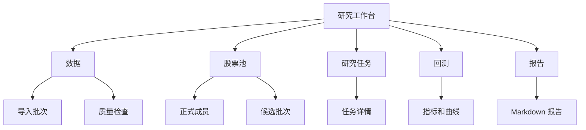

# Augur_Maestro 前端控制台设计规范

版本：v0.1  
状态：草案，待用户确认  
最后更新：2026-05-15

## 0. 文档定位

本文档定义 Augur_Maestro 前端控制台的范围、信息架构和安全边界。

M1 的主入口是 CLI，第一条关键路径先跑通 CLI。React 控制台若进入 M1 收口增强，只能做只读研究展示，不提供真实交易入口，不承载核心业务规则。

## 1. 设计原则

- 前端只负责展示、配置和人工确认，不承载核心交易或研究规则。
- 所有核心动作由后端 service 或 CLI service 执行。
- 用户可见文案使用简体中文。
- 所有页面必须显示足够的状态、错误原因和可追踪 ID。
- 实盘前不提供买入、卖出、撤单、条件单按钮。
- M1 不展示真实账户、真实资金、真实持仓。

## 2. M1 前端范围

M1 前端是可选项。若实现，只做以下只读页面：

| 页面 | 内容 |
|---|---|
| 数据导入 | 导入批次、数据源、时间范围、状态、行数、失败数 |
| 数据质量 | 质量检查批次、问题数量、严重级别、问题列表 |
| 股票池 | 正式股票池成员、候选批次、人工确认状态 |
| 研究任务 | 任务列表、状态、数据区间、切分方式 |
| 回测结果 | 指标摘要、权益曲线、虚拟订单和虚拟成交摘要 |
| 报告 | Markdown 报告列表、生成时间、关联 ID |

M1 前端禁止：

- 创建真实订单。
- 撤真实订单。
- 启停真实策略。
- 修改真实风控。
- 展示完整券商账号或真实资金隐私。
- 保存 API Key 或券商 token。

## 3. M1 信息架构

M1 不需要营销首页。第一屏应直接是研究工作台或数据状态。

## 4. 页面细节

### 4.1 数据导入页

展示字段：

- `run_id`。
- Provider。
- 数据集。
- 市场。
- 股票池。
- 日期范围。
- 复权类型。
- 状态。
- 行数。
- 失败数。
- 开始和结束时间。
- 错误摘要。

交互：

- 按状态筛选。
- 点击进入批次详情。
- 复制 `run_id`。

M1 不在前端触发导入，避免把任务编排复杂度提前引入。

### 4.2 数据质量页

展示字段：

- `quality_run_id`。
- 关联导入批次。
- 检查范围。
- 总体状态。
- 问题数量。
- 问题严重级别。
- 标的、日期、字段和说明。

交互：

- 按严重级别筛选。
- 按标的筛选。
- 复制 `quality_run_id`。

当存在 error 级问题时，页面应明确显示“该数据区间默认不能用于回测”。

### 4.3 股票池页

展示：

- 股票池名称。
- 主题。
- 标的代码 + 名称。
- 来源。
- 理由。
- 是否 active。
- 候选确认状态。

M1 如做前端，可以展示候选状态，但人工确认仍可先通过 CLI 完成。若前端提供确认按钮，必须写入确认原因。

### 4.4 研究任务页

展示：

- `task_id`。
- 任务名称。
- 研究目标。
- 股票池。
- 数据范围。
- 模拟留出区间。
- 建模区间。
- 回测区间。
- 状态。
- 失败原因。

页面必须强调状态，而不是只展示最终收益。

### 4.5 回测页

展示：

- `backtest_id`。
- 引擎。
- 策略名。
- 初始资金。
- 手续费。
- 滑点。
- 总收益。
- 年化收益。
- 最大回撤。
- 夏普比率。
- 换手率。
- 权益曲线。
- 虚拟订单和虚拟成交摘要。

回测页必须标注“这是回测虚拟结果，不是真实订单或真实成交”。

### 4.6 报告页

展示：

- 报告列表。
- 报告路径。
- `artifact_id`。
- `task_id`。
- `backtest_id`。
- 内容哈希。
- 生成时间。

Markdown 报告应保留原文格式。页面不应删除风险提示。

## 5. M2 前端方向

M2 可以加入：

- 模拟盘状态。
- 交易意图列表。
- 风控拒绝记录。
- 模拟订单状态。
- 策略暂停和恢复入口。
- 异常确认入口。

M2 仍不调用真实券商交易接口。

## 6. M3 前端方向

M3 在实盘前必须具备：

- 全局暂停。
- 策略暂停。
- 只读账户、持仓、订单、成交视图。
- 风控拒绝原因。
- unknown 订单告警。
- 对账不一致告警。
- 撤单入口。
- 人工确认流程。

M3 仍不建议提供手动买入/卖出按钮。系统可以提供撤单和暂停，因为它们是安全控制动作。

## 7. 错误展示

前端错误信息应显示：

- 用户可理解的中文说明。
- `error_code`。
- `trace_id`。
- 下一步建议。

不要显示：

- Python traceback 全文。
- 数据库连接字符串。
- API Key。
- 真实账号。
- 完整券商返回敏感信息。

## 8. 可视化优先级

M1 如果实现图表，优先：

- 数据导入状态统计。
- 数据质量问题数量。
- 回测权益曲线。
- 主要回撤片段。
- 标的和主题归因条形图。

不要一开始做复杂大屏。研究系统需要清楚、可扫描、可复盘，而不是装饰性展示。

## 9. 验收标准

M1 前端若实现，验收标准：

- 所有页面能通过 API 获取只读数据。
- 不直接连接数据库。
- 不调用任何券商 SDK。
- 不出现真实交易按钮。
- 错误状态有 `trace_id`。
- 页面文案不暗示回测结果可直接实盘。
- UI 渲染经过实际浏览器验证。
