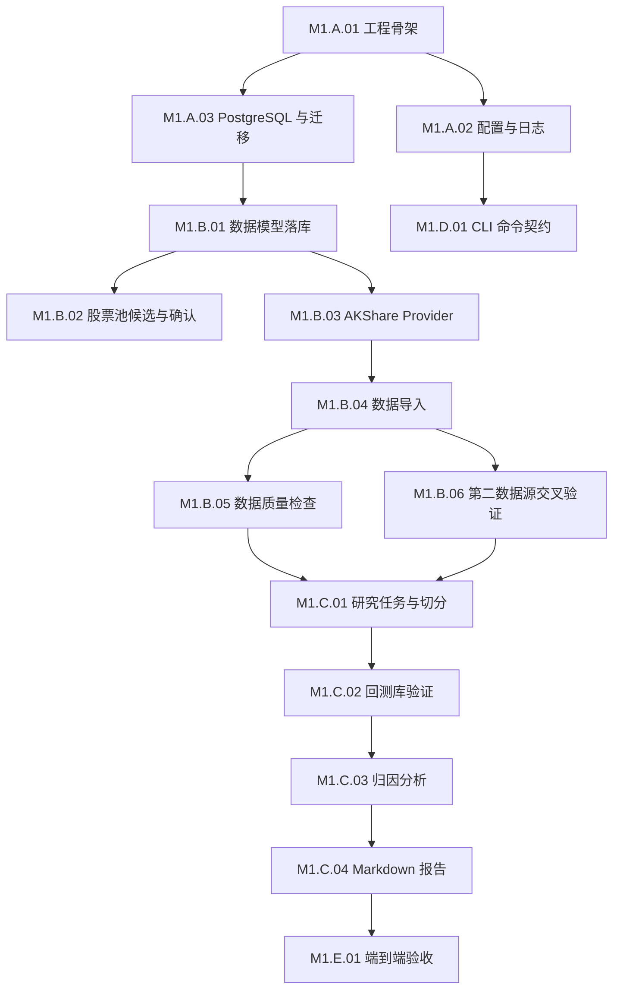

# RobustQuant M1 实施路线图

版本：v0.1  
状态：草案，待用户确认  
最后更新：2026-05-15

## 0. 文档定位

本文档把 [m1-scope.md](m1-scope.md) 的范围边界拆成可执行任务。范围争议回到 `m1-scope.md`，接口和字段争议回到对应专项文档。

本文档用于：

- 排开发顺序。
- 判断任务依赖。
- 定义每个任务的完成标准。
- 记录风险和阻塞。

M1 不进入真实交易实现。任何真实交易相关任务只能出现在文档设计或只读验证里。

## 1. 任务粒度约定

单个任务应满足：

- 能独立提交和评审。
- 预计工作量不超过 3 人日。
- 有明确输入、输出和验收标准。
- 不跨越过多模块边界。

任务状态：

```text
[ ]  未开始
[→]  进行中
[x]  完成
[!]  阻塞
[~]  暂缓或移出 M1
```

任务编号：

- `M1.A.*`：工程底座。
- `M1.B.*`：数据和股票池。
- `M1.C.*`：研究、回测和报告。
- `M1.D.*`：API、CLI 和前端只读展示。
- `M1.E.*`：测试、文档和验收。

## 2. M1 总体依赖



关键路径是：工程骨架 → 数据库迁移 → 数据导入 → 质量检查 → 研究任务 → 回测 → 归因 → 报告 → 端到端验收。

## 3. Track A 工程底座

### M1.A.01 项目骨架

- 状态：[x]
- 依赖：无。
- 目标：建立 Python 工程基础目录和最小测试入口。
- 交付：
  - `src/rq_core/`。
  - `src/cli/`。
  - `src/backend/`。
  - `configs/`。
  - `tests/`。
  - `.env.example`。
  - `requirements.txt`。
  - `requirements-dev.txt`。
  - `pyproject.toml`。
  - `.github/workflows/ci.yml`。
  - `README.md`。
- DoD：
  - 能创建 `venv` 并安装依赖。
  - `pytest` 能运行基础冒烟测试。
  - CI 能运行 `ruff check`、`ruff format --check`、`mypy` 和 `pytest`。
  - `rq_core` 不依赖 FastAPI、Typer、SQLAlchemy、AKShare、Qlib 或 VectorBT。
- 当前进展：
  - 已落地最小工程骨架、开发依赖、CI 和本地质量检查命令。
  - `src/cli/`、`src/backend/` 和 `configs/` 当前仅保留目录说明；具体实现按后续任务推进。

### M1.A.02 配置、错误和日志底座

- 状态：[ ]
- 依赖：M1.A.01。
- 目标：统一 `.env`、YAML、错误码和结构化日志。
- 交付：
  - 配置读取模块。
  - 稳定错误码枚举。
  - `trace_id` / `run_id` 生成规则。
  - JSON 结构化日志工具。
- DoD：
  - `.env` 不进入 Git。
  - 日志不输出 API Key、密码、账号隐私、完整 prompt 或完整报告正文。
  - CLI 出错能显示错误码和排查建议。

### M1.A.03 PostgreSQL 与 Alembic

- 状态：[ ]
- 依赖：M1.A.01。
- 目标：本地数据库可重建、可迁移、可解释。
- 交付：
  - Docker Compose PostgreSQL 配置。
  - SQLAlchemy 2.x 基础设施。
  - Alembic 初始化。
  - 迁移运行脚本。
- DoD：
  - 空库能执行 migration。
  - migration 失败时不会静默吞错。
  - README 写明 Docker Compose 和本机 PostgreSQL 两种路径。

### M1.A.04 Kernel 接口落地

- 状态：[ ]
- 依赖：M1.A.01。
- 目标：先固定 `records.py`、`ports.py`、`services.py` 的接口形状。
- 交付：
  - `common` 类型和错误。
  - `data_kernel` DTO / Protocol。
  - `universe_kernel` DTO / Protocol。
  - `research_kernel` DTO / Protocol。
  - `backtest_kernel` DTO / Protocol。
  - `report_kernel` DTO / Protocol。
- DoD：
  - 与 [kernel-interfaces.md](../backend/kernel/kernel-interfaces.md) 对齐。
  - 类型检查通过。
  - 无外部 SDK 依赖泄漏到 `rq_core`。

## 4. Track B 数据和股票池

### M1.B.01 M1 数据表迁移

- 状态：[ ]
- 依赖：M1.A.03。
- 目标：按 [data-model.md](../backend/data/data-model.md) 创建 M1 表。
- 交付：
  - `market_symbols`。
  - `trade_calendars`。
  - `daily_bars`。
  - `data_ingestion_runs`。
  - `data_quality_runs`。
  - `data_quality_issues`。
  - 股票池、研究任务、回测、归因和报告相关表。
- DoD：
  - 唯一约束、外键、索引和 check 约束与设计一致。
  - `daily_bars` 能阻止重复 `(symbol, trade_date, adjust, source)`。
  - 真实交易相关表不进入 M1 migration。

### M1.B.02 主题股票池配置

- 状态：[ ]
- 依赖：M1.B.01。
- 目标：把主题和候选股票池作为可审计对象。
- 交付：
  - `configs/universe/*.yaml` 示例。
  - 候选生成配置结构。
  - 人工确认记录。
- DoD：
  - 候选、批准、拒绝、忽略四种状态可记录。
  - 未批准候选不能进入正式股票池。
  - 候选理由为空或仅关键词命中时拒绝入库。
  - 过滤规则能排除 ST、长期停牌、低成交额、低换手率、流动性差和疑似易被操纵的小票股。
  - 第一版过滤阈值采用：最小上市天数 250、20 日均成交额不低于 5000 万元、20 日均换手率不低于 0.5%、近 250 个交易日停牌天数不超过 20、总市值不低于 50 亿元。
  - AI 可以扩展候选清单，但必须进入人工确认队列。

### M1.B.03 AKShare Provider

- 状态：[ ]
- 依赖：M1.A.04。
- 目标：通过 `DataProvider` 拉取外部数据，不让上层感知 AKShare。
- 交付：
  - `AkshareDataProvider.get_symbols`。
  - `AkshareDataProvider.get_trade_calendar`。
  - `AkshareDataProvider.get_daily_bars`。
  - AKShare 版本记录。
- DoD：
  - Provider 只返回 DTO，不写数据库。
  - 外部调用失败转成 `ExternalProviderError`。
  - 单测可用 fake provider 替代 AKShare。

### M1.B.04 数据导入服务

- 状态：[ ]
- 依赖：M1.B.01、M1.B.03。
- 目标：把外部行情标准化写入 PostgreSQL。
- 交付：
  - 导入批次创建和状态更新。
  - 标的、交易日历、日线写入。
  - `none` 和 `qfq` 复权类型导入。
  - 部分失败统计。
- DoD：
  - 成功、失败、部分失败都有状态和原因。
  - 导入完成打印 `run_id`。
  - 同一批次可追踪配置哈希和 Provider 版本。

### M1.B.05 数据质量检查

- 状态：[ ]
- 依赖：M1.B.04。
- 目标：数据质量不合格时阻断研究结论。
- 交付：
  - 字段完整性检查。
  - 日期完整性检查。
  - 重复记录检查。
  - 价格关系检查。
  - 复权异常初步检查。
  - 问题分级：`info`、`warning`、`error`。
- DoD：
  - `error` 级问题会阻止数据标记为可回测。
  - 质量报告能按 `quality_run_id` 查询。
  - 报告中能引用导入批次。

### M1.B.06 第二数据源交叉验证

- 状态：[ ]
- 依赖：M1.B.04。
- 目标：引入第二数据源，降低单一 AKShare 数据源导致的回测失真风险。
- 交付：
  - `BaostockDataProvider` 作为第二数据源 Provider。
  - 关键字段抽样对比：交易日、收盘价、成交量、成交额、复权一致性。
  - 数据差异报告。
  - 报告中展示交叉验证状态。
- DoD：
  - 第二数据源不改变主数据源写入路径，只用于校验和差异提示。
  - 如果 BaoStock 字段缺失、限流或维护状态不满足 M1 需要，任务输出明确失败原因和备用源建议。
  - 字段差异超过阈值时生成 warning 或 error。
  - 交叉验证结果能被 Markdown 报告引用。

## 5. Track C 研究、回测和报告

### M1.C.01 研究任务和数据切分

- 状态：[ ]
- 依赖：M1.B.05。
- 目标：把一次研究从临时脚本变成可追踪任务。
- 交付：
  - YAML 研究配置解析。
  - `research_tasks` 创建。
  - `dataset_splits` 生成。
  - 研究任务事件记录。
- DoD：
  - 默认最近 1 年作为模拟留出。
  - 剩余数据按时间顺序 8:2 切分。
  - 切分结果入库且能在报告中引用。

### M1.C.02 基础因子和回测库验证

- 状态：[ ]
- 依赖：M1.C.01。
- 目标：用标准表数据跑通至少一个成熟回测库。
- 交付：
  - 基础因子：动量、均线偏离、波动率、成交额过滤。
  - Qlib 适配验证。
  - VectorBT 适配验证。
  - 两者并行最小验证报告。
  - 主执行器选择建议。
- DoD：
  - 回测不直接访问 AKShare。
  - 回测结果入库。
  - 回测失败有错误原因。
  - Qlib 和 VectorBT 的取舍结论记录到待决策或路线文档；未被选为主执行器的一方是否保留为对照工具要写清楚。

### M1.C.03 回测归因分析

- 状态：[ ]
- 依赖：M1.C.02。
- 目标：解释收益、亏损、成本和回撤来源。
- 交付：
  - 标的贡献归因。
  - 主题贡献归因。
  - 交易成本影响。
  - 主要回撤片段。
- DoD：
  - 归因项能追溯到交易、持仓或权益曲线。
  - 无法解释的部分必须标记“不足以归因”。
  - 不把相关性写成确定因果。

### M1.C.04 Markdown 报告生成

- 状态：[ ]
- 依赖：M1.C.03。
- 目标：输出可读、可复盘、可审计的研究报告。
- 交付：
  - `outputs/reports/*.md`。
  - `report_artifacts` 入库。
  - 报告哈希。
- DoD：
  - 报告包含数据源、导入批次、复权、时间范围、切分、参数、指标、归因和风险提示。
  - 报告不包含任何密钥、账号隐私或真实资金隐私。
  - 报告明确写明不能直接作为实盘建议。

## 6. Track D CLI、API 和前端

### M1.D.01 CLI 命令契约

- 状态：[ ]
- 依赖：M1.A.02、M1.A.04。
- 目标：提供可复现的命令链。
- 交付：
  - `robustquant --help`。
  - `robustquant data init-db`。
  - `robustquant universe build-candidates`。
  - `robustquant universe approve`。
  - `robustquant data import-daily-bars`。
  - `robustquant data validate`。
  - `robustquant research create-task`。
  - `robustquant backtest run`。
  - `robustquant report generate`。
- DoD：
  - 每个命令都有 `--help`。
  - 命令成功输出关键 ID。
  - 命令失败返回非 0 退出码和稳定错误码。

### M1.D.02 FastAPI 基础只读入口

- 状态：[~]
- 依赖：M1.A.02、M1.B.01。
- 目标：如实现，只提供健康检查和只读查询。
- M1 最小交付：
  - `GET /healthz`。
  - `GET /version`。
- 后续可选：
  - 导入批次查询。
  - 数据质量结果查询。
  - 研究任务查询。
  - 报告列表查询。
- DoD：
  - API 不触发数据导入、回测或交易。
  - API 层不写核心业务规则。

### M1.D.03 React 只读控制台

- 状态：[~]
- 依赖：M1.D.02。
- 目标：CLI 跑通后再决定是否实现；若实现前端，只做研究状态展示。
- 页面：
  - 数据导入批次。
  - 数据质量问题。
  - 研究任务。
  - 回测结果摘要。
  - 报告列表。
- DoD：
  - 不提供真实下单、撤单、策略启停按钮。
  - 不在前端保存敏感配置。
  - UI 文案使用简体中文。

## 7. Track E 测试、文档和验收

### M1.E.01 端到端命令链

- 状态：[ ]
- 依赖：M1.C.04、M1.D.01。
- 目标：用一条 README 命令链复现 M1。
- DoD：
  - 初始化数据库。
  - 生成候选股票池。
  - 人工确认股票池。
  - 导入日线数据。
  - 运行质量检查。
  - 创建研究任务。
  - 运行回测。
  - 生成报告。

### M1.E.02 测试矩阵

- 状态：[→]
- 依赖：各模块实现。
- 最小测试：
  - Kernel DTO 和服务接口单测。
  - fake provider 数据导入单测。
  - 数据质量检查单测。
  - 候选股票池人工确认规则单测。
  - 数据切分单测。
  - 报告模板单测。
- DoD：
  - 核心业务规则有测试。
  - 外部 SDK 可通过 fake 或 fixture 隔离。
- 当前进展：
  - 已有 `TradingGateway` 交易能力锁的安全测试，覆盖 read-only 模式下下单、改单、撤单在触达适配器前被阻断。
  - 已建立 CI 基线，后续每个模块落地时继续补对应测试。

### M1.E.03 文档收口

- 状态：[ ]
- 依赖：M1.E.01。
- 目标：实现后回写设计和使用文档。
- DoD：
  - README 有完整运行步骤。
  - `docs/` 中实现偏差已更新。
  - 未实现事项进入 [open-decisions.md](../architecture/open-decisions.md) 或后续任务。

### M1.E.04 CI 和本地质量门禁

- 状态：[x]
- 依赖：M1.A.01 的当前工程骨架。
- 目标：让每次 push 和 pull request 至少经过基础机器检查。
- 交付：
  - `.github/workflows/ci.yml`。
  - `pyproject.toml` 中的 `pytest`、`pytest-cov`、`ruff`、`mypy` 配置。
  - `requirements-dev.txt`。
  - `requirements-dev.lock.txt`。
  - `.pre-commit-config.yaml`。
  - `.secrets.baseline`。
  - `src/scripts/quality/trading_safety_static_check.py`。
  - `src/scripts/quality/markdown_docs_check.py`。
  - `.github/pull_request_template.md`。
  - `.github/CODEOWNERS`。
- DoD：
  - CI 使用 Python 3.11。
  - CI 运行 `python -m ruff check .`。
  - CI 运行 `python -m ruff format --check .`。
  - CI 运行 `python -m mypy -p rq_core`。
  - CI 运行 `detect-secrets-hook --baseline .secrets.baseline $(git ls-files)`。
  - CI 运行 `python -m pip_audit -r requirements-dev.lock.txt`。
  - CI 运行 `python src/scripts/quality/trading_safety_static_check.py`。
  - CI 运行 `python src/scripts/quality/markdown_docs_check.py`。
  - CI 运行 `python -m pytest`。
  - 测试覆盖率第一版阈值不低于 60%。
  - 真实券商接口不会在 CI 中被调用。

## 8. 风险登记册

| ID | 风险 | 影响 | 缓解 |
|---|---|---|---|
| R1 | AKShare 字段变化或限流 | 数据导入失败或结果不稳定 | Provider 版本记录、错误状态、第二数据源交叉验证 |
| R2 | 主题股票池幸存者偏差 | 回测结果偏乐观 | 报告强制提示，后续引入历史成分或更严格样本 |
| R3 | Qlib 或 VectorBT A 股适配成本高 | M1 回测延期 | 两者并行最小验证，及时选主执行器 |
| R4 | 数据质量检查太弱 | 错误数据进入报告 | M1 至少覆盖阻断型基础检查 |
| R5 | 过早做前端 | 拖慢研究闭环 | 先跑通 CLI，React 只读控制台后置 |
| R6 | 实盘接口诱惑过早接入 | 真实资金风险 | M1 migration 和代码禁止真实交易表和真实券商调用 |
| R7 | 文档和实现漂移 | 后续维护困难 | 每个任务 DoD 包含必要文档回写 |
| R8 | 盈立源码截图需求被误解为开发任务或实盘接入 | 范围膨胀、真实订单风险 | 源码截图归为券商申请材料事项；开发侧只解析官方网页手册，禁止真实提交 |

## 9. 当前排期建议

建议顺序：

1. 先完成 A 轨工程底座。
2. 再完成 B 轨数据和股票池。
3. 然后完成 C 轨研究、回测、归因和报告。
4. D 轨 CLI 必须跟随每个服务落地。
5. FastAPI 保持只读可选，React 等 CLI 跑通后再决定是否作为收口增强。

这个顺序的原因是：没有标准化数据和质量检查，回测越早跑越容易产生看似漂亮但无法信任的结果。

## 10. 盈立 OpenAPI 官方网页手册解析

盈立申请材料要求源码截图，该事项与 RobustQuant 开发无关，不作为 M1 任务。开发侧只解析 uSmart 官方网页手册和本地 Markdown 转换稿，为未来正式券商接入设计提供依据。

### YL.01 官方网页文档解析确认

- 状态：[!]
- 依赖：uSmart 官方网页手册已转换到 `API_manual/uSmart/API_manual/`；交易 API、基础报价 API、报价推送 API 必须分开解析和建模。
- 目标：从官方网页手册提取认证、endpoint、签名、下单、改单、撤单、订单状态、账户查询、行情查询和推送能力。
- DoD：
  - 明确认证方式、endpoint、签名、下单、改单、撤单参数。
  - 明确账号资金、持仓、订单状态、行情查询和实时变动推送的接口范围。
  - 网页手册已给出 UAT 测试地址；UAT 是否等同 sandbox / paper trading、是否保证交易动作不产生真实委托，仍需券商确认。
  - 官方网页手册未说明的改单语义、订单状态或错误码，标记为 `unknown_by_official_doc`。
  - 不输出申请截图源码，不运行真实交易接口。
  - 文档摘录和待确认项同步更新到 [yingli-openapi-reference.md](../backend/clients/yingli-openapi-reference.md)。
